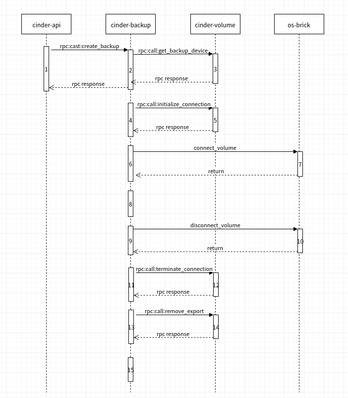

### [API](https://docs.openstack.org/api-ref/block-storage/v3/index.html?expanded=create-a-backup-detail#backups-backups)

> POST /v3/{project_id}/backups

Create a backup

Creates a Block Storage backup from a volume or snapshot.

The status of the volume must be available or if the force flag is used, backups of in-use volumes may also be created.

### Workflow

**This is bases on Newton**

**1 cinder api**
* check volume_id(input) == snapshot.volume_id (if backup a snapshot) 
* check volume status in ["available", "in-use"]
* check in-use volume must use the force flag
* check snapshot to be backed up must be available
* store volume status
* get an available backup service in same az (if not backup_use_same_host)
* get the same host backup service (if backup_use_same_host and up)
* Reserve a quota before setting volume status and backup status
* Find the latest backup and use it as the parent backup to do an incremental backup.
* check the parent backup must be available for incremental backup.
* update volume status 'backing-up'.
* Create backup in DB (status is creating)
* update the quotas.

**2 cinder backup**
* notify about backup usage("create.start")
* check volume status is 'backing-up'
* check backup status is 'creating'
* get backup service (CephBackupDriver)
* get get_backup_device  **goto 3**

**3 cinder volume**
* return object volume if ceph
* TODO(not ceph or backup from snapshot)

**4 cinder backup**
* initialize connection volume (Or: initialize connection snapshot) **goto 5**

**5 cinder volume**
* allow connection to connector and return connection info.

**6 cinder backup**
* call connect_volume **goto 7**

**7 os-brick**
* create ceph conf
* return rbd_handle: Enables LibRBD.Image objects to be treated as Python IO objects.

** 8 cinder backup**
* driver backup [detail](https://blog.csdn.net/sinat_19820591/article/details/101266988)
  * CephBackupDriver
  * GlusterfsBackupDriver -- PosixBackupDriver -- ChunkedBackupDriver
  * GoogleBackupDriver -- ChunkedBackupDriver
  * NFSBackupDriver -- PosixBackupDriver  -- ChunkedBackupDriver
  * PosixBackupDriver -- ChunkedBackupDriver
  * SwiftBackupDriver -- ChunkedBackupDriver
  * TSMBackupDriver

**9 cinder backup ** 
* call disconnect_volume **goto 10**

**10 os-brick**
* delete ceph conf
* close rbd_handle

**11 cinder backup**
* call terminate connection volume (Or: terminate connection snapshot) **goto 12**

**12 cinder volume**
* disallow connection from connector (Ceph do nothing)

**13  cinder backup**
* call remove_export **goto 14**

**14 cinder volume**
* Removes an export for a logical volume (Ceph do nothing)

**15 cinder backup**
* Delete temp volumes or snapshots when backup creation is completed. (Ceph has no temp volumes or snapshots)
* restore the volume original status
* update the backup status to available
* update the backup size same to volume size
* Handle the num_dependent_backups of parent backup when child backup has created successfully (parent_backup.num_dependent_backups += 1)
* notify about backup usage("create.end")
