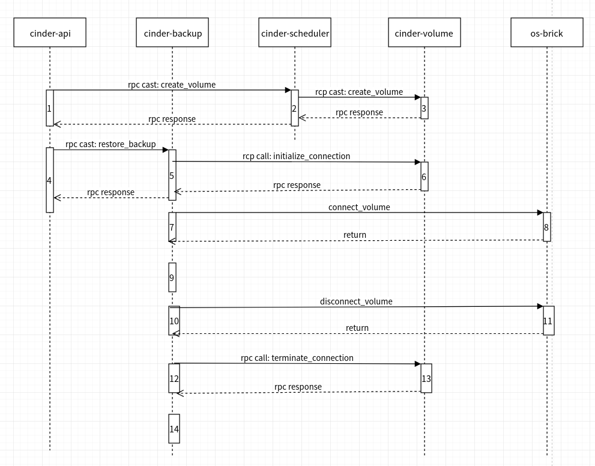

### [API](https://docs.openstack.org/api-ref/block-storage/v3/index.html?expanded=restore-a-backup-detail#backups-backups)

> POST /v3/{project_id}/backups/{backup_id}/restores

Restore a backup


Restores a Block Storage backup to an existing or new Block Storage volume.

The name parameter will work only if a new volume is created.

If UUID is specified, the backup will be restored to the specified volume. The specified volume has the following requirements:

 * the specified volume status is available.
 * the size of specified volume must be equal to or greater than the size of backup.

If no existing volume UUID is provided, the backup will be restored to a new volume matching the size and name of the originally backed up volume. In this case, if the name parameter is provided, it will be used as the name of the new volume.


### Workflow


**This is bases on Newton**


**1 cinder api**
* check restore policy 
* check backup status is available
* check backup size is not None
* create a volume if none specified (volume size = backup size, name = 'restore_backup_%s' % backup_id)

**2 cinder scheduler**
* select the host

**3 cinder volume**
* call driver to create a blank volume

**4 cinder api**
* check target volume status is available
* check target volume size >= backup size
* get available backup service host
* update backup status to restoring
* update target volume status to restoring-backup

**5 cinder backup**
* notify about backup usage("restore.start")
* check target volume status is restoring-backup
* check backup_service = configured_service
* get backup service (CephBackupDriver)
* initialize connection volume (Or: initialize connection snapshot) **goto 6**

**6 cinder volume**
* allow connection to connector and return connection info.

**7 cinder backup**
* call connect_volume **goto 8**

**8 os-brick**
* create ceph conf
* return rbd_handle: Enables LibRBD.Image objects to be treated as Python IO objects.


**9 cinder backup**
* driver backup [detail](https://blog.csdn.net/sinat_19820591/article/details/101266988)
* **diff restore** (Copy only extents changed between two points.)
1. check can  diff restore:
```
In order for a differential restore to be performed we need:
    1 base exist: backups/volume-volume-id.backup.base
    2 restore point snapshot exist: backups/volume-volume-id.backup.base@backup.backup-id.snap.time1
    3 destination volume must be RBD
    4 target volume is different from source volume of backup
    5 destination volume must have zero extents
```
 2. export diff
 ```
 ()[root@busybox-openstack-5c687fdc9-mpwjd /]# rbd export-diff  backups/volume-volume-id.backup.base@backup.backup-id1.snap.time1 test_diff_backup_id2
Exporting image: 100% complete...done.

 ```
3. import diff to target volume
```
()[root@busybox-openstack-5c687fdc9-mpwjd /]# rbd import-diff test_diff_backup_id2 volumes/new-volume-id
Importing image diff: 100% complete...done.
()[root@busybox-openstack-5c687fdc9-mpwjd /]# rbd ls -l volumes
NAME                                       SIZE PARENT FMT PROT LOCK 
new-volume-id                              1GiB          2           
new-volume-id@backup.backup-id1.snap.time1 1GiB          2           
volume-id                                  1GiB          2           
volume-id@backup.backup-id1.snap.time1     1GiB          2      
```
4. resize
```
()[root@busybox-openstack-5c687fdc9-mpwjd /]# rbd create volumes/new-volume-id2 --size 2G
()[root@busybox-openstack-5c687fdc9-mpwjd /]# rbd import-diff test_diff_backup_id2 volumes/new-volume-id2
Importing image diff: 100% complete...done.
()[root@busybox-openstack-5c687fdc9-mpwjd /]# rbd ls -l volumes
NAME                                        SIZE PARENT FMT PROT LOCK 
new-volume-id                               1GiB          2           
new-volume-id@backup.backup-id1.snap.time1  1GiB          2           
new-volume-id2                              1GiB          2           
new-volume-id2@backup.backup-id1.snap.time1 1GiB          2           
volume-id                                   1GiB          2           
volume-id@backup.backup-id1.snap.time1      1GiB          2           
()[root@busybox-openstack-5c687fdc9-mpwjd /]# 
()[root@busybox-openstack-5c687fdc9-mpwjd /]# rbd resize volumes/new-volume-id2 --size 2G
Resizing image: 100% complete...done.
()[root@busybox-openstack-5c687fdc9-mpwjd /]# rbd ls -l volumes
NAME                                        SIZE PARENT FMT PROT LOCK 
new-volume-id                               1GiB          2           
new-volume-id@backup.backup-id1.snap.time1  1GiB          2           
new-volume-id2                              2GiB          2           
new-volume-id2@backup.backup-id1.snap.time1 1GiB          2           
volume-id                                   1GiB          2           
volume-id@backup.backup-id1.snap.time1      1GiB          2 
```
* **full restore**(Restore volume using full copy i.e. all extents.)
  * transfer data between files (Python IO objects). chunk=128M
* restore volume metadata from backup.

**10 cinder backup ** 
* call disconnect_volume **goto 11**

**11 os-brick**
* delete ceph conf
* close rbd_handle

**12 cinder backup**
* call terminate connection volume (Or: terminate connection snapshot) **goto 13**

**13 cinder volume**
* disallow connection from connector (Ceph do nothing)


**14 cinder backup**
* update target volume status to available
* update backup status to available
* notify about backup usage("restore.end")