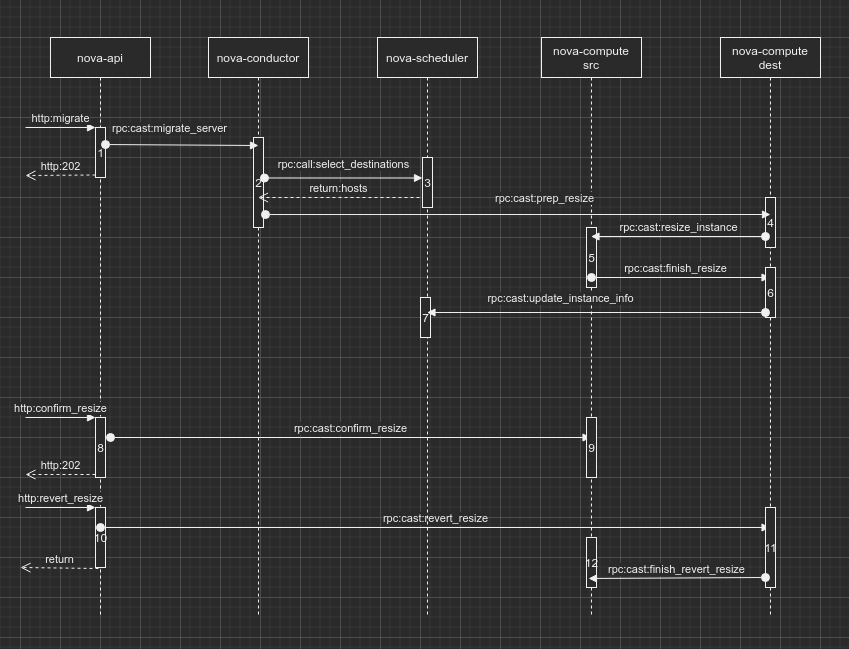
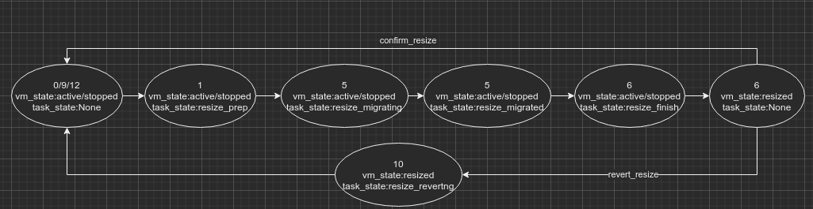
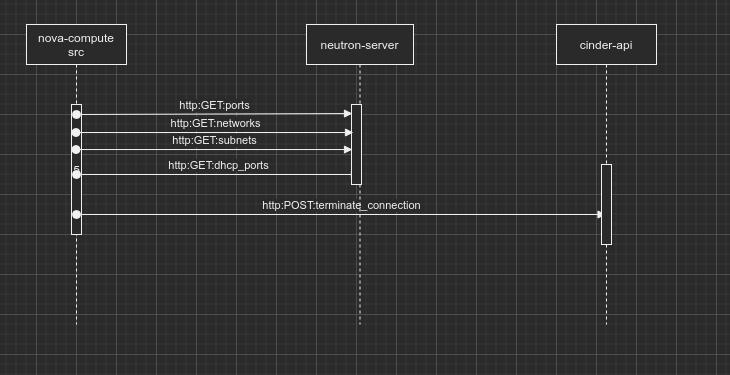
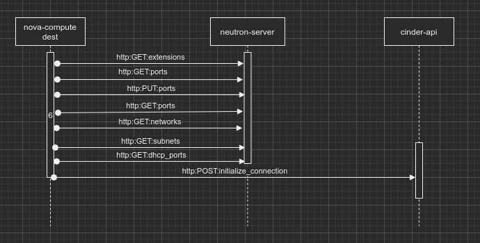

### [API](https://docs.openstack.org/api-ref/compute/?expanded=migrate-server-migrate-action-detail#migrate-server-migrate-action)

> POST /servers/{server_id}/action

Migrate Server (migrate Action)

Specify the migrate action in the request body.

Up to microversion 2.55, the scheduler chooses the host. Starting from microversion 2.56, the host parameter is available to specify the destination host. If you specify null or don’t specify this parameter, the scheduler chooses a host.

Asynchronous Postconditions

A successfully migrated server shows a VERIFY_RESIZE status and finished migration status. If the cloud has configured the resize_confirm_window option of the Compute service to a positive value, the Compute service automatically confirms the migrate operation after the configured interval.

Policy defaults enable only users with the administrative role to perform this operation. Cloud providers can change these permissions through the policy.json file.

Normal response codes: 202

Error response codes: badRequest(400), unauthorized(401), forbidden(403) itemNotFound(404), conflict(409)

**Example Migrate Server (migrate Action) (v2.1)**

```
{
    "migrate": null
}
```

**Example Migrate Server (migrate Action) (v2.56)**
```
{
    "migrate": {
        "host": "host1"
    }
}
```

### Overview





### Workflow

**This is bases on Newton**

**1 nova-api(nova.compute.api.API.resize)**

* check vm_state in [stopped, active]
* flavor check
  * migrate->flavor_id is None
  * resize  ->new flavor_id
* quota  reserve if resize
* save instance task_state to **resize_prep**
* allow_resize_to_same_host
* rpc call to conductor migrate_server **goto 2**

**2  nova-conductor**
* set request_spec
* rpc call select_destinations **goto 3**
* rpc cast prep_resize to destionation host nova-compute **goto 4**

**3 nova-scheduler**
* select destinations by request_specs

**4 nova-compute destination(nova.compute.manager.ComputeManager.prep_resize)**
* notify about instance usage "compute.instance.resize.prep.start"
* check support migrate to same host
* record "old_vm_state" to system metadata for set the resized/reverted instance back to the same state
* resize claim
* rpc cast resize instance to source host nova-compute **goto 5**

Logs:
```
2019-12-13 15:41:00.745 22558 DEBUG oslo_messaging._drivers.amqpdriver [req-0feb5d68-c83e-4e1d-9203-a6cd98862c4c 6c3c0761000f423780b2d1cbf4459dc5 a899ce15f11740ab864a57b888163d3a - - -] CALL msg_id: 931aa4a09ea44e39a547fdebb04bf9c4 exchange 'nova' topic 'conductor' _send /usr/lib/python2.7/site-packages/oslo_messaging/_drivers/amqpdriver.py:568
2019-12-13 15:41:00.763 22558 DEBUG oslo_messaging._drivers.amqpdriver [req-0feb5d68-c83e-4e1d-9203-a6cd98862c4c 6c3c0761000f423780b2d1cbf4459dc5 a899ce15f11740ab864a57b888163d3a - - -] CALL msg_id: 8724d60adaef4779b7304e5914efa930 exchange 'nova' topic 'conductor' _send /usr/lib/python2.7/site-packages/oslo_messaging/_drivers/amqpdriver.py:568
2019-12-13 15:41:00.792 22558 DEBUG oslo_messaging._drivers.amqpdriver [req-0feb5d68-c83e-4e1d-9203-a6cd98862c4c 6c3c0761000f423780b2d1cbf4459dc5 a899ce15f11740ab864a57b888163d3a - - -] CAST unique_id: ba3a183bcadc4f53bd357c2710d989dd NOTIFY exchange 'nova' topic 'notifications.info' _send /usr/lib/python2.7/site-packages/oslo_messaging/_drivers/amqpdriver.py:552
2019-12-13 15:41:00.799 22558 DEBUG oslo_messaging._drivers.amqpdriver [req-0feb5d68-c83e-4e1d-9203-a6cd98862c4c 6c3c0761000f423780b2d1cbf4459dc5 a899ce15f11740ab864a57b888163d3a - - -] CAST unique_id: c9c01bef25d14826bfb704d6abaa0256 NOTIFY exchange 'nova' topic 'notifications.info' _send /usr/lib/python2.7/site-packages/oslo_messaging/_drivers/amqpdriver.py:552
2019-12-13 15:41:00.802 22558 DEBUG nova.compute.manager [req-0feb5d68-c83e-4e1d-9203-a6cd98862c4c 6c3c0761000f423780b2d1cbf4459dc5 a899ce15f11740ab864a57b888163d3a - - -] [instance: b9c2056d-c3d8-417c-99dd-90f868cd02d8] Stashing vm_state: active _prep_resize /usr/lib/python2.7/site-packages/nova/compute/manager.py:3681
2019-12-13 15:41:00.805 22558 DEBUG oslo_messaging._drivers.amqpdriver [req-0feb5d68-c83e-4e1d-9203-a6cd98862c4c 6c3c0761000f423780b2d1cbf4459dc5 a899ce15f11740ab864a57b888163d3a - - -] CALL msg_id: ff906fa4442a40cc9f2a4dd0412aab94 exchange 'nova' topic 'conductor' _send /usr/lib/python2.7/site-packages/oslo_messaging/_drivers/amqpdriver.py:568
2019-12-13 15:41:00.903 22558 DEBUG oslo_concurrency.lockutils [req-0feb5d68-c83e-4e1d-9203-a6cd98862c4c 6c3c0761000f423780b2d1cbf4459dc5 a899ce15f11740ab864a57b888163d3a - - -] Lock "compute_resources" acquired by "nova.compute.resource_tracker.resize_claim" :: waited 0.000s inner /usr/lib/python2.7/site-packages/oslo_concurrency/lockutils.py:270
2019-12-13 15:41:01.732 22558 DEBUG oslo_messaging._drivers.amqpdriver [req-0feb5d68-c83e-4e1d-9203-a6cd98862c4c 6c3c0761000f423780b2d1cbf4459dc5 a899ce15f11740ab864a57b888163d3a - - -] CALL msg_id: 8c5182b390564f7db6e56449e25c5796 exchange 'nova' topic 'conductor' _send /usr/lib/python2.7/site-packages/oslo_messaging/_drivers/amqpdriver.py:568
2019-12-13 15:41:01.750 22558 DEBUG nova.compute.resource_tracker [req-0feb5d68-c83e-4e1d-9203-a6cd98862c4c 6c3c0761000f423780b2d1cbf4459dc5 a899ce15f11740ab864a57b888163d3a - - -] Memory overhead for 512 MB instance; 0 MB _move_claim /usr/lib/python2.7/site-packages/nova/compute/resource_tracker.py:224
2019-12-13 15:41:01.750 22558 DEBUG nova.compute.resource_tracker [req-0feb5d68-c83e-4e1d-9203-a6cd98862c4c 6c3c0761000f423780b2d1cbf4459dc5 a899ce15f11740ab864a57b888163d3a - - -] Disk overhead for 20 GB instance; 0 GB _move_claim /usr/lib/python2.7/site-packages/nova/compute/resource_tracker.py:227

2019-12-13 15:41:01.755 22558 INFO nova.compute.claims [req-0feb5d68-c83e-4e1d-9203-a6cd98862c4c 6c3c0761000f423780b2d1cbf4459dc5 a899ce15f11740ab864a57b888163d3a - - -] [instance: b9c2056d-c3d8-417c-99dd-90f868cd02d8] Attempting claim: memory 512 MB, disk 20 GB, vcpus 1 CPU
2019-12-13 15:41:01.755 22558 INFO nova.compute.claims [req-0feb5d68-c83e-4e1d-9203-a6cd98862c4c 6c3c0761000f423780b2d1cbf4459dc5 a899ce15f11740ab864a57b888163d3a - - -] [instance: b9c2056d-c3d8-417c-99dd-90f868cd02d8] Total memory: 262050 MB, used: 72704.00 MB
2019-12-13 15:41:01.755 22558 INFO nova.compute.claims [req-0feb5d68-c83e-4e1d-9203-a6cd98862c4c 6c3c0761000f423780b2d1cbf4459dc5 a899ce15f11740ab864a57b888163d3a - - -] [instance: b9c2056d-c3d8-417c-99dd-90f868cd02d8] memory limit: 262050.00 MB, free: 189346.00 MB
2019-12-13 15:41:01.756 22558 INFO nova.compute.claims [req-0feb5d68-c83e-4e1d-9203-a6cd98862c4c 6c3c0761000f423780b2d1cbf4459dc5 a899ce15f11740ab864a57b888163d3a - - -] [instance: b9c2056d-c3d8-417c-99dd-90f868cd02d8] Total disk: 11364 GB, used: 20.00 GB
2019-12-13 15:41:01.756 22558 INFO nova.compute.claims [req-0feb5d68-c83e-4e1d-9203-a6cd98862c4c 6c3c0761000f423780b2d1cbf4459dc5 a899ce15f11740ab864a57b888163d3a - - -] [instance: b9c2056d-c3d8-417c-99dd-90f868cd02d8] disk limit: 11364.00 GB, free: 11344.00 GB
2019-12-13 15:41:01.756 22558 INFO nova.compute.claims [req-0feb5d68-c83e-4e1d-9203-a6cd98862c4c 6c3c0761000f423780b2d1cbf4459dc5 a899ce15f11740ab864a57b888163d3a - - -] [instance: b9c2056d-c3d8-417c-99dd-90f868cd02d8] Total vcpu: 20 VCPU, used: 4.00 VCPU
2019-12-13 15:41:01.756 22558 INFO nova.compute.claims [req-0feb5d68-c83e-4e1d-9203-a6cd98862c4c 6c3c0761000f423780b2d1cbf4459dc5 a899ce15f11740ab864a57b888163d3a - - -] [instance: b9c2056d-c3d8-417c-99dd-90f868cd02d8] vcpu limit: 80.00 VCPU, free: 76.00 VCPU
2019-12-13 15:41:01.757 22558 DEBUG nova.virt.hardware [req-0feb5d68-c83e-4e1d-9203-a6cd98862c4c 6c3c0761000f423780b2d1cbf4459dc5 a899ce15f11740ab864a57b888163d3a - - -] Require both a host and instance NUMA topology to fit instance on host. numa_fit_instance_to_host /usr/lib/python2.7/site-packages/nova/virt/hardware.py:1310
2019-12-13 15:41:01.758 22558 INFO nova.compute.claims [req-0feb5d68-c83e-4e1d-9203-a6cd98862c4c 6c3c0761000f423780b2d1cbf4459dc5 a899ce15f11740ab864a57b888163d3a - - -] [instance: b9c2056d-c3d8-417c-99dd-90f868cd02d8] Claim successful
2019-12-13 15:41:01.758 22558 DEBUG nova.objects.instance [req-0feb5d68-c83e-4e1d-9203-a6cd98862c4c 6c3c0761000f423780b2d1cbf4459dc5 a899ce15f11740ab864a57b888163d3a - - -] Lazy-loading 'pci_devices' on Instance uuid b9c2056d-c3d8-417c-99dd-90f868cd02d8 obj_load_attr /usr/lib/python2.7/site-packages/nova/objects/instance.py:1013
2019-12-13 15:41:01.759 22558 DEBUG oslo_messaging._drivers.amqpdriver [req-0feb5d68-c83e-4e1d-9203-a6cd98862c4c 6c3c0761000f423780b2d1cbf4459dc5 a899ce15f11740ab864a57b888163d3a - - -] CALL msg_id: cd97cd13ac5d4d2fb1bd95b8d901c8b6 exchange 'nova' topic 'conductor' _send /usr/lib/python2.7/site-packages/oslo_messaging/_drivers/amqpdriver.py:568
2019-12-13 15:41:01.784 22558 DEBUG oslo_messaging._drivers.amqpdriver [req-0feb5d68-c83e-4e1d-9203-a6cd98862c4c 6c3c0761000f423780b2d1cbf4459dc5 a899ce15f11740ab864a57b888163d3a - - -] CALL msg_id: cc3cbf4094dd4723bad9239c8114476c exchange 'nova' topic 'conductor' _send /usr/lib/python2.7/site-packages/oslo_messaging/_drivers/amqpdriver.py:568
2019-12-13 15:41:01.844 22558 INFO nova.compute.resource_tracker [req-0feb5d68-c83e-4e1d-9203-a6cd98862c4c 6c3c0761000f423780b2d1cbf4459dc5 a899ce15f11740ab864a57b888163d3a - - -] Updating from migration b9c2056d-c3d8-417c-99dd-90f868cd02d8
2019-12-13 15:41:01.851 22558 DEBUG oslo_messaging._drivers.amqpdriver [req-0feb5d68-c83e-4e1d-9203-a6cd98862c4c 6c3c0761000f423780b2d1cbf4459dc5 a899ce15f11740ab864a57b888163d3a - - -] CALL msg_id: a5638fb934254ceea4cce0fc1b2837b7 exchange 'nova' topic 'conductor' _send /usr/lib/python2.7/site-packages/oslo_messaging/_drivers/amqpdriver.py:568
2019-12-13 15:41:01.919 22558 DEBUG oslo_concurrency.lockutils [req-0feb5d68-c83e-4e1d-9203-a6cd98862c4c 6c3c0761000f423780b2d1cbf4459dc5 a899ce15f11740ab864a57b888163d3a - - -] Lock "compute_resources" released by "nova.compute.resource_tracker.resize_claim" :: held 1.016s inner /usr/lib/python2.7/site-packages/oslo_concurrency/lockutils.py:282
```

**5 nova-compute source(nova.compute.manager.ComputeManager.resize_instance)**



* get network info
* save migrate status to "migrating"
* save instance task_state to **resize_migrating**
* notify about instance usage "compute.instance.resize.start"
* driver migrate disk and power off
  * check boot from volume
  * check images_type
  * check share storage
  * **power off**
  * get block device mapping
  * **disconnect volumes**
  * rename instance base dir to name with "_resize" suffix
  * copy image to destinantion host
* call cinder api to terminate volume connections
* save migration status to "post-migrating"
* **save instance host and node to destination host**
* save instance task_state to **resize_migrated**
* rpc cast  finsh resize to destination host nova-compute **goto 6**
* notify about instance usage "compute.instance.resize.end"

Logs:
```
2019-12-13 15:41:01.972 653 DEBUG oslo_messaging._drivers.amqpdriver [req-0feb5d68-c83e-4e1d-9203-a6cd98862c4c 6c3c0761000f423780b2d1cbf4459dc5 a899ce15f11740ab864a57b888163d3a - - -] CALL msg_id: eaa4a05a427d4838acdb56e513a5ddd4 exchange 'nova' topic 'conductor' _send /usr/lib/python2.7/site-packages/oslo_messaging/_drivers/amqpdriver.py:568
2019-12-13 15:41:01.991 653 DEBUG oslo_concurrency.lockutils [req-0feb5d68-c83e-4e1d-9203-a6cd98862c4c 6c3c0761000f423780b2d1cbf4459dc5 a899ce15f11740ab864a57b888163d3a - - -] Acquired semaphore "refresh_cache-b9c2056d-c3d8-417c-99dd-90f868cd02d8" lock /usr/lib/python2.7/site-packages/oslo_concurrency/lockutils.py:212
2019-12-13 15:41:01.992 653 DEBUG nova.network.neutronv2.api [req-0feb5d68-c83e-4e1d-9203-a6cd98862c4c 6c3c0761000f423780b2d1cbf4459dc5 a899ce15f11740ab864a57b888163d3a - - -] [instance: b9c2056d-c3d8-417c-99dd-90f868cd02d8] _get_instance_nw_info() _get_instance_nw_info /usr/lib/python2.7/site-packages/nova/network/neutronv2/api.py:1336
2019-12-13 15:41:01.993 653 DEBUG oslo_messaging._drivers.amqpdriver [req-0feb5d68-c83e-4e1d-9203-a6cd98862c4c 6c3c0761000f423780b2d1cbf4459dc5 a899ce15f11740ab864a57b888163d3a - - -] CALL msg_id: 08171c3f1bf14f7e9a89b9d8150da278 exchange 'nova' topic 'conductor' _send /usr/lib/python2.7/site-packages/oslo_messaging/_drivers/amqpdriver.py:568
2019-12-13 15:41:02.325 653 DEBUG neutronclient.v2_0.client [req-0feb5d68-c83e-4e1d-9203-a6cd98862c4c 6c3c0761000f423780b2d1cbf4459dc5 a899ce15f11740ab864a57b888163d3a - - -] GET call to neutron for http://neutron-server.openstack.svc.cluster.local:9696/v2.0/ports.json?tenant_id=d183fc1cd70a4705a30a7d5b47ee1900&device_id=b9c2056d-c3d8-417c-99dd-90f868cd02d8 used request id req-6c64ac1e-0ce7-4093-94a5-6db569ede0a5 _append_request_id /usr/lib/python2.7/site-packages/neutronclient/v2_0/client.py:128
2019-12-13 15:41:02.402 653 DEBUG neutronclient.v2_0.client [req-0feb5d68-c83e-4e1d-9203-a6cd98862c4c 6c3c0761000f423780b2d1cbf4459dc5 a899ce15f11740ab864a57b888163d3a - - -] GET call to neutron for http://neutron-server.openstack.svc.cluster.local:9696/v2.0/networks.json?id=e37206ff-e59a-4b6c-8784-c7b5827b6291 used request id req-0f64c5be-f3d4-4041-86db-10a0fcc5d381 _append_request_id /usr/lib/python2.7/site-packages/neutronclient/v2_0/client.py:128
2019-12-13 15:41:02.422 653 DEBUG neutronclient.v2_0.client [req-0feb5d68-c83e-4e1d-9203-a6cd98862c4c 6c3c0761000f423780b2d1cbf4459dc5 a899ce15f11740ab864a57b888163d3a - - -] GET call to neutron for http://neutron-server.openstack.svc.cluster.local:9696/v2.0/floatingips.json?fixed_ip_address=192.168.111.14&port_id=34c97e35-b168-42f3-9c76-1d8ade9114c3 used request id req-1516f470-ff00-433c-9c63-8e2971c1753f _append_request_id /usr/lib/python2.7/site-packages/neutronclient/v2_0/client.py:128
2019-12-13 15:41:02.492 653 DEBUG neutronclient.v2_0.client [req-0feb5d68-c83e-4e1d-9203-a6cd98862c4c 6c3c0761000f423780b2d1cbf4459dc5 a899ce15f11740ab864a57b888163d3a - - -] GET call to neutron for http://neutron-server.openstack.svc.cluster.local:9696/v2.0/subnets.json?id=312fc6e1-e5d0-4587-bcdf-60f13fadfcfb used request id req-8f49d1d1-ea84-4f2f-8d87-dd08ea7a7ca5 _append_request_id /usr/lib/python2.7/site-packages/neutronclient/v2_0/client.py:128
2019-12-13 15:41:02.546 653 DEBUG neutronclient.v2_0.client [req-0feb5d68-c83e-4e1d-9203-a6cd98862c4c 6c3c0761000f423780b2d1cbf4459dc5 a899ce15f11740ab864a57b888163d3a - - -] GET call to neutron for http://neutron-server.openstack.svc.cluster.local:9696/v2.0/ports.json?network_id=e37206ff-e59a-4b6c-8784-c7b5827b6291&device_owner=network%3Adhcp used request id req-a3676371-9984-48c5-8405-04d6b990151d _append_request_id /usr/lib/python2.7/site-packages/neutronclient/v2_0/client.py:128
2019-12-13 15:41:02.547 653 DEBUG nova.network.base_api [req-0feb5d68-c83e-4e1d-9203-a6cd98862c4c 6c3c0761000f423780b2d1cbf4459dc5 a899ce15f11740ab864a57b888163d3a - - -] [instance: b9c2056d-c3d8-417c-99dd-90f868cd02d8] Updating instance_info_cache with network_info: [{"profile": {}, "ovs_interfaceid": "34c97e35-b168-42f3-9c76-1d8ade9114c3", "preserve_on_delete": false, "network": {"bridge": "br-int", "subnets": [{"ips": [{"meta": {}, "version": 4, "type": "fixed", "floating_ips": [], "address": "192.168.111.14"}], "version": 4, "meta": {"dhcp_server": "192.168.111.3"}, "dns": [{"meta": {}, "version": 4, "type": "dns", "address": "8.8.4.4"}, {"meta": {}, "version": 4, "type": "dns", "address": "8.8.8.8"}], "routes": [], "cidr": "192.168.111.0/24", "gateway": {"meta": {}, "version": 4, "type": "gateway", "address": "192.168.111.1"}}], "meta": {"injected": false, "tenant_id": "d183fc1cd70a4705a30a7d5b47ee1900", "vmware_neutron_vlan": 2081, "vmware_neutron_bridge": "vlan-2081", "mtu": 1500}, "id": "e37206ff-e59a-4b6c-8784-c7b5827b6291", "label": "share_net"}, "devname": "tap34c97e35-b1", "vnic_type": "normal", "qbh_params": null, "meta": {}, "details": {"port_filter": true, "ovs_hybrid_plug": false}, "address": "fa:16:3e:68:c4:d4", "active": true, "type": "ovs", "id": "34c97e35-b168-42f3-9c76-1d8ade9114c3", "qbg_params": null}] update_instance_cache_with_nw_info /usr/lib/python2.7/site-packages/nova/network/base_api.py:43
2019-12-13 15:41:02.548 653 DEBUG oslo_messaging._drivers.amqpdriver [req-0feb5d68-c83e-4e1d-9203-a6cd98862c4c 6c3c0761000f423780b2d1cbf4459dc5 a899ce15f11740ab864a57b888163d3a - - -] CALL msg_id: 83a37533408d4d09b5c2777e49ada664 exchange 'nova' topic 'conductor' _send /usr/lib/python2.7/site-packages/oslo_messaging/_drivers/amqpdriver.py:568
2019-12-13 15:41:02.564 653 DEBUG oslo_concurrency.lockutils [req-0feb5d68-c83e-4e1d-9203-a6cd98862c4c 6c3c0761000f423780b2d1cbf4459dc5 a899ce15f11740ab864a57b888163d3a - - -] Releasing semaphore "refresh_cache-b9c2056d-c3d8-417c-99dd-90f868cd02d8" lock /usr/lib/python2.7/site-packages/oslo_concurrency/lockutils.py:225
2019-12-13 15:41:02.565 653 DEBUG oslo_messaging._drivers.amqpdriver [req-0feb5d68-c83e-4e1d-9203-a6cd98862c4c 6c3c0761000f423780b2d1cbf4459dc5 a899ce15f11740ab864a57b888163d3a - - -] CALL msg_id: bb7d1539bd784fe483ab038b15e3e1fd exchange 'nova' topic 'conductor' _send /usr/lib/python2.7/site-packages/oslo_messaging/_drivers/amqpdriver.py:568
2019-12-13 15:41:02.590 653 DEBUG oslo_messaging._drivers.amqpdriver [req-0feb5d68-c83e-4e1d-9203-a6cd98862c4c 6c3c0761000f423780b2d1cbf4459dc5 a899ce15f11740ab864a57b888163d3a - - -] CALL msg_id: acfda6e2b0fb42de9aa7923a68bf558e exchange 'nova' topic 'conductor' _send /usr/lib/python2.7/site-packages/oslo_messaging/_drivers/amqpdriver.py:568
2019-12-13 15:41:02.744 653 DEBUG oslo_messaging._drivers.amqpdriver [req-0feb5d68-c83e-4e1d-9203-a6cd98862c4c 6c3c0761000f423780b2d1cbf4459dc5 a899ce15f11740ab864a57b888163d3a - - -] CAST unique_id: 8d13bc9c6977434194f32e4c0fe351da NOTIFY exchange 'nova' topic 'notifications.info' _send /usr/lib/python2.7/site-packages/oslo_messaging/_drivers/amqpdriver.py:552
2019-12-13 15:41:02.754 653 DEBUG oslo_messaging._drivers.amqpdriver [req-0feb5d68-c83e-4e1d-9203-a6cd98862c4c 6c3c0761000f423780b2d1cbf4459dc5 a899ce15f11740ab864a57b888163d3a - - -] CALL msg_id: 9a28fc88a9ba4b16a4d781b129595653 exchange 'nova' topic 'conductor' _send /usr/lib/python2.7/site-packages/oslo_messaging/_drivers/amqpdriver.py:568
2019-12-13 15:41:02.769 653 DEBUG nova.virt.libvirt.driver [req-0feb5d68-c83e-4e1d-9203-a6cd98862c4c 6c3c0761000f423780b2d1cbf4459dc5 a899ce15f11740ab864a57b888163d3a - - -] [instance: b9c2056d-c3d8-417c-99dd-90f868cd02d8] Starting migrate_disk_and_power_off migrate_disk_and_power_off /usr/lib/python2.7/site-packages/nova/virt/libvirt/driver.py:7405
2019-12-13 15:41:02.772 653 DEBUG nova.virt.libvirt.driver [req-0feb5d68-c83e-4e1d-9203-a6cd98862c4c 6c3c0761000f423780b2d1cbf4459dc5 a899ce15f11740ab864a57b888163d3a - - -] [instance: b9c2056d-c3d8-417c-99dd-90f868cd02d8] Shutting down instance from state 1 _clean_shutdown /usr/lib/python2.7/site-packages/nova/virt/libvirt/driver.py:2462
2019-12-13 15:41:05.782 653 INFO nova.virt.libvirt.driver [req-0feb5d68-c83e-4e1d-9203-a6cd98862c4c 6c3c0761000f423780b2d1cbf4459dc5 a899ce15f11740ab864a57b888163d3a - - -] [instance: b9c2056d-c3d8-417c-99dd-90f868cd02d8] Instance shutdown successfully after 3 seconds.
2019-12-13 15:41:05.790 653 DEBUG nova.virt.libvirt.volume.alcubierre [req-0feb5d68-c83e-4e1d-9203-a6cd98862c4c 6c3c0761000f423780b2d1cbf4459dc5 a899ce15f11740ab864a57b888163d3a - - -] calling os-brick to detach Alcubierre Volume disconnect_volume /usr/lib/python2.7/site-packages/nova/virt/libvirt/volume/alcubierre.py:72
2019-12-13 15:41:05.790 653 DEBUG os_brick.initiator.connectors.alcubierres [req-0feb5d68-c83e-4e1d-9203-a6cd98862c4c 6c3c0761000f423780b2d1cbf4459dc5 a899ce15f11740ab864a57b888163d3a - - -] ==> disconnect_volume: call {'args': (<os_brick.initiator.connectors.alcubierres.LibvirtAlcubierreVolumeDriver object at 0x733df90>, {u'password': u'alcubierre', u'device_path': u'/dev/escache64', u'rbd_ceph_conf': u'/tmp/ceph-alcubierre.conf', u'volume_id': u'0cf9a3d5-0963-4c4d-ba7e-033351735ccd', u'discache_wait_times': 30, u'host': u'node-1.domain.tld', u'qos_specs': None, u'encrypted': False, u'user': u'admin', u'namespaces': u'alcubierre', u'volume_name': u'0cf9a3d5-0963-4c4d-ba7e-033351735ccd', u'access_mode': u'rw', u'rest_api_url': u'http://alcubierre-manager-%s.ceph.svc.cluster.local:3141', u'pool': u'volumes'}, None), 'kwargs': {}} trace_logging_wrapper /usr/lib/python2.7/site-packages/os_brick/utils.py:141
2019-12-13 15:41:05.791 653 DEBUG oslo_concurrency.lockutils [req-0feb5d68-c83e-4e1d-9203-a6cd98862c4c 6c3c0761000f423780b2d1cbf4459dc5 a899ce15f11740ab864a57b888163d3a - - -] Lock "connect_volume" acquired by "os_brick.initiator.connectors.alcubierres.disconnect_volume" :: waited 0.000s inner /usr/lib/python2.7/site-packages/oslo_concurrency/lockutils.py:270
2019-12-13 15:41:06.575 653 DEBUG oslo_concurrency.lockutils [req-0feb5d68-c83e-4e1d-9203-a6cd98862c4c 6c3c0761000f423780b2d1cbf4459dc5 a899ce15f11740ab864a57b888163d3a - - -] Lock "connect_volume" released by "os_brick.initiator.connectors.alcubierres.disconnect_volume" :: held 0.784s inner /usr/lib/python2.7/site-packages/oslo_concurrency/lockutils.py:282
2019-12-13 15:41:06.575 653 DEBUG os_brick.initiator.connectors.alcubierres [req-0feb5d68-c83e-4e1d-9203-a6cd98862c4c 6c3c0761000f423780b2d1cbf4459dc5 a899ce15f11740ab864a57b888163d3a - - -] <== disconnect_volume: return (784ms) None trace_logging_wrapper /usr/lib/python2.7/site-packages/os_brick/utils.py:165
2019-12-13 15:41:06.575 653 DEBUG nova.virt.libvirt.volume.alcubierre [req-0feb5d68-c83e-4e1d-9203-a6cd98862c4c 6c3c0761000f423780b2d1cbf4459dc5 a899ce15f11740ab864a57b888163d3a - - -] Disconnected Alcubierre Volume vdb disconnect_volume /usr/lib/python2.7/site-packages/nova/virt/libvirt/volume/alcubierre.py:78
2019-12-13 15:41:06.578 653 DEBUG nova.virt.libvirt.driver [req-0feb5d68-c83e-4e1d-9203-a6cd98862c4c 6c3c0761000f423780b2d1cbf4459dc5 a899ce15f11740ab864a57b888163d3a - - -] skipping disk for instance-0000003b as it does not have a path _get_instance_disk_info /usr/lib/python2.7/site-packages/nova/virt/libvirt/driver.py:7186
2019-12-13 15:41:06.578 653 DEBUG nova.virt.libvirt.driver [req-0feb5d68-c83e-4e1d-9203-a6cd98862c4c 6c3c0761000f423780b2d1cbf4459dc5 a899ce15f11740ab864a57b888163d3a - - -] skipping disk /dev/escache64 (vdb) as it is a volume _get_instance_disk_info /usr/lib/python2.7/site-packages/nova/virt/libvirt/driver.py:7195
2019-12-13 15:41:06.579 653 DEBUG oslo_concurrency.processutils [req-0feb5d68-c83e-4e1d-9203-a6cd98862c4c 6c3c0761000f423780b2d1cbf4459dc5 a899ce15f11740ab864a57b888163d3a - - -] Running cmd (subprocess): mv /var/lib/nova/instances/b9c2056d-c3d8-417c-99dd-90f868cd02d8 /var/lib/nova/instances/b9c2056d-c3d8-417c-99dd-90f868cd02d8_resize execute /usr/lib/python2.7/site-packages/oslo_concurrency/processutils.py:349
2019-12-13 15:41:06.597 653 DEBUG oslo_concurrency.processutils [req-0feb5d68-c83e-4e1d-9203-a6cd98862c4c 6c3c0761000f423780b2d1cbf4459dc5 a899ce15f11740ab864a57b888163d3a - - -] CMD "mv /var/lib/nova/instances/b9c2056d-c3d8-417c-99dd-90f868cd02d8 /var/lib/nova/instances/b9c2056d-c3d8-417c-99dd-90f868cd02d8_resize" returned: 0 in 0.018s execute /usr/lib/python2.7/site-packages/oslo_concurrency/processutils.py:379
2019-12-13 15:41:06.598 653 DEBUG oslo_concurrency.processutils [req-0feb5d68-c83e-4e1d-9203-a6cd98862c4c 6c3c0761000f423780b2d1cbf4459dc5 a899ce15f11740ab864a57b888163d3a - - -] Running cmd (subprocess): mkdir -p /var/lib/nova/instances/b9c2056d-c3d8-417c-99dd-90f868cd02d8 execute /usr/lib/python2.7/site-packages/oslo_concurrency/processutils.py:349
2019-12-13 15:41:06.618 653 DEBUG oslo_concurrency.processutils [req-0feb5d68-c83e-4e1d-9203-a6cd98862c4c 6c3c0761000f423780b2d1cbf4459dc5 a899ce15f11740ab864a57b888163d3a - - -] CMD "mkdir -p /var/lib/nova/instances/b9c2056d-c3d8-417c-99dd-90f868cd02d8" returned: 0 in 0.020s execute /usr/lib/python2.7/site-packages/oslo_concurrency/processutils.py:379
2019-12-13 15:41:06.620 653 DEBUG os_brick.utils [req-0feb5d68-c83e-4e1d-9203-a6cd98862c4c 6c3c0761000f423780b2d1cbf4459dc5 a899ce15f11740ab864a57b888163d3a - - -] ==> get_connector_properties: call {'execute': None, 'my_ip': '192.168.10.3', 'enforce_multipath': True, 'host': 'node-1.domain.tld', 'root_helper': 'sudo nova-rootwrap /etc/nova/rootwrap.conf', 'multipath': False} trace_logging_wrapper /usr/lib/python2.7/site-packages/os_brick/utils.py:141
2019-12-13 15:41:06.620 653 INFO oslo.privsep.daemon [req-0feb5d68-c83e-4e1d-9203-a6cd98862c4c 6c3c0761000f423780b2d1cbf4459dc5 a899ce15f11740ab864a57b888163d3a - - -] Running privsep helper: ['sudo', 'nova-rootwrap', '/etc/nova/rootwrap.conf', 'privsep-helper', '--config-file', '/etc/nova/nova.conf', '--config-file', '/tmp/pod-shared/nova-vnc.ini', '--config-dir', '/opt/nova-compute/conf', '--privsep_context', 'os_brick.privileged.default', '--privsep_sock_path', '/tmp/tmp7hp4wy/privsep.sock']
2019-12-13 15:41:07.100 653 INFO oslo.privsep.daemon [req-0feb5d68-c83e-4e1d-9203-a6cd98862c4c 6c3c0761000f423780b2d1cbf4459dc5 a899ce15f11740ab864a57b888163d3a - - -] Spawned new privsep daemon via rootwrap
2019-12-13 15:41:07.101 653 DEBUG oslo.privsep.daemon [req-0feb5d68-c83e-4e1d-9203-a6cd98862c4c 6c3c0761000f423780b2d1cbf4459dc5 a899ce15f11740ab864a57b888163d3a - - -] Accepted privsep connection to /tmp/tmp7hp4wy/privsep.sock __init__ /usr/lib/python2.7/site-packages/oslo_privsep/daemon.py:313
2019-12-13 15:41:07.224 653 DEBUG os_brick.utils [req-0feb5d68-c83e-4e1d-9203-a6cd98862c4c 6c3c0761000f423780b2d1cbf4459dc5 a899ce15f11740ab864a57b888163d3a - - -] <== get_connector_properties: return (603ms) {'initiator': u'iqn.1994-05.com.redhat:cfd82a7ae936', 'ip': u'192.168.10.3', 'platform': u'x86_64', 'host': u'node-1.domain.tld', 'do_local_attach': False, 'os_type': u'linux2', 'multipath': False} trace_logging_wrapper /usr/lib/python2.7/site-packages/os_brick/utils.py:165
2019-12-13 15:41:07.266 653 DEBUG cinderclient.v2.client [req-0feb5d68-c83e-4e1d-9203-a6cd98862c4c 6c3c0761000f423780b2d1cbf4459dc5 a899ce15f11740ab864a57b888163d3a - - -] REQ: curl -g -i -X POST http://cinder-api.openstack.svc.cluster.local:8776/v2/a899ce15f11740ab864a57b888163d3a/volumes/0cf9a3d5-0963-4c4d-ba7e-033351735ccd/action -H "User-Agent: python-cinderclient" -H "Content-Type: application/json" -H "Accept: application/json" -H "X-Auth-Token: {SHA1}6b8fdb1936b871d6b52372eb3a52c7813f403d2c" -d '{"os-terminate_connection": {"connector": {"platform": "x86_64", "host": "node-1.domain.tld", "do_local_attach": false, "ip": "192.168.10.3", "os_type": "linux2", "multipath": false, "initiator": "iqn.1994-05.com.redhat:cfd82a7ae936"}}}' _http_log_request /usr/lib/python2.7/site-packages/keystoneauth1/session.py:342
2019-12-13 15:41:07.399 653 DEBUG cinderclient.v2.client [req-0feb5d68-c83e-4e1d-9203-a6cd98862c4c 6c3c0761000f423780b2d1cbf4459dc5 a899ce15f11740ab864a57b888163d3a - - -] RESP: [202] Content-Type: text/html; charset=UTF-8 Content-Length: 0 X-Openstack-Request-Id: req-d8e7c859-c25c-458d-a3d6-e708ff02d00c Date: Fri, 13 Dec 2019 07:41:07 GMT Connection: keep-alive 
2019-12-13 15:41:07.400 653 DEBUG cinderclient.client [req-0feb5d68-c83e-4e1d-9203-a6cd98862c4c 6c3c0761000f423780b2d1cbf4459dc5 a899ce15f11740ab864a57b888163d3a - - -] POST call to cinder for http://cinder-api.openstack.svc.cluster.local:8776/v2/a899ce15f11740ab864a57b888163d3a/volumes/0cf9a3d5-0963-4c4d-ba7e-033351735ccd/action used request id req-d8e7c859-c25c-458d-a3d6-e708ff02d00c _log_request_id /usr/lib/python2.7/site-packages/cinderclient/client.py:95
2019-12-13 15:41:07.403 653 DEBUG oslo_messaging._drivers.amqpdriver [req-0feb5d68-c83e-4e1d-9203-a6cd98862c4c 6c3c0761000f423780b2d1cbf4459dc5 a899ce15f11740ab864a57b888163d3a - - -] CALL msg_id: 83b0562229924b408eb992e76c425ffb exchange 'nova' topic 'conductor' _send /usr/lib/python2.7/site-packages/oslo_messaging/_drivers/amqpdriver.py:568
2019-12-13 15:41:07.425 653 DEBUG oslo_messaging._drivers.amqpdriver [req-0feb5d68-c83e-4e1d-9203-a6cd98862c4c 6c3c0761000f423780b2d1cbf4459dc5 a899ce15f11740ab864a57b888163d3a - - -] CALL msg_id: df79523e56a147d6b8c3d6d49ba35da4 exchange 'nova' topic 'conductor' _send /usr/lib/python2.7/site-packages/oslo_messaging/_drivers/amqpdriver.py:568
2019-12-13 15:41:07.635 653 DEBUG oslo_messaging._drivers.amqpdriver [req-0feb5d68-c83e-4e1d-9203-a6cd98862c4c 6c3c0761000f423780b2d1cbf4459dc5 a899ce15f11740ab864a57b888163d3a - - -] CALL msg_id: e96d660c2e6944a4b4d09ce21645149c exchange 'nova' topic 'conductor' _send /usr/lib/python2.7/site-packages/oslo_messaging/_drivers/amqpdriver.py:568
2019-12-13 15:41:07.656 653 DEBUG oslo_messaging._drivers.amqpdriver [req-0feb5d68-c83e-4e1d-9203-a6cd98862c4c 6c3c0761000f423780b2d1cbf4459dc5 a899ce15f11740ab864a57b888163d3a - - -] CAST unique_id: 0275aa1ddf554d378d16c51a4b255fdc exchange 'nova' topic 'compute.node-3.domain.tld' _send /usr/lib/python2.7/site-packages/oslo_messaging/_drivers/amqpdriver.py:568
2019-12-13 15:41:07.659 653 DEBUG oslo_messaging._drivers.amqpdriver [req-0feb5d68-c83e-4e1d-9203-a6cd98862c4c 6c3c0761000f423780b2d1cbf4459dc5 a899ce15f11740ab864a57b888163d3a - - -] CAST unique_id: 5869579fa02d47109af7101bd4404216 NOTIFY exchange 'nova' topic 'notifications.info' _send /usr/lib/python2.7/site-packages/oslo_messaging/_drivers/amqpdriver.py:552
2019-12-13 15:41:07.670 653 DEBUG oslo_concurrency.lockutils [req-0feb5d68-c83e-4e1d-9203-a6cd98862c4c 6c3c0761000f423780b2d1cbf4459dc5 a899ce15f11740ab864a57b888163d3a - - -] Lock "b9c2056d-c3d8-417c-99dd-90f868cd02d8-events" acquired by "nova.compute.manager._clear_events" :: waited 0.000s inner /usr/lib/python2.7/site-packages/oslo_concurrency/lockutils.py:270
2019-12-13 15:41:07.670 653 DEBUG oslo_concurrency.lockutils [req-0feb5d68-c83e-4e1d-9203-a6cd98862c4c 6c3c0761000f423780b2d1cbf4459dc5 a899ce15f11740ab864a57b888163d3a - - -] Lock "b9c2056d-c3d8-417c-99dd-90f868cd02d8-events" released by "nova.compute.manager._clear_events" :: held 0.000s inner /usr/lib/python2.7/site-packages/oslo_concurrency/lockutils.py:282
2019-12-13 15:41:07.671 653 DEBUG oslo_messaging._drivers.amqpdriver [req-0feb5d68-c83e-4e1d-9203-a6cd98862c4c 6c3c0761000f423780b2d1cbf4459dc5 a899ce15f11740ab864a57b888163d3a - - -] CALL msg_id: 4786ae210d564b69beef1b525811a92f exchange 'nova' topic 'conductor' _send /usr/lib/python2.7/site-packages/oslo_messaging/_drivers/amqpdriver.py:568
```

**6 nova-compute destination(nova.compute.manager.ComputeManager.finish_resize)**



* call neutron api to setup network on host
  * check neutron api port binding extension
* call neutron api migrate instance finish
  * list port
  * **update port binding**
* call neutron api get instance network information
* save instance task_state to **resize_finish**
* notify about instance usage "compute.instnace.finsh_resize.start"
* get block device information
  * **call cinder api to initialize connection**
* driver finish migration
  * create image if backing file missed, create disk snapshot
  * ensure console log for instnace
  * create config drive
  * resize disk if resize instance
  * get guest xml
    * **connect volumes**
  * create domain and network
  * power on if old vm state was power on
* save migration status to "finished"
* save instance vm_state to **resized** and **task_state to None**
* update scheduler instance info **goto 7**
* notify about instance usage "compute.instnace.finish_resize.end"
* commit quota if resize

Logs:
```
2019-12-13 15:41:01.920 22558 INFO nova.compute.manager [req-0feb5d68-c83e-4e1d-9203-a6cd98862c4c 6c3c0761000f423780b2d1cbf4459dc5 a899ce15f11740ab864a57b888163d3a - - -] [instance: b9c2056d-c3d8-417c-99dd-90f868cd02d8] Migrating
2019-12-13 15:41:01.920 22558 DEBUG oslo_messaging._drivers.amqpdriver [req-0feb5d68-c83e-4e1d-9203-a6cd98862c4c 6c3c0761000f423780b2d1cbf4459dc5 a899ce15f11740ab864a57b888163d3a - - -] CALL msg_id: 89d172e31d7b48559e93a56fc7928b2a exchange 'nova' topic 'conductor' _send /usr/lib/python2.7/site-packages/oslo_messaging/_drivers/amqpdriver.py:568
2019-12-13 15:41:01.954 22558 DEBUG oslo_messaging._drivers.amqpdriver [req-0feb5d68-c83e-4e1d-9203-a6cd98862c4c 6c3c0761000f423780b2d1cbf4459dc5 a899ce15f11740ab864a57b888163d3a - - -] CAST unique_id: e08e9691d3f9435a86573550d36183f2 exchange 'nova' topic 'compute.node-1.domain.tld' _send /usr/lib/python2.7/site-packages/oslo_messaging/_drivers/amqpdriver.py:568
2019-12-13 15:41:01.959 22558 DEBUG oslo_messaging._drivers.amqpdriver [req-0feb5d68-c83e-4e1d-9203-a6cd98862c4c 6c3c0761000f423780b2d1cbf4459dc5 a899ce15f11740ab864a57b888163d3a - - -] CAST unique_id: 78fe9318defe4a19a9f5eaad3888add1 NOTIFY exchange 'nova' topic 'notifications.info' _send /usr/lib/python2.7/site-packages/oslo_messaging/_drivers/amqpdriver.py:552
2019-12-13 15:41:01.962 22558 DEBUG oslo_messaging._drivers.amqpdriver [req-0feb5d68-c83e-4e1d-9203-a6cd98862c4c 6c3c0761000f423780b2d1cbf4459dc5 a899ce15f11740ab864a57b888163d3a - - -] CALL msg_id: d5d75d4a5a824e1dbba40cacd09079e2 exchange 'nova' topic 'conductor' _send /usr/lib/python2.7/site-packages/oslo_messaging/_drivers/amqpdriver.py:568
2019-12-13 15:41:07.665 22558 DEBUG oslo_messaging._drivers.amqpdriver [req-0feb5d68-c83e-4e1d-9203-a6cd98862c4c 6c3c0761000f423780b2d1cbf4459dc5 a899ce15f11740ab864a57b888163d3a - - -] CALL msg_id: 1ce874223c734ddbba715a3dfa4d531f exchange 'nova' topic 'conductor' _send /usr/lib/python2.7/site-packages/oslo_messaging/_drivers/amqpdriver.py:568
2019-12-13 15:41:07.913 22558 DEBUG neutronclient.v2_0.client [req-0feb5d68-c83e-4e1d-9203-a6cd98862c4c 6c3c0761000f423780b2d1cbf4459dc5 a899ce15f11740ab864a57b888163d3a - - -] GET call to neutron for http://neutron-server.openstack.svc.cluster.local:9696/v2.0/extensions.json used request id req-89667e34-f6fd-4ee6-a201-4d5cbd125188 _append_request_id /usr/lib/python2.7/site-packages/neutronclient/v2_0/client.py:128
2019-12-13 15:41:07.969 22558 DEBUG neutronclient.v2_0.client [req-0feb5d68-c83e-4e1d-9203-a6cd98862c4c 6c3c0761000f423780b2d1cbf4459dc5 a899ce15f11740ab864a57b888163d3a - - -] GET call to neutron for http://neutron-server.openstack.svc.cluster.local:9696/v2.0/ports.json?tenant_id=d183fc1cd70a4705a30a7d5b47ee1900&device_id=b9c2056d-c3d8-417c-99dd-90f868cd02d8 used request id req-25dd897c-845d-497e-9c2b-2dd2db9b37b7 _append_request_id /usr/lib/python2.7/site-packages/neutronclient/v2_0/client.py:128
2019-12-13 15:41:07.970 22558 INFO nova.network.neutronv2.api [req-0feb5d68-c83e-4e1d-9203-a6cd98862c4c 6c3c0761000f423780b2d1cbf4459dc5 a899ce15f11740ab864a57b888163d3a - - -] [instance: b9c2056d-c3d8-417c-99dd-90f868cd02d8] Updating port 34c97e35-b168-42f3-9c76-1d8ade9114c3 with attributes {'binding:host_id': u'node-3.domain.tld'}
2019-12-13 15:41:08.576 22558 DEBUG neutronclient.v2_0.client [req-0feb5d68-c83e-4e1d-9203-a6cd98862c4c 6c3c0761000f423780b2d1cbf4459dc5 a899ce15f11740ab864a57b888163d3a - - -] PUT call to neutron for http://neutron-server.openstack.svc.cluster.local:9696/v2.0/ports/34c97e35-b168-42f3-9c76-1d8ade9114c3.json used request id req-7f22924a-6073-4ff2-bce6-05eb320b5a65 _append_request_id /usr/lib/python2.7/site-packages/neutronclient/v2_0/client.py:128
2019-12-13 15:41:08.576 22558 DEBUG oslo_concurrency.lockutils [req-0feb5d68-c83e-4e1d-9203-a6cd98862c4c 6c3c0761000f423780b2d1cbf4459dc5 a899ce15f11740ab864a57b888163d3a - - -] Acquired semaphore "refresh_cache-b9c2056d-c3d8-417c-99dd-90f868cd02d8" lock /usr/lib/python2.7/site-packages/oslo_concurrency/lockutils.py:212
2019-12-13 15:41:08.577 22558 DEBUG nova.network.neutronv2.api [req-0feb5d68-c83e-4e1d-9203-a6cd98862c4c 6c3c0761000f423780b2d1cbf4459dc5 a899ce15f11740ab864a57b888163d3a - - -] [instance: b9c2056d-c3d8-417c-99dd-90f868cd02d8] _get_instance_nw_info() _get_instance_nw_info /usr/lib/python2.7/site-packages/nova/network/neutronv2/api.py:1336
2019-12-13 15:41:08.578 22558 DEBUG oslo_messaging._drivers.amqpdriver [req-0feb5d68-c83e-4e1d-9203-a6cd98862c4c 6c3c0761000f423780b2d1cbf4459dc5 a899ce15f11740ab864a57b888163d3a - - -] CALL msg_id: 5d20d95a1e2e4762a203608e6ebdcea8 exchange 'nova' topic 'conductor' _send /usr/lib/python2.7/site-packages/oslo_messaging/_drivers/amqpdriver.py:568
2019-12-13 15:41:08.655 22558 DEBUG neutronclient.v2_0.client [req-0feb5d68-c83e-4e1d-9203-a6cd98862c4c 6c3c0761000f423780b2d1cbf4459dc5 a899ce15f11740ab864a57b888163d3a - - -] GET call to neutron for http://neutron-server.openstack.svc.cluster.local:9696/v2.0/ports.json?tenant_id=d183fc1cd70a4705a30a7d5b47ee1900&device_id=b9c2056d-c3d8-417c-99dd-90f868cd02d8 used request id req-fd29fbe1-ed68-45c2-91c3-3e3cd9906c56 _append_request_id /usr/lib/python2.7/site-packages/neutronclient/v2_0/client.py:128
2019-12-13 15:41:08.729 22558 DEBUG neutronclient.v2_0.client [req-0feb5d68-c83e-4e1d-9203-a6cd98862c4c 6c3c0761000f423780b2d1cbf4459dc5 a899ce15f11740ab864a57b888163d3a - - -] GET call to neutron for http://neutron-server.openstack.svc.cluster.local:9696/v2.0/networks.json?id=e37206ff-e59a-4b6c-8784-c7b5827b6291 used request id req-1c934f88-9388-42e4-96be-2a4787a02b8f _append_request_id /usr/lib/python2.7/site-packages/neutronclient/v2_0/client.py:128
2019-12-13 15:41:08.749 22558 DEBUG neutronclient.v2_0.client [req-0feb5d68-c83e-4e1d-9203-a6cd98862c4c 6c3c0761000f423780b2d1cbf4459dc5 a899ce15f11740ab864a57b888163d3a - - -] GET call to neutron for http://neutron-server.openstack.svc.cluster.local:9696/v2.0/floatingips.json?fixed_ip_address=192.168.111.14&port_id=34c97e35-b168-42f3-9c76-1d8ade9114c3 used request id req-7b76bf50-4601-4149-982c-5e6749793b17 _append_request_id /usr/lib/python2.7/site-packages/neutronclient/v2_0/client.py:128
2019-12-13 15:41:08.818 22558 DEBUG neutronclient.v2_0.client [req-0feb5d68-c83e-4e1d-9203-a6cd98862c4c 6c3c0761000f423780b2d1cbf4459dc5 a899ce15f11740ab864a57b888163d3a - - -] GET call to neutron for http://neutron-server.openstack.svc.cluster.local:9696/v2.0/subnets.json?id=312fc6e1-e5d0-4587-bcdf-60f13fadfcfb used request id req-dec2385f-6fae-48b1-9181-0f95725d9c70 _append_request_id /usr/lib/python2.7/site-packages/neutronclient/v2_0/client.py:128
2019-12-13 15:41:08.873 22558 DEBUG neutronclient.v2_0.client [req-0feb5d68-c83e-4e1d-9203-a6cd98862c4c 6c3c0761000f423780b2d1cbf4459dc5 a899ce15f11740ab864a57b888163d3a - - -] GET call to neutron for http://neutron-server.openstack.svc.cluster.local:9696/v2.0/ports.json?network_id=e37206ff-e59a-4b6c-8784-c7b5827b6291&device_owner=network%3Adhcp used request id req-6ef89ffb-3b8c-4028-9081-d2be961008ff _append_request_id /usr/lib/python2.7/site-packages/neutronclient/v2_0/client.py:128
2019-12-13 15:41:08.875 22558 DEBUG nova.network.base_api [req-0feb5d68-c83e-4e1d-9203-a6cd98862c4c 6c3c0761000f423780b2d1cbf4459dc5 a899ce15f11740ab864a57b888163d3a - - -] [instance: b9c2056d-c3d8-417c-99dd-90f868cd02d8] Updating instance_info_cache with network_info: [{"profile": {}, "ovs_interfaceid": "34c97e35-b168-42f3-9c76-1d8ade9114c3", "preserve_on_delete": false, "network": {"bridge": "br-int", "subnets": [{"ips": [{"meta": {}, "version": 4, "type": "fixed", "floating_ips": [], "address": "192.168.111.14"}], "version": 4, "meta": {"dhcp_server": "192.168.111.3"}, "dns": [{"meta": {}, "version": 4, "type": "dns", "address": "8.8.4.4"}, {"meta": {}, "version": 4, "type": "dns", "address": "8.8.8.8"}], "routes": [], "cidr": "192.168.111.0/24", "gateway": {"meta": {}, "version": 4, "type": "gateway", "address": "192.168.111.1"}}], "meta": {"injected": false, "tenant_id": "d183fc1cd70a4705a30a7d5b47ee1900", "vmware_neutron_vlan": 2081, "vmware_neutron_bridge": "vlan-2081", "mtu": 1500}, "id": "e37206ff-e59a-4b6c-8784-c7b5827b6291", "label": "share_net"}, "devname": "tap34c97e35-b1", "vnic_type": "normal", "qbh_params": null, "meta": {}, "details": {"port_filter": true, "ovs_hybrid_plug": false}, "address": "fa:16:3e:68:c4:d4", "active": false, "type": "ovs", "id": "34c97e35-b168-42f3-9c76-1d8ade9114c3", "qbg_params": null}] update_instance_cache_with_nw_info /usr/lib/python2.7/site-packages/nova/network/base_api.py:43
2019-12-13 15:41:08.877 22558 DEBUG oslo_messaging._drivers.amqpdriver [req-0feb5d68-c83e-4e1d-9203-a6cd98862c4c 6c3c0761000f423780b2d1cbf4459dc5 a899ce15f11740ab864a57b888163d3a - - -] CALL msg_id: 68bc53c0060840a38ec4a5d2a43157f0 exchange 'nova' topic 'conductor' _send /usr/lib/python2.7/site-packages/oslo_messaging/_drivers/amqpdriver.py:568
2019-12-13 15:41:08.906 22558 DEBUG oslo_concurrency.lockutils [req-0feb5d68-c83e-4e1d-9203-a6cd98862c4c 6c3c0761000f423780b2d1cbf4459dc5 a899ce15f11740ab864a57b888163d3a - - -] Releasing semaphore "refresh_cache-b9c2056d-c3d8-417c-99dd-90f868cd02d8" lock /usr/lib/python2.7/site-packages/oslo_concurrency/lockutils.py:225
2019-12-13 15:41:08.913 22558 DEBUG oslo_messaging._drivers.amqpdriver [req-0feb5d68-c83e-4e1d-9203-a6cd98862c4c 6c3c0761000f423780b2d1cbf4459dc5 a899ce15f11740ab864a57b888163d3a - - -] CALL msg_id: 023c7153b1c8463b94da77308fa49100 exchange 'nova' topic 'conductor' _send /usr/lib/python2.7/site-packages/oslo_messaging/_drivers/amqpdriver.py:568
2019-12-13 15:41:09.127 22558 DEBUG oslo_messaging._drivers.amqpdriver [req-0feb5d68-c83e-4e1d-9203-a6cd98862c4c 6c3c0761000f423780b2d1cbf4459dc5 a899ce15f11740ab864a57b888163d3a - - -] CAST unique_id: 360ce969f08f40c1a7974f2c15f35491 NOTIFY exchange 'nova' topic 'notifications.info' _send /usr/lib/python2.7/site-packages/oslo_messaging/_drivers/amqpdriver.py:552
2019-12-13 15:41:09.131 22558 DEBUG oslo_messaging._drivers.amqpdriver [req-0feb5d68-c83e-4e1d-9203-a6cd98862c4c 6c3c0761000f423780b2d1cbf4459dc5 a899ce15f11740ab864a57b888163d3a - - -] CALL msg_id: 1645836311c64baf9e940521310b3312 exchange 'nova' topic 'conductor' _send /usr/lib/python2.7/site-packages/oslo_messaging/_drivers/amqpdriver.py:568
2019-12-13 15:41:09.148 22558 DEBUG os_brick.utils [req-0feb5d68-c83e-4e1d-9203-a6cd98862c4c 6c3c0761000f423780b2d1cbf4459dc5 a899ce15f11740ab864a57b888163d3a - - -] ==> get_connector_properties: call {'execute': None, 'my_ip': '192.168.10.5', 'enforce_multipath': True, 'host': 'node-3.domain.tld', 'root_helper': 'sudo nova-rootwrap /etc/nova/rootwrap.conf', 'multipath': False} trace_logging_wrapper /usr/lib/python2.7/site-packages/os_brick/utils.py:141
2019-12-13 15:41:09.258 22558 INFO oslo.privsep.daemon [req-0feb5d68-c83e-4e1d-9203-a6cd98862c4c 6c3c0761000f423780b2d1cbf4459dc5 a899ce15f11740ab864a57b888163d3a - - -] Running privsep helper: ['sudo', 'nova-rootwrap', '/etc/nova/rootwrap.conf', 'privsep-helper', '--config-file', '/etc/nova/nova.conf', '--config-file', '/tmp/pod-shared/nova-vnc.ini', '--config-dir', '/opt/nova-compute/conf', '--privsep_context', 'os_brick.privileged.default', '--privsep_sock_path', '/tmp/tmpEbmYYO/privsep.sock']
2019-12-13 15:41:09.689 22558 INFO oslo.privsep.daemon [req-0feb5d68-c83e-4e1d-9203-a6cd98862c4c 6c3c0761000f423780b2d1cbf4459dc5 a899ce15f11740ab864a57b888163d3a - - -] Spawned new privsep daemon via rootwrap
2019-12-13 15:41:09.690 22558 DEBUG oslo.privsep.daemon [req-0feb5d68-c83e-4e1d-9203-a6cd98862c4c 6c3c0761000f423780b2d1cbf4459dc5 a899ce15f11740ab864a57b888163d3a - - -] Accepted privsep connection to /tmp/tmpEbmYYO/privsep.sock __init__ /usr/lib/python2.7/site-packages/oslo_privsep/daemon.py:313
2019-12-13 15:41:09.808 22558 DEBUG os_brick.initiator.linuxfc [req-0feb5d68-c83e-4e1d-9203-a6cd98862c4c 6c3c0761000f423780b2d1cbf4459dc5 a899ce15f11740ab864a57b888163d3a - - -] No Fibre Channel support detected on system. get_fc_hbas /usr/lib/python2.7/site-packages/os_brick/initiator/linuxfc.py:107
2019-12-13 15:41:09.808 22558 DEBUG os_brick.initiator.linuxfc [req-0feb5d68-c83e-4e1d-9203-a6cd98862c4c 6c3c0761000f423780b2d1cbf4459dc5 a899ce15f11740ab864a57b888163d3a - - -] No Fibre Channel support detected on system. get_fc_hbas /usr/lib/python2.7/site-packages/os_brick/initiator/linuxfc.py:107
2019-12-13 15:41:09.808 22558 DEBUG os_brick.utils [req-0feb5d68-c83e-4e1d-9203-a6cd98862c4c 6c3c0761000f423780b2d1cbf4459dc5 a899ce15f11740ab864a57b888163d3a - - -] <== get_connector_properties: return (660ms) {'initiator': u'iqn.1994-05.com.redhat:cfd82a7ae936', 'ip': u'192.168.10.5', 'platform': u'x86_64', 'host': u'node-3.domain.tld', 'do_local_attach': False, 'os_type': u'linux2', 'multipath': False} trace_logging_wrapper /usr/lib/python2.7/site-packages/os_brick/utils.py:165
2019-12-13 15:41:09.887 22558 DEBUG cinderclient.v2.client [req-0feb5d68-c83e-4e1d-9203-a6cd98862c4c 6c3c0761000f423780b2d1cbf4459dc5 a899ce15f11740ab864a57b888163d3a - - -] REQ: curl -g -i -X POST http://cinder-api.openstack.svc.cluster.local:8776/v2/a899ce15f11740ab864a57b888163d3a/volumes/0cf9a3d5-0963-4c4d-ba7e-033351735ccd/action -H "User-Agent: python-cinderclient" -H "Content-Type: application/json" -H "Accept: application/json" -H "X-Auth-Token: {SHA1}6b8fdb1936b871d6b52372eb3a52c7813f403d2c" -d '{"os-initialize_connection": {"connector": {"platform": "x86_64", "host": "node-3.domain.tld", "do_local_attach": false, "ip": "192.168.10.5", "os_type": "linux2", "multipath": false, "initiator": "iqn.1994-05.com.redhat:cfd82a7ae936"}}}' _http_log_request /usr/lib/python2.7/site-packages/keystoneauth1/session.py:342
2019-12-13 15:41:09.984 22558 DEBUG cinderclient.v2.client [req-0feb5d68-c83e-4e1d-9203-a6cd98862c4c 6c3c0761000f423780b2d1cbf4459dc5 a899ce15f11740ab864a57b888163d3a - - -] RESP: [200] X-Compute-Request-Id: req-063a1163-a47f-4f74-bb42-112814dcd8a0 Content-Type: application/json Content-Length: 503 X-Openstack-Request-Id: req-063a1163-a47f-4f74-bb42-112814dcd8a0 Date: Fri, 13 Dec 2019 07:41:09 GMT Connection: keep-alive 
2019-12-13 15:41:09.984 22558 DEBUG cinderclient.client [req-0feb5d68-c83e-4e1d-9203-a6cd98862c4c 6c3c0761000f423780b2d1cbf4459dc5 a899ce15f11740ab864a57b888163d3a - - -] POST call to cinder for http://cinder-api.openstack.svc.cluster.local:8776/v2/a899ce15f11740ab864a57b888163d3a/volumes/0cf9a3d5-0963-4c4d-ba7e-033351735ccd/action used request id req-063a1163-a47f-4f74-bb42-112814dcd8a0 _log_request_id /usr/lib/python2.7/site-packages/cinderclient/client.py:95
2019-12-13 15:41:09.986 22558 DEBUG oslo_messaging._drivers.amqpdriver [req-0feb5d68-c83e-4e1d-9203-a6cd98862c4c 6c3c0761000f423780b2d1cbf4459dc5 a899ce15f11740ab864a57b888163d3a - - -] CALL msg_id: f226c5b531784c7a987428da16fdffea exchange 'nova' topic 'conductor' _send /usr/lib/python2.7/site-packages/oslo_messaging/_drivers/amqpdriver.py:568
compute.node-3.20191213.log:2019-12-13 15:41:10 +0800 | nova-compute-mknkh | 2019-12-13 15:41:10.004 22558 DEBUG nova.virt.libvirt.driver [req-0feb5d68-c83e-4e1d-9203-a6cd98862c4c 6c3c0761000f423780b2d1cbf4459dc5 a899ce15f11740ab864a57b888163d3a - - -] [instance: b9c2056d-c3d8-417c-99dd-90f868cd02d8] Starting finish_migration finish_migration /usr/lib/python2.7/site-packages/nova/virt/libvirt/driver.py:7597
compute.node-3.20191213.log:2019-12-13 15:41:10 +0800 | nova-compute-mknkh | 2019-12-13 15:41:10.912 22558 WARNING nova.virt.osinfo [req-0feb5d68-c83e-4e1d-9203-a6cd98862c4c 6c3c0761000f423780b2d1cbf4459dc5 a899ce15f11740ab864a57b888163d3a - - -] Cannot find OS information - Reason: (No configuration information found for operating system cirros)
compute.node-3.20191213.log:2019-12-13 15:41:10 +0800 | nova-compute-mknkh | 2019-12-13 15:41:10.913 22558 DEBUG nova.block_device [req-0feb5d68-c83e-4e1d-9203-a6cd98862c4c 6c3c0761000f423780b2d1cbf4459dc5 a899ce15f11740ab864a57b888163d3a - - -] block_device_list [u'vdb'] volume_in_mapping /usr/lib/python2.7/site-packages/nova/block_device.py:589
compute.node-3.20191213.log:2019-12-13 15:41:10 +0800 | nova-compute-mknkh | 2019-12-13 15:41:10.913 22558 DEBUG nova.virt.libvirt.driver [req-0feb5d68-c83e-4e1d-9203-a6cd98862c4c 6c3c0761000f423780b2d1cbf4459dc5 a899ce15f11740ab864a57b888163d3a - - -] [instance: b9c2056d-c3d8-417c-99dd-90f868cd02d8] Instance directory exists: not creating _create_image /usr/lib/python2.7/site-packages/nova/virt/libvirt/driver.py:3067
compute.node-3.20191213.log:2019-12-13 15:41:10 +0800 | nova-compute-mknkh | 2019-12-13 15:41:10.914 22558 INFO nova.virt.libvirt.driver [req-0feb5d68-c83e-4e1d-9203-a6cd98862c4c 6c3c0761000f423780b2d1cbf4459dc5 a899ce15f11740ab864a57b888163d3a - - -] [instance: b9c2056d-c3d8-417c-99dd-90f868cd02d8] Creating image
compute.node-3.20191213.log:2019-12-13 15:41:11 +0800 | nova-compute-mknkh | 2019-12-13 15:41:11.017 22558 DEBUG nova.virt.libvirt.storage.rbd_utils [req-0feb5d68-c83e-4e1d-9203-a6cd98862c4c 6c3c0761000f423780b2d1cbf4459dc5 a899ce15f11740ab864a57b888163d3a - - -] creating snapshot(nova-resize) on rbd image(b9c2056d-c3d8-417c-99dd-90f868cd02d8_disk) create_snap /usr/lib/python2.7/site-packages/nova/virt/libvirt/storage/rbd_utils.py:382
2019-12-13 15:41:12.206 22558 DEBUG nova.virt.libvirt.driver [req-0feb5d68-c83e-4e1d-9203-a6cd98862c4c 6c3c0761000f423780b2d1cbf4459dc5 a899ce15f11740ab864a57b888163d3a - - -] [instance: b9c2056d-c3d8-417c-99dd-90f868cd02d8] Ensure instance console log exists: /var/lib/nova/instances/b9c2056d-c3d8-417c-99dd-90f868cd02d8/console.log _ensure_console_log_for_instance /usr/lib/python2.7/site-packages/nova/virt/libvirt/driver.py:2951
2019-12-13 15:41:12.209 22558 DEBUG nova.virt.libvirt.driver [req-0feb5d68-c83e-4e1d-9203-a6cd98862c4c 6c3c0761000f423780b2d1cbf4459dc5 a899ce15f11740ab864a57b888163d3a - - -] [instance: b9c2056d-c3d8-417c-99dd-90f868cd02d8] Start _get_guest_xml network_info=[{"profile": {}, "ovs_interfaceid": "34c97e35-b168-42f3-9c76-1d8ade9114c3", "preserve_on_delete": false, "network": {"bridge": "br-int", "subnets": [{"ips": [{"version": 4, "vif_mac": "fa:16:3e:68:c4:d4", "floating_ips": [], "label": "share_net", "meta": {}, "address": "192.168.111.14", "type": "fixed"}], "version": 4, "meta": {"dhcp_server": "192.168.111.3"}, "dns": [{"meta": {}, "version": 4, "type": "dns", "address": "8.8.4.4"}, {"meta": {}, "version": 4, "type": "dns", "address": "8.8.8.8"}], "routes": [], "cidr": "192.168.111.0/24", "gateway": {"meta": {}, "version": 4, "type": "gateway", "address": "192.168.111.1"}}], "meta": {"injected": false, "tenant_id": "d183fc1cd70a4705a30a7d5b47ee1900", "vmware_neutron_vlan": 2081, "vmware_neutron_bridge": "vlan-2081", "mtu": 1500}, "id": "e37206ff-e59a-4b6c-8784-c7b5827b6291", "label": "share_net"}, "devname": "tap34c97e35-b1", "vnic_type": "normal", "qbh_params": null, "meta": {}, "details": {"port_filter": true, "ovs_hybrid_plug": false}, "address": "fa:16:3e:68:c4:d4", "active": false, "type": "ovs", "id": "34c97e35-b168-42f3-9c76-1d8ade9114c3", "qbg_params": null}] disk_info={'disk_bus': 'virtio', 'cdrom_bus': 'ide', 'mapping': {u'/dev/vdb': {'bus': u'virtio', 'type': u'disk', 'dev': u'vdb'}, 'disk': {'bus': 'virtio', 'boot_index': '1', 'type': 'disk', 'dev': u'vda'}, 'root': {'bus': 'virtio', 'boot_index': '1', 'type': 'disk', 'dev': u'vda'}}} image_meta=ImageMeta(checksum='4bda4108d1a74dd73a6ae6d0ba369916',container_format='bare',created_at=2019-12-09T18:01:34Z,direct_url=<?>,disk_format='raw',id=ae6a908c-1944-4e7a-99ec-dc99469914bb,min_disk=1,min_ram=0,name='TestVM',owner='a899ce15f11740ab864a57b888163d3a',properties=ImageMetaProps,protected=<?>,size=41126400,status='active',tags=<?>,updated_at=2019-12-09T18:01:36Z,virtual_size=<?>,visibility=<?>) rescue=None block_device_info={'swap': None, 'root_device_name': u'/dev/vda', 'ephemerals': [], 'block_device_mapping': [{'guest_format': None, 'boot_index': None, 'mount_device': u'/dev/vdb', 'connection_info': {u'driver_volume_type': u'alcubierre', 'connector': {'platform': 'x86_64', 'host': 'node-3.domain.tld', 'do_local_attach': False, 'ip': '192.168.10.5', 'os_type': 'linux2', 'multipath': False, 'initiator': u'iqn.1994-05.com.redhat:cfd82a7ae936'}, 'serial': u'0cf9a3d5-0963-4c4d-ba7e-033351735ccd', u'data': {u'access_mode': u'rw', u'rbd_ceph_conf': u'/tmp/ceph-alcubierre.conf', u'volume_name': u'0cf9a3d5-0963-4c4d-ba7e-033351735ccd', u'discache_wait_times': 30, u'host': u'node-3.domain.tld', u'qos_specs': None, u'encrypted': False, u'user': u'admin', u'namespaces': u'alcubierre', u'volume_id': u'0cf9a3d5-0963-4c4d-ba7e-033351735ccd', u'password': u'***', u'rest_api_url': u'http://alcubierre-manager-%s.ceph.svc.cluster.local:3141', u'pool': u'volumes'}}, 'disk_bus': u'virtio', 'device_type': u'disk', 'delete_on_termination': False}]} _get_guest_xml /usr/lib/python2.7/site-packages/nova/virt/libvirt/driver.py:4937
2019-12-13 15:41:12.230 22558 DEBUG nova.virt.libvirt.driver [req-0feb5d68-c83e-4e1d-9203-a6cd98862c4c 6c3c0761000f423780b2d1cbf4459dc5 a899ce15f11740ab864a57b888163d3a - - -] CPU mode 'host-model' model '' was chosen _get_guest_cpu_model_config /usr/lib/python2.7/site-packages/nova/virt/libvirt/driver.py:3522
2019-12-13 15:41:12.230 22558 DEBUG nova.virt.hardware [req-0feb5d68-c83e-4e1d-9203-a6cd98862c4c 6c3c0761000f423780b2d1cbf4459dc5 a899ce15f11740ab864a57b888163d3a - - -] Getting desirable topologies for flavor Flavor(created_at=2019-12-09T17:59:39Z,deleted=False,deleted_at=None,disabled=False,ephemeral_gb=0,extra_specs={},flavorid='1',id=4,is_public=True,memory_mb=512,name='1-512-20',projects=<?>,root_gb=20,rxtx_factor=1.0,swap=0,updated_at=None,vcpu_weight=0,vcpus=1) and image_meta ImageMeta(checksum='4bda4108d1a74dd73a6ae6d0ba369916',container_format='bare',created_at=2019-12-09T18:01:34Z,direct_url=<?>,disk_format='raw',id=ae6a908c-1944-4e7a-99ec-dc99469914bb,min_disk=1,min_ram=0,name='TestVM',owner='a899ce15f11740ab864a57b888163d3a',properties=ImageMetaProps,protected=<?>,size=41126400,status='active',tags=<?>,updated_at=2019-12-09T18:01:36Z,virtual_size=<?>,visibility=<?>), allow threads: True _get_desirable_cpu_topologies /usr/lib/python2.7/site-packages/nova/virt/hardware.py:568
2019-12-13 15:41:12.231 22558 DEBUG nova.virt.hardware [req-0feb5d68-c83e-4e1d-9203-a6cd98862c4c 6c3c0761000f423780b2d1cbf4459dc5 a899ce15f11740ab864a57b888163d3a - - -] Flavor limits 65536:65536:65536 _get_cpu_topology_constraints /usr/lib/python2.7/site-packages/nova/virt/hardware.py:312
2019-12-13 15:41:12.231 22558 DEBUG nova.virt.hardware [req-0feb5d68-c83e-4e1d-9203-a6cd98862c4c 6c3c0761000f423780b2d1cbf4459dc5 a899ce15f11740ab864a57b888163d3a - - -] Image limits 65536:65536:65536 _get_cpu_topology_constraints /usr/lib/python2.7/site-packages/nova/virt/hardware.py:323
2019-12-13 15:41:12.232 22558 DEBUG nova.virt.hardware [req-0feb5d68-c83e-4e1d-9203-a6cd98862c4c 6c3c0761000f423780b2d1cbf4459dc5 a899ce15f11740ab864a57b888163d3a - - -] Flavor pref -1:-1:-1 _get_cpu_topology_constraints /usr/lib/python2.7/site-packages/nova/virt/hardware.py:346
2019-12-13 15:41:12.232 22558 DEBUG nova.virt.hardware [req-0feb5d68-c83e-4e1d-9203-a6cd98862c4c 6c3c0761000f423780b2d1cbf4459dc5 a899ce15f11740ab864a57b888163d3a - - -] Image pref -1:-1:-1 _get_cpu_topology_constraints /usr/lib/python2.7/site-packages/nova/virt/hardware.py:365
2019-12-13 15:41:12.232 22558 DEBUG nova.virt.hardware [req-0feb5d68-c83e-4e1d-9203-a6cd98862c4c 6c3c0761000f423780b2d1cbf4459dc5 a899ce15f11740ab864a57b888163d3a - - -] Chosen -1:-1:-1 limits 65536:65536:65536 _get_cpu_topology_constraints /usr/lib/python2.7/site-packages/nova/virt/hardware.py:394
2019-12-13 15:41:12.232 22558 DEBUG nova.virt.hardware [req-0feb5d68-c83e-4e1d-9203-a6cd98862c4c 6c3c0761000f423780b2d1cbf4459dc5 a899ce15f11740ab864a57b888163d3a - - -] Topology preferred VirtCPUTopology(cores=-1,sockets=-1,threads=-1), maximum VirtCPUTopology(cores=65536,sockets=65536,threads=65536) _get_desirable_cpu_topologies /usr/lib/python2.7/site-packages/nova/virt/hardware.py:572
2019-12-13 15:41:12.233 22558 DEBUG nova.virt.hardware [req-0feb5d68-c83e-4e1d-9203-a6cd98862c4c 6c3c0761000f423780b2d1cbf4459dc5 a899ce15f11740ab864a57b888163d3a - - -] Build topologies for 1 vcpu(s) 1:1:1 _get_possible_cpu_topologies /usr/lib/python2.7/site-packages/nova/virt/hardware.py:433
2019-12-13 15:41:12.233 22558 DEBUG nova.virt.hardware [req-0feb5d68-c83e-4e1d-9203-a6cd98862c4c 6c3c0761000f423780b2d1cbf4459dc5 a899ce15f11740ab864a57b888163d3a - - -] Got 1 possible topologies _get_possible_cpu_topologies /usr/lib/python2.7/site-packages/nova/virt/hardware.py:460
2019-12-13 15:41:12.233 22558 DEBUG nova.virt.hardware [req-0feb5d68-c83e-4e1d-9203-a6cd98862c4c 6c3c0761000f423780b2d1cbf4459dc5 a899ce15f11740ab864a57b888163d3a - - -] Possible topologies [VirtCPUTopology(cores=1,sockets=1,threads=1)] _get_desirable_cpu_topologies /usr/lib/python2.7/site-packages/nova/virt/hardware.py:585
2019-12-13 15:41:12.233 22558 DEBUG nova.virt.hardware [req-0feb5d68-c83e-4e1d-9203-a6cd98862c4c 6c3c0761000f423780b2d1cbf4459dc5 a899ce15f11740ab864a57b888163d3a - - -] Sorted desired topologies [VirtCPUTopology(cores=1,sockets=1,threads=1)] _get_desirable_cpu_topologies /usr/lib/python2.7/site-packages/nova/virt/hardware.py:610
2019-12-13 15:41:12.234 22558 DEBUG nova.objects.instance [req-0feb5d68-c83e-4e1d-9203-a6cd98862c4c 6c3c0761000f423780b2d1cbf4459dc5 a899ce15f11740ab864a57b888163d3a - - -] Lazy-loading 'vcpu_model' on Instance uuid b9c2056d-c3d8-417c-99dd-90f868cd02d8 obj_load_attr /usr/lib/python2.7/site-packages/nova/objects/instance.py:1013
2019-12-13 15:41:12.235 22558 DEBUG oslo_messaging._drivers.amqpdriver [req-0feb5d68-c83e-4e1d-9203-a6cd98862c4c 6c3c0761000f423780b2d1cbf4459dc5 a899ce15f11740ab864a57b888163d3a - - -] CALL msg_id: 12f483013f4d46f69eb8649c66137003 exchange 'nova' topic 'conductor' _send /usr/lib/python2.7/site-packages/oslo_messaging/_drivers/amqpdriver.py:568
2019-12-13 15:41:12.262 22558 DEBUG nova.virt.libvirt.driver [req-0feb5d68-c83e-4e1d-9203-a6cd98862c4c 6c3c0761000f423780b2d1cbf4459dc5 a899ce15f11740ab864a57b888163d3a - - -] Path '/var/lib/nova/instances' supports direct I/O _supports_direct_io /usr/lib/python2.7/site-packages/nova/virt/libvirt/driver.py:2879
2019-12-13 15:41:12.265 22558 DEBUG oslo_concurrency.processutils [req-0feb5d68-c83e-4e1d-9203-a6cd98862c4c 6c3c0761000f423780b2d1cbf4459dc5 a899ce15f11740ab864a57b888163d3a - - -] Running cmd (subprocess): ceph mon dump --format=json --id admin --conf /etc/ceph/ceph.conf execute /usr/lib/python2.7/site-packages/oslo_concurrency/processutils.py:349
2019-12-13 15:41:12.620 22558 DEBUG oslo_concurrency.processutils [req-0feb5d68-c83e-4e1d-9203-a6cd98862c4c 6c3c0761000f423780b2d1cbf4459dc5 a899ce15f11740ab864a57b888163d3a - - -] CMD "ceph mon dump --format=json --id admin --conf /etc/ceph/ceph.conf" returned: 0 in 0.354s execute /usr/lib/python2.7/site-packages/oslo_concurrency/processutils.py:379
2019-12-13 15:41:12.621 22558 DEBUG nova.virt.libvirt.volume.alcubierres [req-0feb5d68-c83e-4e1d-9203-a6cd98862c4c 6c3c0761000f423780b2d1cbf4459dc5 a899ce15f11740ab864a57b888163d3a - - -] Calling os-brick to attach iSCSI Volume connect_volume /usr/lib/python2.7/site-packages/nova/virt/libvirt/volume/alcubierres.py:50
2019-12-13 15:41:12.621 22558 DEBUG os_brick.initiator.connectors.alcubierres [req-0feb5d68-c83e-4e1d-9203-a6cd98862c4c 6c3c0761000f423780b2d1cbf4459dc5 a899ce15f11740ab864a57b888163d3a - - -] ==> connect_volume: call {'args': (<os_brick.initiator.connectors.alcubierres.LibvirtAlcubierreVolumeDriver object at 0x6364450>, {u'access_mode': u'rw', u'rbd_ceph_conf': u'/tmp/ceph-alcubierre.conf', u'volume_name': u'0cf9a3d5-0963-4c4d-ba7e-033351735ccd', u'discache_wait_times': 30, u'host': u'node-3.domain.tld', u'qos_specs': None, u'encrypted': False, u'user': u'admin', u'namespaces': u'alcubierre', u'volume_id': u'0cf9a3d5-0963-4c4d-ba7e-033351735ccd', u'password': u'alcubierre', u'rest_api_url': u'http://alcubierre-manager-%s.ceph.svc.cluster.local:3141', u'pool': u'volumes'}), 'kwargs': {}} trace_logging_wrapper /usr/lib/python2.7/site-packages/os_brick/utils.py:141
2019-12-13 15:41:12.622 22558 DEBUG oslo_concurrency.lockutils [req-0feb5d68-c83e-4e1d-9203-a6cd98862c4c 6c3c0761000f423780b2d1cbf4459dc5 a899ce15f11740ab864a57b888163d3a - - -] Lock "connect_volume" acquired by "os_brick.initiator.connectors.alcubierres.connect_volume" :: waited 0.000s inner /usr/lib/python2.7/site-packages/oslo_concurrency/lockutils.py:270
2019-12-13 15:41:14.045 22558 DEBUG os_brick.initiator.connectors.alcubierres [req-0feb5d68-c83e-4e1d-9203-a6cd98862c4c 6c3c0761000f423780b2d1cbf4459dc5 a899ce15f11740ab864a57b888163d3a - - -] Mount /dev/escache64 to the instance. connect_volume /usr/lib/python2.7/site-packages/os_brick/initiator/connectors/alcubierres.py:114
2019-12-13 15:41:14.047 22558 DEBUG oslo_concurrency.lockutils [req-0feb5d68-c83e-4e1d-9203-a6cd98862c4c 6c3c0761000f423780b2d1cbf4459dc5 a899ce15f11740ab864a57b888163d3a - - -] Lock "connect_volume" released by "os_brick.initiator.connectors.alcubierres.connect_volume" :: held 1.426s inner /usr/lib/python2.7/site-packages/oslo_concurrency/lockutils.py:282
2019-12-13 15:41:14.048 22558 DEBUG os_brick.initiator.connectors.alcubierres [req-0feb5d68-c83e-4e1d-9203-a6cd98862c4c 6c3c0761000f423780b2d1cbf4459dc5 a899ce15f11740ab864a57b888163d3a - - -] <== connect_volume: return (1426ms) {'path': u'/dev/escache64', 'type': u'block'} trace_logging_wrapper /usr/lib/python2.7/site-packages/os_brick/utils.py:165
2019-12-13 15:41:14.048 22558 DEBUG nova.virt.libvirt.volume.alcubierres [req-0feb5d68-c83e-4e1d-9203-a6cd98862c4c 6c3c0761000f423780b2d1cbf4459dc5 a899ce15f11740ab864a57b888163d3a - - -] Attached iSCSI volume {'path': u'/dev/escache64', 'type': 'block'} connect_volume /usr/lib/python2.7/site-packages/nova/virt/libvirt/volume/alcubierres.py:52
2019-12-13 15:41:14.053 22558 DEBUG oslo_messaging._drivers.amqpdriver [req-0feb5d68-c83e-4e1d-9203-a6cd98862c4c 6c3c0761000f423780b2d1cbf4459dc5 a899ce15f11740ab864a57b888163d3a - - -] CALL msg_id: 1113faa32a354703885617cd408faff3 exchange 'nova' topic 'conductor' _send /usr/lib/python2.7/site-packages/oslo_messaging/_drivers/amqpdriver.py:568
2019-12-13 15:41:14.074 22558 DEBUG nova.virt.libvirt.vif [req-0feb5d68-c83e-4e1d-9203-a6cd98862c4c 6c3c0761000f423780b2d1cbf4459dc5 a899ce15f11740ab864a57b888163d3a - - -] vif_type=ovs instance=Instance(access_ip_v4=None,access_ip_v6=None,architecture=None,auto_disk_config=True,availability_zone='nova',cell_name=None,cleaned=False,config_drive='',created_at=2019-12-12T09:11:22Z,default_ephemeral_device=None,default_swap_device=None,deleted=False,deleted_at=None,device_metadata=<?>,disable_terminate=False,display_description='pgc-test-ins1',display_name='pgc-test-ins1',ec2_ids=<?>,ephemeral_gb=0,ephemeral_key_uuid=None,fault=<?>,flavor=Flavor(4),host='node-3.domain.tld',hostname='pgc-test-ins1',id=59,image_ref='ae6a908c-1944-4e7a-99ec-dc99469914bb',info_cache=InstanceInfoCache,instance_type_id=4,kernel_id='',key_data=None,key_name=None,keypairs=<?>,launch_index=0,launched_at=2019-12-13T07:33:19Z,launched_on='node-3.domain.tld',locked=False,locked_by=None,memory_mb=512,metadata={},migration_context=MigrationContext,new_flavor=Flavor(4),node='node-3.domain.tld',numa_topology=None,old_flavor=Flavor(4),os_type=None,pci_devices=PciDeviceList,pci_requests=InstancePCIRequests,power_state=1,progress=0,project_id='d183fc1cd70a4705a30a7d5b47ee1900',ramdisk_id='',reservation_id='r-tvlv5kvq',root_device_name='/dev/vda',root_gb=20,security_groups=SecurityGroupList,services=<?>,shutdown_terminate=False,system_metadata={image_base_image_ref='ae6a908c-1944-4e7a-99ec-dc99469914bb',image_container_format='bare',image_disk_format='raw',image_hypervisor_type='qemu',image_min_disk='20',image_min_ram='0',image_os_distro='cirros',memory_max='512',old_vm_state='active',vcpus_max='1'},tags=<?>,task_state='resize_finish',terminated_at=None,updated_at=2019-12-13T07:41:07Z,user_data='Q29udGVudC1UeXBlOiB0ZXh0L3BsYWluOyBjaGFyc2V0PSJ1cy1hc2NpaSIKTUlNRS1WZXJzaW9uOiAxLjAKQ29udGVudC1UcmFuc2Zlci1FbmNvZGluZzogN2JpdAoKI2Nsb3VkLWNvbmZpZwpjaHBhc3N3ZDoKICBsaXN0OiB8CiAgICByb290OjEKICBleHBpcmU6IGZhbHNl',user_id='342df7d966e04e25bab78899cbf41aee',uuid=b9c2056d-c3d8-417c-99dd-90f868cd02d8,vcpu_model=VirtCPUModel,vcpus=1,vm_mode=None,vm_state='active') vif={"profile": {}, "ovs_interfaceid": "34c97e35-b168-42f3-9c76-1d8ade9114c3", "preserve_on_delete": false, "network": {"bridge": "br-int", "subnets": [{"ips": [{"version": 4, "vif_mac": "fa:16:3e:68:c4:d4", "floating_ips": [], "label": "share_net", "meta": {}, "address": "192.168.111.14", "type": "fixed"}], "version": 4, "meta": {"dhcp_server": "192.168.111.3"}, "dns": [{"meta": {}, "version": 4, "type": "dns", "address": "8.8.4.4"}, {"meta": {}, "version": 4, "type": "dns", "address": "8.8.8.8"}], "routes": [], "cidr": "192.168.111.0/24", "gateway": {"meta": {}, "version": 4, "type": "gateway", "address": "192.168.111.1"}}], "meta": {"injected": false, "tenant_id": "d183fc1cd70a4705a30a7d5b47ee1900", "vmware_neutron_vlan": 2081, "vmware_neutron_bridge": "vlan-2081", "mtu": 1500}, "id": "e37206ff-e59a-4b6c-8784-c7b5827b6291", "label": "share_net"}, "devname": "tap34c97e35-b1", "vnic_type": "normal", "qbh_params": null, "meta": {}, "details": {"port_filter": true, "ovs_hybrid_plug": false}, "address": "fa:16:3e:68:c4:d4", "active": false, "type": "ovs", "id": "34c97e35-b168-42f3-9c76-1d8ade9114c3", "qbg_params": null} virt_type=kvm get_config /usr/lib/python2.7/site-packages/nova/virt/libvirt/vif.py:510
2019-12-13 15:41:14.076 22558 DEBUG nova.network.os_vif_util [req-0feb5d68-c83e-4e1d-9203-a6cd98862c4c 6c3c0761000f423780b2d1cbf4459dc5 a899ce15f11740ab864a57b888163d3a - - -] Converting VIF {"profile": {}, "ovs_interfaceid": "34c97e35-b168-42f3-9c76-1d8ade9114c3", "preserve_on_delete": false, "network": {"bridge": "br-int", "subnets": [{"ips": [{"version": 4, "vif_mac": "fa:16:3e:68:c4:d4", "floating_ips": [], "label": "share_net", "meta": {}, "address": "192.168.111.14", "type": "fixed"}], "version": 4, "meta": {"dhcp_server": "192.168.111.3"}, "dns": [{"meta": {}, "version": 4, "type": "dns", "address": "8.8.4.4"}, {"meta": {}, "version": 4, "type": "dns", "address": "8.8.8.8"}], "routes": [], "cidr": "192.168.111.0/24", "gateway": {"meta": {}, "version": 4, "type": "gateway", "address": "192.168.111.1"}}], "meta": {"injected": false, "tenant_id": "d183fc1cd70a4705a30a7d5b47ee1900", "vmware_neutron_vlan": 2081, "vmware_neutron_bridge": "vlan-2081", "mtu": 1500}, "id": "e37206ff-e59a-4b6c-8784-c7b5827b6291", "label": "share_net"}, "devname": "tap34c97e35-b1", "vnic_type": "normal", "qbh_params": null, "meta": {}, "details": {"port_filter": true, "ovs_hybrid_plug": false}, "address": "fa:16:3e:68:c4:d4", "active": false, "type": "ovs", "id": "34c97e35-b168-42f3-9c76-1d8ade9114c3", "qbg_params": null} nova_to_osvif_vif /usr/lib/python2.7/site-packages/nova/network/os_vif_util.py:362
2019-12-13 15:41:14.076 22558 DEBUG nova.network.os_vif_util [req-0feb5d68-c83e-4e1d-9203-a6cd98862c4c 6c3c0761000f423780b2d1cbf4459dc5 a899ce15f11740ab864a57b888163d3a - - -] Converted object VIFOpenVSwitch(active=False,address=fa:16:3e:68:c4:d4,bridge_name='br-int',has_traffic_filtering=True,id=34c97e35-b168-42f3-9c76-1d8ade9114c3,network=Network(e37206ff-e59a-4b6c-8784-c7b5827b6291),plugin='ovs',port_profile=VIFPortProfileBase,preserve_on_delete=False,vif_name='tap34c97e35-b1') nova_to_osvif_vif /usr/lib/python2.7/site-packages/nova/network/os_vif_util.py:374
2019-12-13 15:41:14.077 22558 WARNING nova.virt.osinfo [req-0feb5d68-c83e-4e1d-9203-a6cd98862c4c 6c3c0761000f423780b2d1cbf4459dc5 a899ce15f11740ab864a57b888163d3a - - -] Cannot find OS information - Reason: (No configuration information found for operating system cirros)
2019-12-13 15:41:14.079 22558 DEBUG nova.virt.libvirt.driver [req-0feb5d68-c83e-4e1d-9203-a6cd98862c4c 6c3c0761000f423780b2d1cbf4459dc5 a899ce15f11740ab864a57b888163d3a - - -] [instance: b9c2056d-c3d8-417c-99dd-90f868cd02d8] End _get_guest_xml xml=<domain type="kvm">
2019-12-13 15:41:14.080 22558 DEBUG nova.virt.libvirt.vif [req-0feb5d68-c83e-4e1d-9203-a6cd98862c4c 6c3c0761000f423780b2d1cbf4459dc5 a899ce15f11740ab864a57b888163d3a - - -] vif_type=ovs instance=Instance(access_ip_v4=None,access_ip_v6=None,architecture=None,auto_disk_config=True,availability_zone='nova',cell_name=None,cleaned=False,config_drive='',created_at=2019-12-12T09:11:22Z,default_ephemeral_device=None,default_swap_device=None,deleted=False,deleted_at=None,device_metadata=<?>,disable_terminate=False,display_description='pgc-test-ins1',display_name='pgc-test-ins1',ec2_ids=<?>,ephemeral_gb=0,ephemeral_key_uuid=None,fault=<?>,flavor=Flavor(4),host='node-3.domain.tld',hostname='pgc-test-ins1',id=59,image_ref='ae6a908c-1944-4e7a-99ec-dc99469914bb',info_cache=InstanceInfoCache,instance_type_id=4,kernel_id='',key_data=None,key_name=None,keypairs=<?>,launch_index=0,launched_at=2019-12-13T07:33:19Z,launched_on='node-3.domain.tld',locked=False,locked_by=None,memory_mb=512,metadata={},migration_context=MigrationContext,new_flavor=Flavor(4),node='node-3.domain.tld',numa_topology=None,old_flavor=Flavor(4),os_type=None,pci_devices=PciDeviceList,pci_requests=InstancePCIRequests,power_state=1,progress=0,project_id='d183fc1cd70a4705a30a7d5b47ee1900',ramdisk_id='',reservation_id='r-tvlv5kvq',root_device_name='/dev/vda',root_gb=20,security_groups=SecurityGroupList,services=<?>,shutdown_terminate=False,system_metadata={image_base_image_ref='ae6a908c-1944-4e7a-99ec-dc99469914bb',image_container_format='bare',image_disk_format='raw',image_hypervisor_type='qemu',image_min_disk='20',image_min_ram='0',image_os_distro='cirros',memory_max='512',old_vm_state='active',vcpus_max='1'},tags=<?>,task_state='resize_finish',terminated_at=None,updated_at=2019-12-13T07:41:07Z,user_data='Q29udGVudC1UeXBlOiB0ZXh0L3BsYWluOyBjaGFyc2V0PSJ1cy1hc2NpaSIKTUlNRS1WZXJzaW9uOiAxLjAKQ29udGVudC1UcmFuc2Zlci1FbmNvZGluZzogN2JpdAoKI2Nsb3VkLWNvbmZpZwpjaHBhc3N3ZDoKICBsaXN0OiB8CiAgICByb290OjEKICBleHBpcmU6IGZhbHNl',user_id='342df7d966e04e25bab78899cbf41aee',uuid=b9c2056d-c3d8-417c-99dd-90f868cd02d8,vcpu_model=VirtCPUModel,vcpus=1,vm_mode=None,vm_state='active') vif={"profile": {}, "ovs_interfaceid": "34c97e35-b168-42f3-9c76-1d8ade9114c3", "preserve_on_delete": false, "network": {"bridge": "br-int", "subnets": [{"ips": [{"version": 4, "vif_mac": "fa:16:3e:68:c4:d4", "floating_ips": [], "label": "share_net", "meta": {}, "address": "192.168.111.14", "type": "fixed"}], "version": 4, "meta": {"dhcp_server": "192.168.111.3"}, "dns": [{"meta": {}, "version": 4, "type": "dns", "address": "8.8.4.4"}, {"meta": {}, "version": 4, "type": "dns", "address": "8.8.8.8"}], "routes": [], "cidr": "192.168.111.0/24", "gateway": {"meta": {}, "version": 4, "type": "gateway", "address": "192.168.111.1"}}], "meta": {"injected": false, "tenant_id": "d183fc1cd70a4705a30a7d5b47ee1900", "vmware_neutron_vlan": 2081, "vmware_neutron_bridge": "vlan-2081", "mtu": 1500}, "id": "e37206ff-e59a-4b6c-8784-c7b5827b6291", "label": "share_net"}, "devname": "tap34c97e35-b1", "vnic_type": "normal", "qbh_params": null, "meta": {}, "details": {"port_filter": true, "ovs_hybrid_plug": false}, "address": "fa:16:3e:68:c4:d4", "active": false, "type": "ovs", "id": "34c97e35-b168-42f3-9c76-1d8ade9114c3", "qbg_params": null} plug /usr/lib/python2.7/site-packages/nova/virt/libvirt/vif.py:821
2019-12-13 15:41:14.081 22558 DEBUG nova.network.os_vif_util [req-0feb5d68-c83e-4e1d-9203-a6cd98862c4c 6c3c0761000f423780b2d1cbf4459dc5 a899ce15f11740ab864a57b888163d3a - - -] Converting VIF {"profile": {}, "ovs_interfaceid": "34c97e35-b168-42f3-9c76-1d8ade9114c3", "preserve_on_delete": false, "network": {"bridge": "br-int", "subnets": [{"ips": [{"version": 4, "vif_mac": "fa:16:3e:68:c4:d4", "floating_ips": [], "label": "share_net", "meta": {}, "address": "192.168.111.14", "type": "fixed"}], "version": 4, "meta": {"dhcp_server": "192.168.111.3"}, "dns": [{"meta": {}, "version": 4, "type": "dns", "address": "8.8.4.4"}, {"meta": {}, "version": 4, "type": "dns", "address": "8.8.8.8"}], "routes": [], "cidr": "192.168.111.0/24", "gateway": {"meta": {}, "version": 4, "type": "gateway", "address": "192.168.111.1"}}], "meta": {"injected": false, "tenant_id": "d183fc1cd70a4705a30a7d5b47ee1900", "vmware_neutron_vlan": 2081, "vmware_neutron_bridge": "vlan-2081", "mtu": 1500}, "id": "e37206ff-e59a-4b6c-8784-c7b5827b6291", "label": "share_net"}, "devname": "tap34c97e35-b1", "vnic_type": "normal", "qbh_params": null, "meta": {}, "details": {"port_filter": true, "ovs_hybrid_plug": false}, "address": "fa:16:3e:68:c4:d4", "active": false, "type": "ovs", "id": "34c97e35-b168-42f3-9c76-1d8ade9114c3", "qbg_params": null} nova_to_osvif_vif /usr/lib/python2.7/site-packages/nova/network/os_vif_util.py:362
2019-12-13 15:41:14.081 22558 DEBUG nova.network.os_vif_util [req-0feb5d68-c83e-4e1d-9203-a6cd98862c4c 6c3c0761000f423780b2d1cbf4459dc5 a899ce15f11740ab864a57b888163d3a - - -] Converted object VIFOpenVSwitch(active=False,address=fa:16:3e:68:c4:d4,bridge_name='br-int',has_traffic_filtering=True,id=34c97e35-b168-42f3-9c76-1d8ade9114c3,network=Network(e37206ff-e59a-4b6c-8784-c7b5827b6291),plugin='ovs',port_profile=VIFPortProfileBase,preserve_on_delete=False,vif_name='tap34c97e35-b1') nova_to_osvif_vif /usr/lib/python2.7/site-packages/nova/network/os_vif_util.py:374
2019-12-13 15:41:14.082 22558 DEBUG os_vif [req-0feb5d68-c83e-4e1d-9203-a6cd98862c4c 6c3c0761000f423780b2d1cbf4459dc5 a899ce15f11740ab864a57b888163d3a - - -] Plugging vif VIFOpenVSwitch(active=False,address=fa:16:3e:68:c4:d4,bridge_name='br-int',has_traffic_filtering=True,id=34c97e35-b168-42f3-9c76-1d8ade9114c3,network=Network(e37206ff-e59a-4b6c-8784-c7b5827b6291),plugin='ovs',port_profile=VIFPortProfileBase,preserve_on_delete=False,vif_name='tap34c97e35-b1') plug /usr/lib/python2.7/site-packages/os_vif/__init__.py:76
2019-12-13 15:41:14.099 22558 INFO os_vif [req-0feb5d68-c83e-4e1d-9203-a6cd98862c4c 6c3c0761000f423780b2d1cbf4459dc5 a899ce15f11740ab864a57b888163d3a - - -] Successfully plugged vif VIFOpenVSwitch(active=False,address=fa:16:3e:68:c4:d4,bridge_name='br-int',has_traffic_filtering=True,id=34c97e35-b168-42f3-9c76-1d8ade9114c3,network=Network(e37206ff-e59a-4b6c-8784-c7b5827b6291),plugin='ovs',port_profile=VIFPortProfileBase,preserve_on_delete=False,vif_name='tap34c97e35-b1')
2019-12-13 15:41:14.100 22558 DEBUG oslo_concurrency.processutils [req-0feb5d68-c83e-4e1d-9203-a6cd98862c4c 6c3c0761000f423780b2d1cbf4459dc5 a899ce15f11740ab864a57b888163d3a - - -] Running cmd (subprocess): sudo nova-rootwrap /etc/nova/rootwrap.conf ip link set br-int mtu 1500 execute /usr/lib/python2.7/site-packages/oslo_concurrency/processutils.py:349
2019-12-13 15:41:14.182 22558 DEBUG oslo_concurrency.processutils [req-0feb5d68-c83e-4e1d-9203-a6cd98862c4c 6c3c0761000f423780b2d1cbf4459dc5 a899ce15f11740ab864a57b888163d3a - - -] CMD "sudo nova-rootwrap /etc/nova/rootwrap.conf ip link set br-int mtu 1500" returned: 0 in 0.081s execute /usr/lib/python2.7/site-packages/oslo_concurrency/processutils.py:379
2019-12-13 15:41:14.211 22558 DEBUG oslo_messaging._drivers.amqpdriver [req-0feb5d68-c83e-4e1d-9203-a6cd98862c4c 6c3c0761000f423780b2d1cbf4459dc5 a899ce15f11740ab864a57b888163d3a - - -] CALL msg_id: 9b26fe100a0e4b84aca50ea75cfcd1d1 exchange 'nova' topic 'conductor' _send /usr/lib/python2.7/site-packages/oslo_messaging/_drivers/amqpdriver.py:568
2019-12-13 15:41:14.274 22558 DEBUG oslo_messaging._drivers.amqpdriver [req-0feb5d68-c83e-4e1d-9203-a6cd98862c4c 6c3c0761000f423780b2d1cbf4459dc5 a899ce15f11740ab864a57b888163d3a - - -] CALL msg_id: 639703ccf686457e85d8a526b037ab27 exchange 'nova' topic 'conductor' _send /usr/lib/python2.7/site-packages/oslo_messaging/_drivers/amqpdriver.py:568
2019-12-13 15:41:14.569 22558 DEBUG nova.virt.libvirt.guest [req-0feb5d68-c83e-4e1d-9203-a6cd98862c4c 6c3c0761000f423780b2d1cbf4459dc5 a899ce15f11740ab864a57b888163d3a - - -] [instance: b9c2056d-c3d8-417c-99dd-90f868cd02d8] Failed to set time: agent not configured sync_guest_time /usr/lib/python2.7/site-packages/nova/virt/libvirt/guest.py:176
2019-12-13 15:41:14.570 22558 DEBUG nova.virt.libvirt.driver [req-0feb5d68-c83e-4e1d-9203-a6cd98862c4c 6c3c0761000f423780b2d1cbf4459dc5 a899ce15f11740ab864a57b888163d3a - - -] [instance: b9c2056d-c3d8-417c-99dd-90f868cd02d8] finish_migration finished successfully. finish_migration /usr/lib/python2.7/site-packages/nova/virt/libvirt/driver.py:7697
2019-12-13 15:41:14.571 22558 DEBUG oslo_messaging._drivers.amqpdriver [req-0feb5d68-c83e-4e1d-9203-a6cd98862c4c 6c3c0761000f423780b2d1cbf4459dc5 a899ce15f11740ab864a57b888163d3a - - -] CALL msg_id: 4af13df7e54f495788ba07f3f17d7d4c exchange 'nova' topic 'conductor' _send /usr/lib/python2.7/site-packages/oslo_messaging/_drivers/amqpdriver.py:568
2019-12-13 15:41:14.592 22558 DEBUG oslo_messaging._drivers.amqpdriver [req-0feb5d68-c83e-4e1d-9203-a6cd98862c4c 6c3c0761000f423780b2d1cbf4459dc5 a899ce15f11740ab864a57b888163d3a - - -] CALL msg_id: 8ba15919c56c4422a1f0d3d9ebcbc80f exchange 'nova' topic 'conductor' _send /usr/lib/python2.7/site-packages/oslo_messaging/_drivers/amqpdriver.py:568
2019-12-13 15:41:14.698 22558 DEBUG oslo_messaging._drivers.amqpdriver [req-0feb5d68-c83e-4e1d-9203-a6cd98862c4c 6c3c0761000f423780b2d1cbf4459dc5 a899ce15f11740ab864a57b888163d3a - - -] CAST unique_id: 18fe25d3838b4430bbffcc1aa4a3a953 FANOUT topic 'scheduler' _send /usr/lib/python2.7/site-packages/oslo_messaging/_drivers/amqpdriver.py:557
2019-12-13 15:41:14.702 22558 DEBUG oslo_messaging._drivers.amqpdriver [req-0feb5d68-c83e-4e1d-9203-a6cd98862c4c 6c3c0761000f423780b2d1cbf4459dc5 a899ce15f11740ab864a57b888163d3a - - -] CAST unique_id: bc210b6e75d249e09e06e09b9864ecc0 NOTIFY exchange 'nova' topic 'notifications.info' _send /usr/lib/python2.7/site-packages/oslo_messaging/_drivers/amqpdriver.py:552
2019-12-13 15:41:14.706 22558 DEBUG oslo_messaging._drivers.amqpdriver [req-0feb5d68-c83e-4e1d-9203-a6cd98862c4c 6c3c0761000f423780b2d1cbf4459dc5 a899ce15f11740ab864a57b888163d3a - - -] CALL msg_id: 1a2c73db9f144b059dd36cf3e09ebf60 exchange 'nova' topic 'conductor' _send /usr/lib/python2.7/site-packages/oslo_messaging/_drivers/amqpdriver.py:568
2019-12-13 15:41:14.717 22558 DEBUG oslo_messaging._drivers.amqpdriver [req-0feb5d68-c83e-4e1d-9203-a6cd98862c4c 6c3c0761000f423780b2d1cbf4459dc5 a899ce15f11740ab864a57b888163d3a - - -] CALL msg_id: a73449eb10f4409dbb07c7b2af411e7f exchange 'nova' topic 'conductor' _send /usr/lib/python2.7/site-packages/oslo_messaging/_drivers/amqpdriver.py:568
```

**7 nova-scheduler**
* update host manager instance list

---

**8 nova-api(nova.compute.api.API.confirm_resize)**
* check vm_state in [resized]
* save migration status "confirming"
* rpc cast confirm resize to source nova-compute **goto 9**

**9 nova-compute source(nova.compute.manager.ComputeManager.confirm_resize)**
* check migration status
* notify about instance usage "compute.instance.resize.confirm.start"
* setup network  on host, tear down
* call neutron api to get network information
* driver confirm migration
  * remove dir of "_resize"
  * remove root disk snapshot
  * undefine libvirt domain
  * unplug vifs
  * unfilter instance
* save migration status "confirmed"
* resource tracer drop move claim
* save instance **task_state to None** and **vm_state to active or stopped** according to its power state
* notify about instace usage "compute.instance.resize.confirm.end"
* commit quota

Logs:
```
2019-12-13 15:42:10.250 653 DEBUG oslo_messaging._drivers.amqpdriver [req-74579d91-6895-408b-9935-526a23d35564 - - - - -] CALL msg_id: 476e3540920c4da8b0db40b949bbc59c exchange 'nova' topic 'conductor' _send /usr/lib/python2.7/site-packages/oslo_messaging/_drivers/amqpdriver.py:568
2019-12-13 15:42:10.274 653 DEBUG oslo_concurrency.lockutils [req-74579d91-6895-408b-9935-526a23d35564 - - - - -] Lock "b9c2056d-c3d8-417c-99dd-90f868cd02d8" acquired by "nova.compute.manager.do_confirm_resize" :: waited 0.000s inner /usr/lib/python2.7/site-packages/oslo_concurrency/lockutils.py:270
2019-12-13 15:42:10.275 653 DEBUG nova.compute.manager [req-74579d91-6895-408b-9935-526a23d35564 - - - - -] [instance: b9c2056d-c3d8-417c-99dd-90f868cd02d8] Going to confirm migration 57 do_confirm_resize /usr/lib/python2.7/site-packages/nova/compute/manager.py:3407
2019-12-13 15:42:10.275 653 DEBUG oslo_messaging._drivers.amqpdriver [req-74579d91-6895-408b-9935-526a23d35564 - - - - -] CALL msg_id: 9a0e30fe0ebc46bbb97a3cfd96746564 exchange 'nova' topic 'conductor' _send /usr/lib/python2.7/site-packages/oslo_messaging/_drivers/amqpdriver.py:568
2019-12-13 15:42:10.304 653 DEBUG oslo_messaging._drivers.amqpdriver [req-74579d91-6895-408b-9935-526a23d35564 - - - - -] CALL msg_id: 5c00d9e0ca6e4e27aa786ca551820eee exchange 'nova' topic 'conductor' _send /usr/lib/python2.7/site-packages/oslo_messaging/_drivers/amqpdriver.py:568
2019-12-13 15:42:10.453 653 DEBUG oslo_messaging._drivers.amqpdriver [req-74579d91-6895-408b-9935-526a23d35564 - - - - -] CAST unique_id: 73f9d5c041d1493a9f44c376d78125ab NOTIFY exchange 'nova' topic 'notifications.info' _send /usr/lib/python2.7/site-packages/oslo_messaging/_drivers/amqpdriver.py:552
2019-12-13 15:42:10.459 653 DEBUG oslo_messaging._drivers.amqpdriver [req-74579d91-6895-408b-9935-526a23d35564 - - - - -] CALL msg_id: a9eeaebd4d43485a93e5ab82d302b25c exchange 'nova' topic 'conductor' _send /usr/lib/python2.7/site-packages/oslo_messaging/_drivers/amqpdriver.py:568
2019-12-13 15:42:10.625 653 DEBUG neutronclient.v2_0.client [req-74579d91-6895-408b-9935-526a23d35564 - - - - -] GET call to neutron for http://neutron-server.openstack.svc.cluster.local:9696/v2.0/extensions.json used request id req-87edaece-8a5d-4d3e-98ed-0b7ab16c5b3f _append_request_id /usr/lib/python2.7/site-packages/neutronclient/v2_0/client.py:128
2019-12-13 15:42:10.683 653 DEBUG neutronclient.v2_0.client [req-74579d91-6895-408b-9935-526a23d35564 - - - - -] GET call to neutron for http://neutron-server.openstack.svc.cluster.local:9696/v2.0/ports.json?tenant_id=d183fc1cd70a4705a30a7d5b47ee1900&binding%3Ahost_id=node-3.domain.tld&device_id=b9c2056d-c3d8-417c-99dd-90f868cd02d8 used request id req-76496063-37c3-43ed-8299-6d7237dbe714 _append_request_id /usr/lib/python2.7/site-packages/neutronclient/v2_0/client.py:128
2019-12-13 15:42:10.684 653 DEBUG oslo_concurrency.lockutils [req-74579d91-6895-408b-9935-526a23d35564 - - - - -] Acquired semaphore "refresh_cache-b9c2056d-c3d8-417c-99dd-90f868cd02d8" lock /usr/lib/python2.7/site-packages/oslo_concurrency/lockutils.py:212
2019-12-13 15:42:10.684 653 DEBUG nova.network.neutronv2.api [req-74579d91-6895-408b-9935-526a23d35564 - - - - -] [instance: b9c2056d-c3d8-417c-99dd-90f868cd02d8] _get_instance_nw_info() _get_instance_nw_info /usr/lib/python2.7/site-packages/nova/network/neutronv2/api.py:1336
2019-12-13 15:42:10.684 653 DEBUG nova.objects.instance [req-74579d91-6895-408b-9935-526a23d35564 - - - - -] Lazy-loading 'info_cache' on Instance uuid b9c2056d-c3d8-417c-99dd-90f868cd02d8 obj_load_attr /usr/lib/python2.7/site-packages/nova/objects/instance.py:1013
2019-12-13 15:42:10.686 653 DEBUG oslo_messaging._drivers.amqpdriver [req-74579d91-6895-408b-9935-526a23d35564 - - - - -] CALL msg_id: 3ddf601ee7b2435b84355dfe495419a2 exchange 'nova' topic 'conductor' _send /usr/lib/python2.7/site-packages/oslo_messaging/_drivers/amqpdriver.py:568
2019-12-13 15:42:10.731 653 DEBUG oslo_messaging._drivers.amqpdriver [req-74579d91-6895-408b-9935-526a23d35564 - - - - -] CALL msg_id: d226a1260c3c4133bdcec2d1d530c9a7 exchange 'nova' topic 'conductor' _send /usr/lib/python2.7/site-packages/oslo_messaging/_drivers/amqpdriver.py:568
2019-12-13 15:42:10.796 653 DEBUG neutronclient.v2_0.client [req-74579d91-6895-408b-9935-526a23d35564 - - - - -] GET call to neutron for http://neutron-server.openstack.svc.cluster.local:9696/v2.0/ports.json?tenant_id=d183fc1cd70a4705a30a7d5b47ee1900&device_id=b9c2056d-c3d8-417c-99dd-90f868cd02d8 used request id req-367f20af-ee19-4bb9-a420-e0ade44a64c5 _append_request_id /usr/lib/python2.7/site-packages/neutronclient/v2_0/client.py:128
2019-12-13 15:42:10.871 653 DEBUG neutronclient.v2_0.client [req-74579d91-6895-408b-9935-526a23d35564 - - - - -] GET call to neutron for http://neutron-server.openstack.svc.cluster.local:9696/v2.0/networks.json?id=e37206ff-e59a-4b6c-8784-c7b5827b6291 used request id req-3ea6a226-2f83-4e59-bbaf-c82dd6fde941 _append_request_id /usr/lib/python2.7/site-packages/neutronclient/v2_0/client.py:128
2019-12-13 15:42:10.891 653 DEBUG neutronclient.v2_0.client [req-74579d91-6895-408b-9935-526a23d35564 - - - - -] GET call to neutron for http://neutron-server.openstack.svc.cluster.local:9696/v2.0/floatingips.json?fixed_ip_address=192.168.111.14&port_id=34c97e35-b168-42f3-9c76-1d8ade9114c3 used request id req-da82ba9a-4c7b-4c37-a6bb-e0bb33dd05ea _append_request_id /usr/lib/python2.7/site-packages/neutronclient/v2_0/client.py:128
2019-12-13 15:42:10.959 653 DEBUG neutronclient.v2_0.client [req-74579d91-6895-408b-9935-526a23d35564 - - - - -] GET call to neutron for http://neutron-server.openstack.svc.cluster.local:9696/v2.0/subnets.json?id=312fc6e1-e5d0-4587-bcdf-60f13fadfcfb used request id req-0d71dfb3-1c7b-45fc-852d-e9fd8c7a3ebc _append_request_id /usr/lib/python2.7/site-packages/neutronclient/v2_0/client.py:128
2019-12-13 15:42:11.012 653 DEBUG neutronclient.v2_0.client [req-74579d91-6895-408b-9935-526a23d35564 - - - - -] GET call to neutron for http://neutron-server.openstack.svc.cluster.local:9696/v2.0/ports.json?network_id=e37206ff-e59a-4b6c-8784-c7b5827b6291&device_owner=network%3Adhcp used request id req-9537b7d9-5120-4073-af10-036edab519f6 _append_request_id /usr/lib/python2.7/site-packages/neutronclient/v2_0/client.py:128
2019-12-13 15:42:11.013 653 DEBUG nova.network.base_api [req-74579d91-6895-408b-9935-526a23d35564 - - - - -] [instance: b9c2056d-c3d8-417c-99dd-90f868cd02d8] Updating instance_info_cache with network_info: [{"profile": {}, "ovs_interfaceid": "34c97e35-b168-42f3-9c76-1d8ade9114c3", "preserve_on_delete": false, "network": {"bridge": "br-int", "subnets": [{"ips": [{"meta": {}, "version": 4, "type": "fixed", "floating_ips": [], "address": "192.168.111.14"}], "version": 4, "meta": {"dhcp_server": "192.168.111.3"}, "dns": [{"meta": {}, "version": 4, "type": "dns", "address": "8.8.4.4"}, {"meta": {}, "version": 4, "type": "dns", "address": "8.8.8.8"}], "routes": [], "cidr": "192.168.111.0/24", "gateway": {"meta": {}, "version": 4, "type": "gateway", "address": "192.168.111.1"}}], "meta": {"injected": false, "tenant_id": "d183fc1cd70a4705a30a7d5b47ee1900", "vmware_neutron_vlan": 2081, "vmware_neutron_bridge": "vlan-2081", "mtu": 1500}, "id": "e37206ff-e59a-4b6c-8784-c7b5827b6291", "label": "share_net"}, "devname": "tap34c97e35-b1", "vnic_type": "normal", "qbh_params": null, "meta": {}, "details": {"port_filter": true, "ovs_hybrid_plug": false}, "address": "fa:16:3e:68:c4:d4", "active": true, "type": "ovs", "id": "34c97e35-b168-42f3-9c76-1d8ade9114c3", "qbg_params": null}] update_instance_cache_with_nw_info /usr/lib/python2.7/site-packages/nova/network/base_api.py:43
2019-12-13 15:42:11.015 653 DEBUG oslo_messaging._drivers.amqpdriver [req-74579d91-6895-408b-9935-526a23d35564 - - - - -] CALL msg_id: f0ba9d6cbac2422d9686c168de46bc6b exchange 'nova' topic 'conductor' _send /usr/lib/python2.7/site-packages/oslo_messaging/_drivers/amqpdriver.py:568
2019-12-13 15:42:11.041 653 DEBUG oslo_concurrency.lockutils [req-74579d91-6895-408b-9935-526a23d35564 - - - - -] Releasing semaphore "refresh_cache-b9c2056d-c3d8-417c-99dd-90f868cd02d8" lock /usr/lib/python2.7/site-packages/oslo_concurrency/lockutils.py:225
2019-12-13 15:42:11.042 653 DEBUG oslo_concurrency.processutils [req-74579d91-6895-408b-9935-526a23d35564 - - - - -] Running cmd (subprocess): rm -rf /var/lib/nova/instances/b9c2056d-c3d8-417c-99dd-90f868cd02d8_resize execute /usr/lib/python2.7/site-packages/oslo_concurrency/processutils.py:349
2019-12-13 15:42:11.068 653 DEBUG oslo_concurrency.processutils [req-74579d91-6895-408b-9935-526a23d35564 - - - - -] CMD "rm -rf /var/lib/nova/instances/b9c2056d-c3d8-417c-99dd-90f868cd02d8_resize" returned: 0 in 0.026s execute /usr/lib/python2.7/site-packages/oslo_concurrency/processutils.py:379
2019-12-13 15:42:11.237 653 DEBUG nova.virt.libvirt.storage.rbd_utils [req-74579d91-6895-408b-9935-526a23d35564 - - - - -] removing snapshot(nova-resize) on rbd image(b9c2056d-c3d8-417c-99dd-90f868cd02d8_disk) remove_snap /usr/lib/python2.7/site-packages/nova/virt/libvirt/storage/rbd_utils.py:410
2019-12-13 15:42:11.895 653 DEBUG nova.virt.libvirt.vif [req-74579d91-6895-408b-9935-526a23d35564 - - - - -] vif_type=ovs instance=Instance(access_ip_v4=None,access_ip_v6=None,architecture=None,auto_disk_config=True,availability_zone='nova',cell_name=None,cleaned=False,config_drive='',created_at=2019-12-12T09:11:22Z,default_ephemeral_device=None,default_swap_device=None,deleted=False,deleted_at=None,device_metadata=<?>,disable_terminate=False,display_description='pgc-test-ins1',display_name='pgc-test-ins1',ec2_ids=<?>,ephemeral_gb=0,ephemeral_key_uuid=None,fault=<?>,flavor=Flavor(4),host='node-3.domain.tld',hostname='pgc-test-ins1',id=59,image_ref='ae6a908c-1944-4e7a-99ec-dc99469914bb',info_cache=InstanceInfoCache,instance_type_id=4,kernel_id='',key_data=None,key_name=None,keypairs=<?>,launch_index=0,launched_at=2019-12-13T07:41:14Z,launched_on='node-3.domain.tld',locked=False,locked_by=None,memory_mb=512,metadata={},migration_context=<?>,new_flavor=None,node='node-3.domain.tld',numa_topology=<?>,old_flavor=None,os_type=None,pci_devices=<?>,pci_requests=<?>,power_state=1,progress=0,project_id='d183fc1cd70a4705a30a7d5b47ee1900',ramdisk_id='',reservation_id='r-tvlv5kvq',root_device_name='/dev/vda',root_gb=20,security_groups=<?>,services=<?>,shutdown_terminate=False,system_metadata={image_base_image_ref='ae6a908c-1944-4e7a-99ec-dc99469914bb',image_container_format='bare',image_disk_format='raw',image_hypervisor_type='qemu',image_min_disk='20',image_min_ram='0',image_os_distro='cirros',memory_max='512',vcpus_max='1'},tags=<?>,task_state=None,terminated_at=None,updated_at=2019-12-13T07:41:14Z,user_data='Q29udGVudC1UeXBlOiB0ZXh0L3BsYWluOyBjaGFyc2V0PSJ1cy1hc2NpaSIKTUlNRS1WZXJzaW9uOiAxLjAKQ29udGVudC1UcmFuc2Zlci1FbmNvZGluZzogN2JpdAoKI2Nsb3VkLWNvbmZpZwpjaHBhc3N3ZDoKICBsaXN0OiB8CiAgICByb290OjEKICBleHBpcmU6IGZhbHNl',user_id='342df7d966e04e25bab78899cbf41aee',uuid=b9c2056d-c3d8-417c-99dd-90f868cd02d8,vcpu_model=<?>,vcpus=1,vm_mode=None,vm_state='resized') vif={"profile": {}, "ovs_interfaceid": "34c97e35-b168-42f3-9c76-1d8ade9114c3", "preserve_on_delete": false, "network": {"bridge": "br-int", "subnets": [{"ips": [{"meta": {}, "version": 4, "type": "fixed", "floating_ips": [], "address": "192.168.111.14"}], "version": 4, "meta": {"dhcp_server": "192.168.111.3"}, "dns": [{"meta": {}, "version": 4, "type": "dns", "address": "8.8.4.4"}, {"meta": {}, "version": 4, "type": "dns", "address": "8.8.8.8"}], "routes": [], "cidr": "192.168.111.0/24", "gateway": {"meta": {}, "version": 4, "type": "gateway", "address": "192.168.111.1"}}], "meta": {"injected": false, "tenant_id": "d183fc1cd70a4705a30a7d5b47ee1900", "vmware_neutron_vlan": 2081, "vmware_neutron_bridge": "vlan-2081", "mtu": 1500}, "id": "e37206ff-e59a-4b6c-8784-c7b5827b6291", "label": "share_net"}, "devname": "tap34c97e35-b1", "vnic_type": "normal", "qbh_params": null, "meta": {}, "details": {"port_filter": true, "ovs_hybrid_plug": false}, "address": "fa:16:3e:68:c4:d4", "active": true, "type": "ovs", "id": "34c97e35-b168-42f3-9c76-1d8ade9114c3", "qbg_params": null} unplug /usr/lib/python2.7/site-packages/nova/virt/libvirt/vif.py:1044
2019-12-13 15:42:11.896 653 DEBUG nova.network.os_vif_util [req-74579d91-6895-408b-9935-526a23d35564 - - - - -] Converting VIF {"profile": {}, "ovs_interfaceid": "34c97e35-b168-42f3-9c76-1d8ade9114c3", "preserve_on_delete": false, "network": {"bridge": "br-int", "subnets": [{"ips": [{"meta": {}, "version": 4, "type": "fixed", "floating_ips": [], "address": "192.168.111.14"}], "version": 4, "meta": {"dhcp_server": "192.168.111.3"}, "dns": [{"meta": {}, "version": 4, "type": "dns", "address": "8.8.4.4"}, {"meta": {}, "version": 4, "type": "dns", "address": "8.8.8.8"}], "routes": [], "cidr": "192.168.111.0/24", "gateway": {"meta": {}, "version": 4, "type": "gateway", "address": "192.168.111.1"}}], "meta": {"injected": false, "tenant_id": "d183fc1cd70a4705a30a7d5b47ee1900", "vmware_neutron_vlan": 2081, "vmware_neutron_bridge": "vlan-2081", "mtu": 1500}, "id": "e37206ff-e59a-4b6c-8784-c7b5827b6291", "label": "share_net"}, "devname": "tap34c97e35-b1", "vnic_type": "normal", "qbh_params": null, "meta": {}, "details": {"port_filter": true, "ovs_hybrid_plug": false}, "address": "fa:16:3e:68:c4:d4", "active": true, "type": "ovs", "id": "34c97e35-b168-42f3-9c76-1d8ade9114c3", "qbg_params": null} nova_to_osvif_vif /usr/lib/python2.7/site-packages/nova/network/os_vif_util.py:362
2019-12-13 15:42:11.897 653 DEBUG nova.network.os_vif_util [req-74579d91-6895-408b-9935-526a23d35564 - - - - -] Converted object VIFOpenVSwitch(active=True,address=fa:16:3e:68:c4:d4,bridge_name='br-int',has_traffic_filtering=True,id=34c97e35-b168-42f3-9c76-1d8ade9114c3,network=Network(e37206ff-e59a-4b6c-8784-c7b5827b6291),plugin='ovs',port_profile=VIFPortProfileBase,preserve_on_delete=False,vif_name='tap34c97e35-b1') nova_to_osvif_vif /usr/lib/python2.7/site-packages/nova/network/os_vif_util.py:374
2019-12-13 15:42:11.898 653 DEBUG os_vif [req-74579d91-6895-408b-9935-526a23d35564 - - - - -] Unplugging vif VIFOpenVSwitch(active=True,address=fa:16:3e:68:c4:d4,bridge_name='br-int',has_traffic_filtering=True,id=34c97e35-b168-42f3-9c76-1d8ade9114c3,network=Network(e37206ff-e59a-4b6c-8784-c7b5827b6291),plugin='ovs',port_profile=VIFPortProfileBase,preserve_on_delete=False,vif_name='tap34c97e35-b1') unplug /usr/lib/python2.7/site-packages/os_vif/__init__.py:109
2019-12-13 15:42:11.899 653 INFO os_vif [req-74579d91-6895-408b-9935-526a23d35564 - - - - -] Successfully unplugged vif VIFOpenVSwitch(active=True,address=fa:16:3e:68:c4:d4,bridge_name='br-int',has_traffic_filtering=True,id=34c97e35-b168-42f3-9c76-1d8ade9114c3,network=Network(e37206ff-e59a-4b6c-8784-c7b5827b6291),plugin='ovs',port_profile=VIFPortProfileBase,preserve_on_delete=False,vif_name='tap34c97e35-b1')
2019-12-13 15:42:11.900 653 DEBUG oslo_messaging._drivers.amqpdriver [req-74579d91-6895-408b-9935-526a23d35564 - - - - -] CALL msg_id: 5dfaa0605330413192482d2d8e26f640 exchange 'nova' topic 'conductor' _send /usr/lib/python2.7/site-packages/oslo_messaging/_drivers/amqpdriver.py:568
2019-12-13 15:42:11.930 653 DEBUG oslo_concurrency.lockutils [req-74579d91-6895-408b-9935-526a23d35564 - - - - -] Lock "compute_resources" acquired by "nova.compute.resource_tracker.drop_move_claim" :: waited 0.000s inner /usr/lib/python2.7/site-packages/oslo_concurrency/lockutils.py:270
2019-12-13 15:42:11.931 653 DEBUG nova.objects.instance [req-74579d91-6895-408b-9935-526a23d35564 - - - - -] Lazy-loading 'migration_context' on Instance uuid b9c2056d-c3d8-417c-99dd-90f868cd02d8 obj_load_attr /usr/lib/python2.7/site-packages/nova/objects/instance.py:1013
2019-12-13 15:42:11.931 653 DEBUG oslo_messaging._drivers.amqpdriver [req-74579d91-6895-408b-9935-526a23d35564 - - - - -] CALL msg_id: ae5d52a7766b437dba38993133cf0c94 exchange 'nova' topic 'conductor' _send /usr/lib/python2.7/site-packages/oslo_messaging/_drivers/amqpdriver.py:568
2019-12-13 15:42:11.954 653 DEBUG oslo_messaging._drivers.amqpdriver [req-74579d91-6895-408b-9935-526a23d35564 - - - - -] CALL msg_id: 3988a062ae7343b0877ed96c10abb951 exchange 'nova' topic 'conductor' _send /usr/lib/python2.7/site-packages/oslo_messaging/_drivers/amqpdriver.py:568
2019-12-13 15:42:11.995 653 DEBUG oslo_concurrency.lockutils [req-74579d91-6895-408b-9935-526a23d35564 - - - - -] Lock "compute_resources" released by "nova.compute.resource_tracker.drop_move_claim" :: held 0.064s inner /usr/lib/python2.7/site-packages/oslo_concurrency/lockutils.py:282
2019-12-13 15:42:11.998 653 DEBUG oslo_messaging._drivers.amqpdriver [req-74579d91-6895-408b-9935-526a23d35564 - - - - -] CALL msg_id: 933e5006985a4936b741f0259e9b8298 exchange 'nova' topic 'conductor' _send /usr/lib/python2.7/site-packages/oslo_messaging/_drivers/amqpdriver.py:568
2019-12-13 15:42:12.024 653 DEBUG oslo_messaging._drivers.amqpdriver [req-74579d91-6895-408b-9935-526a23d35564 - - - - -] CALL msg_id: 635a13bac6824ef7afb550c361a90275 exchange 'nova' topic 'conductor' _send /usr/lib/python2.7/site-packages/oslo_messaging/_drivers/amqpdriver.py:568
2019-12-13 15:42:12.137 653 DEBUG oslo_messaging._drivers.amqpdriver [req-74579d91-6895-408b-9935-526a23d35564 - - - - -] CAST unique_id: a417b78b8baf417cabd4a4c2905155f0 NOTIFY exchange 'nova' topic 'notifications.info' _send /usr/lib/python2.7/site-packages/oslo_messaging/_drivers/amqpdriver.py:552
2019-12-13 15:42:12.141 653 DEBUG oslo_messaging._drivers.amqpdriver [req-74579d91-6895-408b-9935-526a23d35564 - - - - -] CALL msg_id: e39abed815c342368bcf4a5fa903d81b exchange 'nova' topic 'conductor' _send /usr/lib/python2.7/site-packages/oslo_messaging/_drivers/amqpdriver.py:568
2019-12-13 15:42:12.154 653 DEBUG oslo_concurrency.lockutils [req-74579d91-6895-408b-9935-526a23d35564 - - - - -] Lock "b9c2056d-c3d8-417c-99dd-90f868cd02d8" released by "nova.compute.manager.do_confirm_resize" :: held 1.880s inner /usr/lib/python2.7/site-packages/oslo_concurrency/lockutils.py:282
2019-12-13 15:42:12.155 653 DEBUG oslo_messaging._drivers.amqpdriver [req-74579d91-6895-408b-9935-526a23d35564 - - - - -] CALL msg_id: ecd23c19a48b435aa1b321870396ae0c exchange 'nova' topic 'conductor' _send /usr/lib/python2.7/site-packages/oslo_messaging/_drivers/amqpdriver.py:568
```

---

**10 nova-api(nova.compute.api.API.revert_resize)**
* check vm_state in [resized]
* save instance task_state to **resize_reverting**
* save migration status to "reverting"
* rpc cast revert resize to destination nova-compute **goto 11**

**11 nova-compute destination(nova.compute.manager.ComputeManager.revert_resize)**
* setup network on host, tear down
* call network api migrate instance start
* call network api get instance network info
* get block device info
* check share storage
* driver destroy
  11.6.1
* call volume api to terminate volume connections
* save migration status to "reverted"
* resource tracker drop move claim
* rpc cast finish revert resize to source nova-compute **goto 12**

**12 nova-compute source(nova.compute.manager.ComputeManager.finish_revert_resize)**
* notify about instance usage "compute.instnace.revert.resize.start"
* set instance flavor to old flavor if resize
* save instance host and node to source compute node
* call network api setup network on host
* call network api get instance network info
* driver finish revert migration
  * clean up failed migration
  * remove dir of "*_resize"
  * roll back to snapshot
  * remove snapshot
  * get guest xml
  * create domain and network
  * wait if power on
* save instance vm_state according to its power state, **stopped if power was off, active if power on,  task_state to None**
* notify about instance usage "compute.instance.revert.resize.end"
* quota commit
