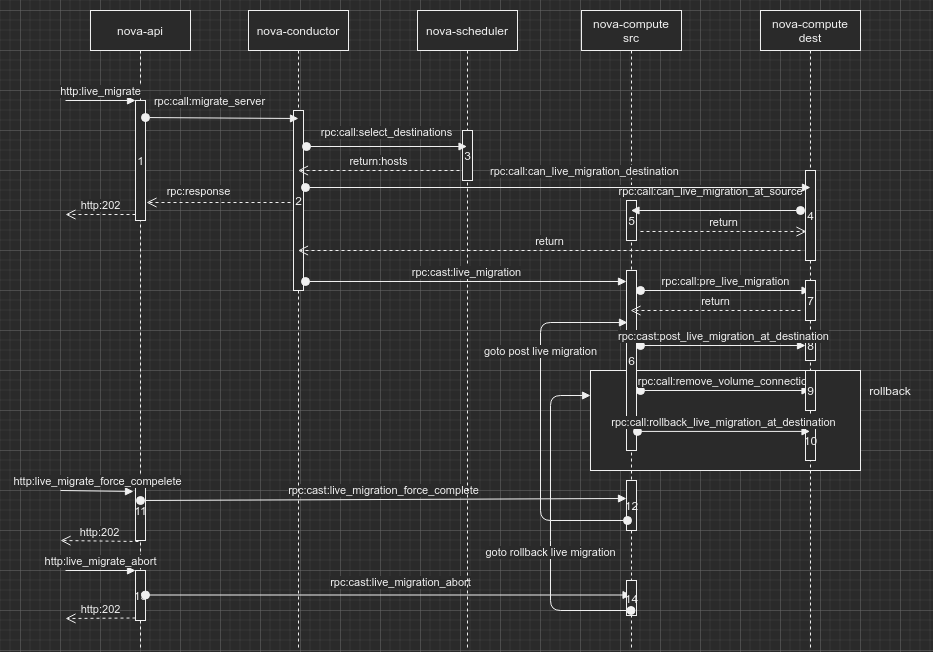
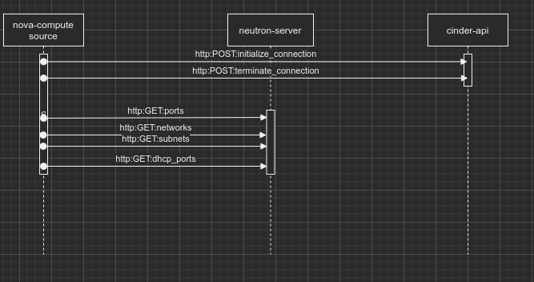
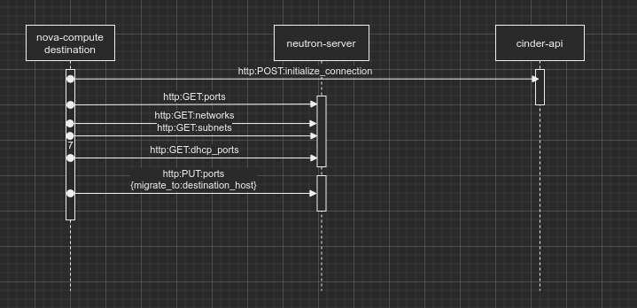
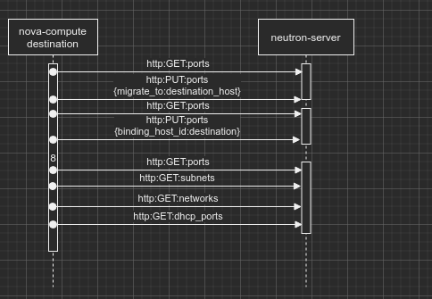

### [API](https://docs.openstack.org/api-ref/compute/?expanded=live-migrate-server-os-migratelive-action-detail#live-migrate-server-os-migratelive-action)

>/servers/{server_id}/action

Live-migrates a server to a new host without rebooting.

Specify the os-migrateLive action in the request body.

Use the host parameter to specify the destination host. If this param is null, the scheduler chooses a host. If a scheduled host is not suitable to do migration, the scheduler tries up to migrate_max_retries rescheduling attempts.

Starting from API version 2.25, the block_migration parameter could be to auto so that nova can decide value of block_migration during live migration.

Policy defaults enable only users with the administrative role to perform this operation. Cloud providers can change these permissions through the policy.json file.

Starting from REST API version 2.34 pre-live-migration checks are done asynchronously, results of these checks are available in instance-actions. Nova responds immediately, and no pre-live-migration checks are returned. The instance will not immediately change state to ERROR, if a failure of the live-migration checks occurs.

Starting from API version 2.68, the force parameter is no longer accepted as this could not be meaningfully supported by servers with complex resource allocations.

Normal response codes: 202

Error response codes: badRequest(400), unauthorized(401), forbidden(403) itemNotFound(404), conflict(409)

**Example Live-Migrate Server (os-migrateLive Action)**
```
{
    "os-migrateLive": {
        "host": "01c0cadef72d47e28a672a76060d492c",
        "block_migration": "auto",
        "force": false
    }
}
```

### Overview



### Workflow

**This is bases on Newton**


**1 nova-api(nova.compute.api.API.live_migrate)**
* check vm_state in [active, puased]
* save instance task_state to **migrating**
* get request_spec
* check force and destination host name
* rpc cast **live_migrate_instance(async)** to nova-conductor if api version > 2.34 else rpc call **migrate_server(sync)**  **goto 2**

**2 nova-conductor**
* check instance is active
* check source host is up
* without destination
  * rpc call nova-scheduler select destination hosts **goto 3**
  * check destination host compatible with source hypervisor
  * rpc call destination nova-compute to check can live migration destination **goto 4**
* with destination
  * check destination is not source
  * check destination nova-compute host is up
  * check destination has enough memory
  * check destination host compatible with source hypervisor
  * rpc call destination nova-compute to check can live migration destination **goto 4**
* rpc cast source nova-compute to live migrate instance **goto 6**

**3 nova-scheduler**
* select destination hosts

**4 nova-compute destination(nova.compute.mananger.ComputeManager.check_can_live_migration_destination)**
* driver check can live migrate at destination
  * compare cpu
  * create share storage test file
* rpc call source nova-compute to check can live migration at source **goto 5**
* driver cleanup live migration destination check
  * cleanup share storage test file

Logs:
```
2019-12-16 16:05:28.175 10895 DEBUG oslo_messaging._drivers.amqpdriver [req-353f3f0b-522c-44cc-ba00-2f8f22225219 6c3c0761000f423780b2d1cbf4459dc5 a899ce15f11740ab864a57b888163d3a - - -] CALL msg_id: e3c1fa25f98f4d049c9e96059d6b78c5 exchange 'nova' topic 'conductor' _send /usr/lib/python2.7/site-packages/oslo_messaging/_drivers/amqpdriver.py:568
2019-12-16 16:05:28.200 10895 DEBUG oslo_messaging._drivers.amqpdriver [req-353f3f0b-522c-44cc-ba00-2f8f22225219 6c3c0761000f423780b2d1cbf4459dc5 a899ce15f11740ab864a57b888163d3a - - -] CALL msg_id: 0c8eb1fba91a4b8d836a25a4fe025a9c exchange 'nova' topic 'conductor' _send /usr/lib/python2.7/site-packages/oslo_messaging/_drivers/amqpdriver.py:568
2019-12-16 16:05:28.232 10895 DEBUG oslo_messaging._drivers.amqpdriver [req-353f3f0b-522c-44cc-ba00-2f8f22225219 6c3c0761000f423780b2d1cbf4459dc5 a899ce15f11740ab864a57b888163d3a - - -] CALL msg_id: 295056904aa24c4aaea7cbe5cef200b4 exchange 'nova' topic 'conductor' _send /usr/lib/python2.7/site-packages/oslo_messaging/_drivers/amqpdriver.py:568
2019-12-16 16:05:28.264 10895 DEBUG nova.objects.instance [req-353f3f0b-522c-44cc-ba00-2f8f22225219 6c3c0761000f423780b2d1cbf4459dc5 a899ce15f11740ab864a57b888163d3a - - -] Lazy-loading 'vcpu_model' on Instance uuid 25a38456-409e-45c3-a878-ad63e052edad obj_load_attr /usr/lib/python2.7/site-packages/nova/objects/instance.py:1013
2019-12-16 16:05:28.265 10895 DEBUG oslo_messaging._drivers.amqpdriver [req-353f3f0b-522c-44cc-ba00-2f8f22225219 6c3c0761000f423780b2d1cbf4459dc5 a899ce15f11740ab864a57b888163d3a - - -] CALL msg_id: 01612ad0cdd84e76862d813326cac085 exchange 'nova' topic 'conductor' _send /usr/lib/python2.7/site-packages/oslo_messaging/_drivers/amqpdriver.py:568
2019-12-16 16:05:28.284 10895 INFO nova.virt.libvirt.driver [req-353f3f0b-522c-44cc-ba00-2f8f22225219 6c3c0761000f423780b2d1cbf4459dc5 a899ce15f11740ab864a57b888163d3a - - -] Instance launched has CPU info: {"vendor": "Intel", "model": "Broadwell", "arch": "x86_64", "features": ["pge", "avx", "xsaveopt", "clflush", "sep", "rtm", "tsc_adjust", "vme", "dtes64", "invpcid", "tsc", "fsgsbase", "xsave", "smap", "bmi2", "vmx", "erms", "xtpr", "cmov", "hle", "smep", "pcid", "est", "pat", "monitor", "smx", "pbe", "lm", "msr", "adx", "3dnowprefetch", "nx", "fxsr", "syscall", "tm", "sse4.1", "pae", "sse4.2", "pclmuldq", "acpi", "fma", "pni", "tsc-deadline", "popcnt", "mmx", "osxsave", "cx8", "mce", "de", "rdtscp", "ht", "dca", "lahf_lm", "abm", "rdseed", "pdcm", "mca", "pdpe1gb", "mbm_local", "sse", "f16c", "pse", "ds", "invtsc", "mbm_total", "tm2", "avx2", "aes", "sse2", "ss", "ds_cpl", "arat", "bmi1", "apic", "ssse3", "fpu", "cx16", "pse36", "mtrr", "movbe", "rdrand", "cmt", "x2apic"], "topology": {"cores": 10, "cells": 2, "threads": 2, "sockets": 1}}
2019-12-16 16:05:28.285 10895 DEBUG nova.virt.libvirt.driver [req-353f3f0b-522c-44cc-ba00-2f8f22225219 6c3c0761000f423780b2d1cbf4459dc5 a899ce15f11740ab864a57b888163d3a - - -] [instance: 25a38456-409e-45c3-a878-ad63e052edad] cpu compare xml: <cpu>
2019-12-16 16:05:28.288 10895 DEBUG nova.virt.libvirt.driver [req-353f3f0b-522c-44cc-ba00-2f8f22225219 6c3c0761000f423780b2d1cbf4459dc5 a899ce15f11740ab864a57b888163d3a - - -] [instance: 25a38456-409e-45c3-a878-ad63e052edad] Creating tmpfile /var/lib/nova/instances/tmpF1uj8T to notify to other compute nodes that they should mount the same storage. _create_shared_storage_test_file /usr/lib/python2.7/site-packages/nova/virt/libvirt/driver.py:5988
2019-12-16 16:05:28.288 10895 DEBUG nova.compute.manager [req-353f3f0b-522c-44cc-ba00-2f8f22225219 6c3c0761000f423780b2d1cbf4459dc5 a899ce15f11740ab864a57b888163d3a - - -] destination check data is LibvirtLiveMigrateData(bdms=<?>,block_migration=<?>,disk_available_mb=11421696,disk_over_commit=<?>,filename='tmpF1uj8T',graphics_listen_addr_spice=<?>,graphics_listen_addr_vnc=<?>,image_type='rbd',instance_relative_path=<?>,is_shared_block_storage=<?>,is_shared_instance_path=<?>,is_volume_backed=<?>,migration=<?>,serial_listen_addr=None,serial_listen_ports=<?>,supported_perf_events=<?>,target_connect_addr=<?>) _do_check_can_live_migrate_destination /usr/lib/python2.7/site-packages/nova/compute/manager.py:5197
2019-12-16 16:05:28.289 10895 DEBUG oslo_messaging._drivers.amqpdriver [req-353f3f0b-522c-44cc-ba00-2f8f22225219 6c3c0761000f423780b2d1cbf4459dc5 a899ce15f11740ab864a57b888163d3a - - -] CALL msg_id: 0ccac8ce01484cddb5efb1caa5eb2e18 exchange 'nova' topic 'conductor' _send /usr/lib/python2.7/site-packages/oslo_messaging/_drivers/amqpdriver.py:568
2019-12-16 16:05:28.311 10895 DEBUG oslo_messaging._drivers.amqpdriver [req-353f3f0b-522c-44cc-ba00-2f8f22225219 6c3c0761000f423780b2d1cbf4459dc5 a899ce15f11740ab864a57b888163d3a - - -] CALL msg_id: a255b02d58ea47a18220104697a87dc2 exchange 'nova' topic 'compute.node-1.domain.tld' _send /usr/lib/python2.7/site-packages/oslo_messaging/_drivers/amqpdriver.py:568
2019-12-16 16:05:28.398 10895 DEBUG oslo_messaging._drivers.amqpdriver [req-353f3f0b-522c-44cc-ba00-2f8f22225219 6c3c0761000f423780b2d1cbf4459dc5 a899ce15f11740ab864a57b888163d3a - - -] CALL msg_id: c9a4173898974f20bae83ddd118a8354 exchange 'nova' topic 'conductor' _send /usr/lib/python2.7/site-packages/oslo_messaging/_drivers/amqpdriver.py:568
2019-12-16 16:05:28.419 10895 DEBUG oslo_messaging._drivers.amqpdriver [req-353f3f0b-522c-44cc-ba00-2f8f22225219 6c3c0761000f423780b2d1cbf4459dc5 a899ce15f11740ab864a57b888163d3a - - -] sending reply msg_id: 94a7f86dab2c4b63836c75882a4215e1 reply queue: reply_606df9f0ee504f0ca4c2c6b4b2c93f37 time elapsed: 0.250252461992s _send_reply /usr/lib/python2.7/site-packages/oslo_messaging/_drivers/amqpdriver.py:142
2019-12-16 16:05:33.693 10895 DEBUG oslo_messaging._drivers.amqpdriver [req-353f3f0b-522c-44cc-ba00-2f8f22225219 6c3c0761000f423780b2d1cbf4459dc5 a899ce15f11740ab864a57b888163d3a - - -] CALL msg_id: 6e30a11685e34aacb83de2ca4b13d75b exchange 'nova' topic 'conductor' _send /usr/lib/python2.7/site-packages/oslo_messaging/_drivers/amqpdriver.py:568
```


**5 nova-compute source(nova.compute.mananger.ComputeManager.check_can_live_migrate_source)**
* check is volume backend instance
* driver check can live migrate at source
  * check share storage test file
  * check is share storage block
  * check destination host has enough disk if block migrate

Logs:
```
2019-12-16 16:05:28.320 14120 DEBUG oslo_messaging._drivers.amqpdriver [req-353f3f0b-522c-44cc-ba00-2f8f22225219 6c3c0761000f423780b2d1cbf4459dc5 a899ce15f11740ab864a57b888163d3a - - -] CALL msg_id: e7ad539d036c45deb00cffdc65d21885 exchange 'nova' topic 'conductor' _send /usr/lib/python2.7/site-packages/oslo_messaging/_drivers/amqpdriver.py:568
2019-12-16 16:05:28.338 14120 DEBUG oslo_messaging._drivers.amqpdriver [req-353f3f0b-522c-44cc-ba00-2f8f22225219 6c3c0761000f423780b2d1cbf4459dc5 a899ce15f11740ab864a57b888163d3a - - -] CALL msg_id: ae5d674c03f9463eacc8e18f94b03ae4 exchange 'nova' topic 'conductor' _send /usr/lib/python2.7/site-packages/oslo_messaging/_drivers/amqpdriver.py:568
2019-12-16 16:05:28.358 14120 DEBUG oslo_messaging._drivers.amqpdriver [req-353f3f0b-522c-44cc-ba00-2f8f22225219 6c3c0761000f423780b2d1cbf4459dc5 a899ce15f11740ab864a57b888163d3a - - -] CALL msg_id: 2def2a59dd494d1e96c01989ab0765a1 exchange 'nova' topic 'conductor' _send /usr/lib/python2.7/site-packages/oslo_messaging/_drivers/amqpdriver.py:568
2019-12-16 16:05:28.375 14120 DEBUG nova.virt.libvirt.driver [req-353f3f0b-522c-44cc-ba00-2f8f22225219 6c3c0761000f423780b2d1cbf4459dc5 a899ce15f11740ab864a57b888163d3a - - -] [instance: 25a38456-409e-45c3-a878-ad63e052edad] Check if temp file /var/lib/nova/instances/tmpF1uj8T exists to indicate shared storage is being used for migration. Exists? False _check_shared_storage_test_file /usr/lib/python2.7/site-packages/nova/virt/libvirt/driver.py:6012
2019-12-16 16:05:28.375 14120 DEBUG nova.compute.manager [req-353f3f0b-522c-44cc-ba00-2f8f22225219 6c3c0761000f423780b2d1cbf4459dc5 a899ce15f11740ab864a57b888163d3a - - -] source check data is LibvirtLiveMigrateData(bdms=<?>,block_migration=False,disk_available_mb=11421696,disk_over_commit=<?>,filename='tmpF1uj8T',graphics_listen_addr_spice=<?>,graphics_listen_addr_vnc=<?>,image_type='rbd',instance_relative_path='25a38456-409e-45c3-a878-ad63e052edad',is_shared_block_storage=True,is_shared_instance_path=False,is_volume_backed=False,migration=<?>,serial_listen_addr=None,serial_listen_ports=<?>,supported_perf_events=<?>,target_connect_addr=<?>) check_can_live_migrate_source /usr/lib/python2.7/site-packages/nova/compute/manager.py:5239
2019-12-16 16:05:28.376 14120 DEBUG oslo_messaging._drivers.amqpdriver [req-353f3f0b-522c-44cc-ba00-2f8f22225219 6c3c0761000f423780b2d1cbf4459dc5 a899ce15f11740ab864a57b888163d3a - - -] CALL msg_id: b746e273f85c42448cd04f8c09f884f9 exchange 'nova' topic 'conductor' _send /usr/lib/python2.7/site-packages/oslo_messaging/_drivers/amqpdriver.py:568
2019-12-16 16:05:28.395 14120 DEBUG oslo_messaging._drivers.amqpdriver [req-353f3f0b-522c-44cc-ba00-2f8f22225219 6c3c0761000f423780b2d1cbf4459dc5 a899ce15f11740ab864a57b888163d3a - - -] sending reply msg_id: a255b02d58ea47a18220104697a87dc2 reply queue: reply_d5869c151c324e2eaccd5bfe2dbdb66e time elapsed: 0.0800202729879s _send_reply /usr/lib/python2.7/site-packages/oslo_messaging/_drivers/amqpdriver.py:142

```

---

**6 nova-compute source(nova.compute.mananger.ComputeManager.live_migration)**



* save migration status to "queued"
* save migration status to "preparing"
* rpc call destination nova-compute to do pre_live_migration **goto 7**
* save migration status to "running"
* driver live migration
  * get instance guest domain
  * copy live migration disks if block migration
  * set libvirt max live migration speed to 1
  * spawn a green thread to do live migration operation
    * **call libvirt migrate to start live migration**
  * wait neutron vif_plugged_complete event
  * live migrate monitor
    * start a loop to get libvirt live migrate job info and check if live migration completed
    * call post method if job completed -> **post live migration**
    * call recover method if job cancelled or failed -> **rollback live migration**
* post live migration
  * driver post live migration
    * call cinder api to initialize volume connection
    * disconnect volumes
  * call cinder api to terminate volume connection
  * call network api to get instance network info
  * notify about instnace usage "compute.instance.live_migration._post.start"
  * driver unfilter instance
  * call network api migrate instance start
  * driver post migration at source
    * unplug vifs
  * rpc cast post live migration at destination **goto 8**
  * get live migration cleanup flags
  * driver cleanup
    * unfilter instances
    * call libvirt destory instance if its power is not shutdown
    * disconnect volumes
    * call libvirt undefine domain
  * clear events for instance
  * update available resource
  * update scheduler instance info
  * clean instance console token
  * save migration status to "completed"
* rollback live migration
  * save instance **task_state to None**
  * call network api to setup network on source host
  * rpc call destination nova-compute remove volume connection **goto 9**
  * notify about instance usage "compute.instance._rollback.start"
  * get live migration cleanup flags
  * rpc cast rollback live migration at destination **goto 10**
  * notify about instance usage "compute.instance._rollback.end"
  * save migration status to "error" or "cancelled"

Logs:
```
2019-12-16 16:05:28.452 14120 DEBUG oslo_messaging._drivers.amqpdriver [req-353f3f0b-522c-44cc-ba00-2f8f22225219 6c3c0761000f423780b2d1cbf4459dc5 a899ce15f11740ab864a57b888163d3a - - -] CALL msg_id: 11babfd418b04ae3accaef30faf225c3 exchange 'nova' topic 'conductor' _send /usr/lib/python2.7/site-packages/oslo_messaging/_drivers/amqpdriver.py:568
2019-12-16 16:05:28.470 14120 DEBUG oslo_messaging._drivers.amqpdriver [req-353f3f0b-522c-44cc-ba00-2f8f22225219 6c3c0761000f423780b2d1cbf4459dc5 a899ce15f11740ab864a57b888163d3a - - -] CALL msg_id: e154749ccfd042c9840a0f91bd3219d4 exchange 'nova' topic 'conductor' _send /usr/lib/python2.7/site-packages/oslo_messaging/_drivers/amqpdriver.py:568
2019-12-16 16:05:28.490 14120 DEBUG oslo_messaging._drivers.amqpdriver [req-353f3f0b-522c-44cc-ba00-2f8f22225219 6c3c0761000f423780b2d1cbf4459dc5 a899ce15f11740ab864a57b888163d3a - - -] CALL msg_id: 8c56275c79664fc3acda6787b760a1f2 exchange 'nova' topic 'conductor' _send /usr/lib/python2.7/site-packages/oslo_messaging/_drivers/amqpdriver.py:568
2019-12-16 16:05:28.493 14120 DEBUG oslo_messaging._drivers.amqpdriver [req-353f3f0b-522c-44cc-ba00-2f8f22225219 6c3c0761000f423780b2d1cbf4459dc5 a899ce15f11740ab864a57b888163d3a - - -] CALL msg_id: c6596e7cb35144a5b7aa9338b183f8ab exchange 'nova' topic 'conductor' _send /usr/lib/python2.7/site-packages/oslo_messaging/_drivers/amqpdriver.py:568
2019-12-16 16:05:28.525 14120 DEBUG oslo_messaging._drivers.amqpdriver [req-353f3f0b-522c-44cc-ba00-2f8f22225219 6c3c0761000f423780b2d1cbf4459dc5 a899ce15f11740ab864a57b888163d3a - - -] CALL msg_id: a5dd994289ad4b6787c30dc9fb00bf00 exchange 'nova' topic 'conductor' _send /usr/lib/python2.7/site-packages/oslo_messaging/_drivers/amqpdriver.py:568
2019-12-16 16:05:28.553 14120 DEBUG nova.compute.manager [req-353f3f0b-522c-44cc-ba00-2f8f22225219 6c3c0761000f423780b2d1cbf4459dc5 a899ce15f11740ab864a57b888163d3a - - -] pre_live_migration for alcubierre. _do_live_migration /usr/lib/python2.7/site-packages/nova/compute/manager.py:5333
2019-12-16 16:05:28.554 14120 DEBUG nova.virt.libvirt.driver [req-353f3f0b-522c-44cc-ba00-2f8f22225219 6c3c0761000f423780b2d1cbf4459dc5 a899ce15f11740ab864a57b888163d3a - - -] [instance: 25a38456-409e-45c3-a878-ad63e052edad] pre live migration volumes for alcubierre. pre_live_migration_at_source /usr/lib/python2.7/site-packages/nova/virt/libvirt/driver.py:6968
2019-12-16 16:05:28.554 14120 DEBUG nova.virt.libvirt.volume.alcubierre [req-353f3f0b-522c-44cc-ba00-2f8f22225219 6c3c0761000f423780b2d1cbf4459dc5 a899ce15f11740ab864a57b888163d3a - - -] calling os-brick to pre live migrate Alcubierre Volume pre_live_migration /usr/lib/python2.7/site-packages/nova/virt/libvirt/volume/alcubierre.py:88
2019-12-16 16:05:28.554 14120 DEBUG os_brick.initiator.connectors.alcubierres [req-353f3f0b-522c-44cc-ba00-2f8f22225219 6c3c0761000f423780b2d1cbf4459dc5 a899ce15f11740ab864a57b888163d3a - - -] ==> pre_live_migration: call {'args': (<os_brick.initiator.connectors.alcubierres.LibvirtAlcubierreVolumeDriver object at 0x6eb4bd0>, {u'password': u'alcubierre', u'device_path': u'/dev/escache80', u'rbd_ceph_conf': u'/tmp/ceph-alcubierre.conf', u'volume_id': u'00c01457-65bb-4d83-9411-3b3e97208542', u'discache_wait_times': 30, u'host': u'node-1.domain.tld', u'qos_specs': None, u'encrypted': False, u'user': u'admin', u'namespaces': u'alcubierre', u'volume_name': u'00c01457-65bb-4d83-9411-3b3e97208542', u'access_mode': u'rw', u'rest_api_url': u'http://alcubierre-manager-%s.ceph.svc.cluster.local:3141', u'pool': u'volumes'}), 'kwargs': {}} trace_logging_wrapper /usr/lib/python2.7/site-packages/os_brick/utils.py:141
2019-12-16 16:05:28.555 14120 DEBUG oslo_concurrency.lockutils [req-353f3f0b-522c-44cc-ba00-2f8f22225219 6c3c0761000f423780b2d1cbf4459dc5 a899ce15f11740ab864a57b888163d3a - - -] Lock "pre_live_migration" acquired by "os_brick.initiator.connectors.alcubierres.pre_live_migration" :: waited 0.000s inner /usr/lib/python2.7/site-packages/oslo_concurrency/lockutils.py:270
2019-12-16 16:05:33.452 14120 INFO os_brick.initiator.connectors.alcubierres [req-353f3f0b-522c-44cc-ba00-2f8f22225219 6c3c0761000f423780b2d1cbf4459dc5 a899ce15f11740ab864a57b888163d3a - - -] Wait for the cache to be cleared, the numberof remaining times: 29.
2019-12-16 16:05:33.665 14120 DEBUG oslo_concurrency.lockutils [req-353f3f0b-522c-44cc-ba00-2f8f22225219 6c3c0761000f423780b2d1cbf4459dc5 a899ce15f11740ab864a57b888163d3a - - -] Lock "pre_live_migration" released by "os_brick.initiator.connectors.alcubierres.pre_live_migration" :: held 5.110s inner /usr/lib/python2.7/site-packages/oslo_concurrency/lockutils.py:282
2019-12-16 16:05:33.665 14120 DEBUG os_brick.initiator.connectors.alcubierres [req-353f3f0b-522c-44cc-ba00-2f8f22225219 6c3c0761000f423780b2d1cbf4459dc5 a899ce15f11740ab864a57b888163d3a - - -] <== pre_live_migration: return (5109ms) None trace_logging_wrapper /usr/lib/python2.7/site-packages/os_brick/utils.py:165
2019-12-16 16:05:33.666 14120 DEBUG oslo_messaging._drivers.amqpdriver [req-353f3f0b-522c-44cc-ba00-2f8f22225219 6c3c0761000f423780b2d1cbf4459dc5 a899ce15f11740ab864a57b888163d3a - - -] CALL msg_id: 205002c501494dd5b3d144f055811053 exchange 'nova' topic 'conductor' _send /usr/lib/python2.7/site-packages/oslo_messaging/_drivers/amqpdriver.py:568
2019-12-16 16:05:33.687 14120 DEBUG oslo_messaging._drivers.amqpdriver [req-353f3f0b-522c-44cc-ba00-2f8f22225219 6c3c0761000f423780b2d1cbf4459dc5 a899ce15f11740ab864a57b888163d3a - - -] CALL msg_id: b3b7ee8789be408897ca5b27299814a0 exchange 'nova' topic 'compute.node-3.domain.tld' _send /usr/lib/python2.7/site-packages/oslo_messaging/_drivers/amqpdriver.py:568
2019-12-16 16:05:37.910 14120 DEBUG oslo_messaging._drivers.amqpdriver [req-353f3f0b-522c-44cc-ba00-2f8f22225219 6c3c0761000f423780b2d1cbf4459dc5 a899ce15f11740ab864a57b888163d3a - - -] CALL msg_id: e3b0b1675cc54c38a1d5d1d904982a0a exchange 'nova' topic 'conductor' _send /usr/lib/python2.7/site-packages/oslo_messaging/_drivers/amqpdriver.py:568
2019-12-16 16:05:37.928 14120 DEBUG nova.compute.manager [req-353f3f0b-522c-44cc-ba00-2f8f22225219 6c3c0761000f423780b2d1cbf4459dc5 a899ce15f11740ab864a57b888163d3a - - -] live_migration data is LibvirtLiveMigrateData(bdms=[LibvirtLiveMigrateBDMInfo],block_migration=False,disk_available_mb=11421696,disk_over_commit=<?>,filename='tmpF1uj8T',graphics_listen_addr_spice=127.0.0.1,graphics_listen_addr_vnc=0.0.0.0,image_type='rbd',instance_relative_path='25a38456-409e-45c3-a878-ad63e052edad',is_shared_block_storage=True,is_shared_instance_path=False,is_volume_backed=False,migration=Migration(90),serial_listen_addr='127.0.0.1',serial_listen_ports=[],supported_perf_events=[],target_connect_addr=None) _do_live_migration /usr/lib/python2.7/site-packages/nova/compute/manager.py:5354
2019-12-16 16:05:37.931 14120 DEBUG nova.virt.libvirt.driver [req-353f3f0b-522c-44cc-ba00-2f8f22225219 6c3c0761000f423780b2d1cbf4459dc5 a899ce15f11740ab864a57b888163d3a - - -] Slow the migration process (Pausing) until Nova receives network events indicating everything is setup. (default: 107) _live_migration /usr/lib/python2.7/site-packages/nova/virt/libvirt/driver.py:6655
2019-12-16 16:05:37.933 14120 DEBUG nova.compute.manager [req-353f3f0b-522c-44cc-ba00-2f8f22225219 6c3c0761000f423780b2d1cbf4459dc5 a899ce15f11740ab864a57b888163d3a - - -] [instance: 25a38456-409e-45c3-a878-ad63e052edad] Preparing to wait for external event network-vif-plugged-9c29ae4c-4aaa-4449-841b-6f93421959fc prepare_for_instance_event /usr/lib/python2.7/site-packages/nova/compute/manager.py:329
2019-12-16 16:05:37.934 14120 DEBUG oslo_concurrency.lockutils [req-353f3f0b-522c-44cc-ba00-2f8f22225219 6c3c0761000f423780b2d1cbf4459dc5 a899ce15f11740ab864a57b888163d3a - - -] Lock "25a38456-409e-45c3-a878-ad63e052edad-events" acquired by "nova.compute.manager._create_or_get_event" :: waited 0.000s inner /usr/lib/python2.7/site-packages/oslo_concurrency/lockutils.py:270
2019-12-16 16:05:37.934 14120 DEBUG oslo_concurrency.lockutils [req-353f3f0b-522c-44cc-ba00-2f8f22225219 6c3c0761000f423780b2d1cbf4459dc5 a899ce15f11740ab864a57b888163d3a - - -] Lock "25a38456-409e-45c3-a878-ad63e052edad-events" released by "nova.compute.manager._create_or_get_event" :: held 0.000s inner /usr/lib/python2.7/site-packages/oslo_concurrency/lockutils.py:282
2019-12-16 16:05:37.934 14120 DEBUG nova.virt.libvirt.driver [req-353f3f0b-522c-44cc-ba00-2f8f22225219 6c3c0761000f423780b2d1cbf4459dc5 a899ce15f11740ab864a57b888163d3a - - -] [instance: 25a38456-409e-45c3-a878-ad63e052edad] Waiting for VIFs plugged events: [('network-vif-plugged', u'9c29ae4c-4aaa-4449-841b-6f93421959fc')] _live_migration /usr/lib/python2.7/site-packages/nova/virt/libvirt/driver.py:6692
2019-12-16 16:05:37.972 14120 DEBUG nova.virt.libvirt.migration [req-353f3f0b-522c-44cc-ba00-2f8f22225219 6c3c0761000f423780b2d1cbf4459dc5 a899ce15f11740ab864a57b888163d3a - - -] Find same serial number: pos=1, serial=00c01457-65bb-4d83-9411-3b3e97208542 _update_volume_xml /usr/lib/python2.7/site-packages/nova/virt/libvirt/migration.py:157
2019-12-16 16:05:40.551 14120 DEBUG nova.virt.libvirt.driver [req-353f3f0b-522c-44cc-ba00-2f8f22225219 6c3c0761000f423780b2d1cbf4459dc5 a899ce15f11740ab864a57b888163d3a - - -] [instance: 25a38456-409e-45c3-a878-ad63e052edad] VIFs events received, continuing migration, bandwidth: 107 _live_migration /usr/lib/python2.7/site-packages/nova/virt/libvirt/driver.py:6700
2019-12-16 16:05:40.553 14120 DEBUG nova.virt.libvirt.driver [req-353f3f0b-522c-44cc-ba00-2f8f22225219 6c3c0761000f423780b2d1cbf4459dc5 a899ce15f11740ab864a57b888163d3a - - -] [instance: 25a38456-409e-45c3-a878-ad63e052edad] Starting monitoring of live migration _live_migration /usr/lib/python2.7/site-packages/nova/virt/libvirt/driver.py:6710
2019-12-16 16:05:40.553 14120 DEBUG nova.objects.instance [req-353f3f0b-522c-44cc-ba00-2f8f22225219 6c3c0761000f423780b2d1cbf4459dc5 a899ce15f11740ab864a57b888163d3a - - -] Lazy-loading 'flavor' on Instance uuid 25a38456-409e-45c3-a878-ad63e052edad obj_load_attr /usr/lib/python2.7/site-packages/nova/objects/instance.py:1013
2019-12-16 16:05:40.554 14120 DEBUG oslo_messaging._drivers.amqpdriver [req-353f3f0b-522c-44cc-ba00-2f8f22225219 6c3c0761000f423780b2d1cbf4459dc5 a899ce15f11740ab864a57b888163d3a - - -] CALL msg_id: 49fa2bcc8f9b463e8280e63e137c36a7 exchange 'nova' topic 'conductor' _send /usr/lib/python2.7/site-packages/oslo_messaging/_drivers/amqpdriver.py:568
2019-12-16 16:05:40.670 14120 DEBUG nova.virt.libvirt.migration [req-353f3f0b-522c-44cc-ba00-2f8f22225219 6c3c0761000f423780b2d1cbf4459dc5 a899ce15f11740ab864a57b888163d3a - - -] [instance: 25a38456-409e-45c3-a878-ad63e052edad] Current None elapsed 0 steps [(0, 46), (150, 47), (300, 48), (450, 51), (600, 57), (750, 66), (900, 84), (1050, 117), (1200, 179), (1350, 291), (1500, 500)] update_downtime /usr/lib/python2.7/site-packages/nova/virt/libvirt/migration.py:343
2019-12-16 16:05:40.671 14120 INFO nova.virt.libvirt.migration [req-353f3f0b-522c-44cc-ba00-2f8f22225219 6c3c0761000f423780b2d1cbf4459dc5 a899ce15f11740ab864a57b888163d3a - - -] [instance: 25a38456-409e-45c3-a878-ad63e052edad] Increasing downtime to 46 ms after 0 sec elapsed time
2019-12-16 16:05:40.673 14120 DEBUG oslo_messaging._drivers.amqpdriver [req-353f3f0b-522c-44cc-ba00-2f8f22225219 6c3c0761000f423780b2d1cbf4459dc5 a899ce15f11740ab864a57b888163d3a - - -] CALL msg_id: 7e02c184ea36468da41cb3f0819fc297 exchange 'nova' topic 'conductor' _send /usr/lib/python2.7/site-packages/oslo_messaging/_drivers/amqpdriver.py:568
2019-12-16 16:05:40.696 14120 DEBUG oslo_messaging._drivers.amqpdriver [req-353f3f0b-522c-44cc-ba00-2f8f22225219 6c3c0761000f423780b2d1cbf4459dc5 a899ce15f11740ab864a57b888163d3a - - -] CALL msg_id: 3b5894c86fbf4424a63a8e2f1de8fe82 exchange 'nova' topic 'conductor' _send /usr/lib/python2.7/site-packages/oslo_messaging/_drivers/amqpdriver.py:568
2019-12-16 16:05:41.099 14120 INFO nova.virt.libvirt.driver [req-353f3f0b-522c-44cc-ba00-2f8f22225219 6c3c0761000f423780b2d1cbf4459dc5 a899ce15f11740ab864a57b888163d3a - - -] [instance: 25a38456-409e-45c3-a878-ad63e052edad] Migration running for 0 secs, memory 98% remaining; (bytes processed=7755671, remaining=545390592, total=554508288)
2019-12-16 16:05:41.601 14120 DEBUG nova.virt.libvirt.migration [req-353f3f0b-522c-44cc-ba00-2f8f22225219 6c3c0761000f423780b2d1cbf4459dc5 a899ce15f11740ab864a57b888163d3a - - -] [instance: 25a38456-409e-45c3-a878-ad63e052edad] Current 46 elapsed 0 steps [(0, 46), (150, 47), (300, 48), (450, 51), (600, 57), (750, 66), (900, 84), (1050, 117), (1200, 179), (1350, 291), (1500, 500)] update_downtime /usr/lib/python2.7/site-packages/nova/virt/libvirt/migration.py:343
2019-12-16 16:05:41.601 14120 DEBUG nova.virt.libvirt.migration [req-353f3f0b-522c-44cc-ba00-2f8f22225219 6c3c0761000f423780b2d1cbf4459dc5 a899ce15f11740ab864a57b888163d3a - - -] [instance: 25a38456-409e-45c3-a878-ad63e052edad] Downtime does not need to change update_downtime /usr/lib/python2.7/site-packages/nova/virt/libvirt/migration.py:355
2019-12-16 16:05:42.103 14120 DEBUG nova.virt.libvirt.migration [req-353f3f0b-522c-44cc-ba00-2f8f22225219 6c3c0761000f423780b2d1cbf4459dc5 a899ce15f11740ab864a57b888163d3a - - -] [instance: 25a38456-409e-45c3-a878-ad63e052edad] Current 46 elapsed 1 steps [(0, 46), (150, 47), (300, 48), (450, 51), (600, 57), (750, 66), (900, 84), (1050, 117), (1200, 179), (1350, 291), (1500, 500)] update_downtime /usr/lib/python2.7/site-packages/nova/virt/libvirt/migration.py:343
2019-12-16 16:05:42.103 14120 DEBUG nova.virt.libvirt.migration [req-353f3f0b-522c-44cc-ba00-2f8f22225219 6c3c0761000f423780b2d1cbf4459dc5 a899ce15f11740ab864a57b888163d3a - - -] [instance: 25a38456-409e-45c3-a878-ad63e052edad] Downtime does not need to change update_downtime /usr/lib/python2.7/site-packages/nova/virt/libvirt/migration.py:355
2019-12-16 16:05:42.605 14120 DEBUG nova.virt.libvirt.migration [req-353f3f0b-522c-44cc-ba00-2f8f22225219 6c3c0761000f423780b2d1cbf4459dc5 a899ce15f11740ab864a57b888163d3a - - -] [instance: 25a38456-409e-45c3-a878-ad63e052edad] Current 46 elapsed 1 steps [(0, 46), (150, 47), (300, 48), (450, 51), (600, 57), (750, 66), (900, 84), (1050, 117), (1200, 179), (1350, 291), (1500, 500)] update_downtime /usr/lib/python2.7/site-packages/nova/virt/libvirt/migration.py:343
2019-12-16 16:05:42.606 14120 DEBUG nova.virt.libvirt.migration [req-353f3f0b-522c-44cc-ba00-2f8f22225219 6c3c0761000f423780b2d1cbf4459dc5 a899ce15f11740ab864a57b888163d3a - - -] [instance: 25a38456-409e-45c3-a878-ad63e052edad] Downtime does not need to change update_downtime /usr/lib/python2.7/site-packages/nova/virt/libvirt/migration.py:355
2019-12-16 16:05:43.108 14120 DEBUG nova.virt.libvirt.migration [req-353f3f0b-522c-44cc-ba00-2f8f22225219 6c3c0761000f423780b2d1cbf4459dc5 a899ce15f11740ab864a57b888163d3a - - -] [instance: 25a38456-409e-45c3-a878-ad63e052edad] Current 46 elapsed 2 steps [(0, 46), (150, 47), (300, 48), (450, 51), (600, 57), (750, 66), (900, 84), (1050, 117), (1200, 179), (1350, 291), (1500, 500)] update_downtime /usr/lib/python2.7/site-packages/nova/virt/libvirt/migration.py:343
2019-12-16 16:05:43.108 14120 DEBUG nova.virt.libvirt.migration [req-353f3f0b-522c-44cc-ba00-2f8f22225219 6c3c0761000f423780b2d1cbf4459dc5 a899ce15f11740ab864a57b888163d3a - - -] [instance: 25a38456-409e-45c3-a878-ad63e052edad] Downtime does not need to change update_downtime /usr/lib/python2.7/site-packages/nova/virt/libvirt/migration.py:355
2019-12-16 16:05:43.440 14120 DEBUG nova.virt.libvirt.driver [req-353f3f0b-522c-44cc-ba00-2f8f22225219 6c3c0761000f423780b2d1cbf4459dc5 a899ce15f11740ab864a57b888163d3a - - -] [instance: 25a38456-409e-45c3-a878-ad63e052edad] Migration operation thread has finished _live_migration_operation /usr/lib/python2.7/site-packages/nova/virt/libvirt/driver.py:6306
2019-12-16 16:05:43.440 14120 DEBUG nova.virt.libvirt.driver [req-353f3f0b-522c-44cc-ba00-2f8f22225219 6c3c0761000f423780b2d1cbf4459dc5 a899ce15f11740ab864a57b888163d3a - - -] [instance: 25a38456-409e-45c3-a878-ad63e052edad] Migration operation thread notification thread_finished /usr/lib/python2.7/site-packages/nova/virt/libvirt/driver.py:6669
2019-12-16 16:05:43.609 14120 DEBUG nova.virt.libvirt.guest [req-353f3f0b-522c-44cc-ba00-2f8f22225219 6c3c0761000f423780b2d1cbf4459dc5 a899ce15f11740ab864a57b888163d3a - - -] Domain has shutdown/gone away: Domain not found: no domain with matching uuid '25a38456-409e-45c3-a878-ad63e052edad' (instance-00000035) get_job_info /usr/lib/python2.7/site-packages/nova/virt/libvirt/guest.py:680
2019-12-16 16:05:43.610 14120 INFO nova.virt.libvirt.driver [req-353f3f0b-522c-44cc-ba00-2f8f22225219 6c3c0761000f423780b2d1cbf4459dc5 a899ce15f11740ab864a57b888163d3a - - -] [instance: 25a38456-409e-45c3-a878-ad63e052edad] Migration operation has completed
2019-12-16 16:05:43.610 14120 INFO nova.compute.manager [req-353f3f0b-522c-44cc-ba00-2f8f22225219 6c3c0761000f423780b2d1cbf4459dc5 a899ce15f11740ab864a57b888163d3a - - -] [instance: 25a38456-409e-45c3-a878-ad63e052edad] _post_live_migration() is started..
2019-12-16 16:05:43.612 14120 DEBUG oslo_messaging._drivers.amqpdriver [req-353f3f0b-522c-44cc-ba00-2f8f22225219 6c3c0761000f423780b2d1cbf4459dc5 a899ce15f11740ab864a57b888163d3a - - -] CALL msg_id: a3f6347e2b5b4c2891df95398cc67634 exchange 'nova' topic 'conductor' _send /usr/lib/python2.7/site-packages/oslo_messaging/_drivers/amqpdriver.py:568
2019-12-16 16:05:43.635 14120 DEBUG os_brick.utils [req-353f3f0b-522c-44cc-ba00-2f8f22225219 6c3c0761000f423780b2d1cbf4459dc5 a899ce15f11740ab864a57b888163d3a - - -] ==> get_connector_properties: call {'execute': None, 'my_ip': '192.168.10.3', 'enforce_multipath': True, 'host': 'node-1.domain.tld', 'root_helper': 'sudo nova-rootwrap /etc/nova/rootwrap.conf', 'multipath': False} trace_logging_wrapper /usr/lib/python2.7/site-packages/os_brick/utils.py:141
2019-12-16 16:05:43.672 14120 DEBUG os_brick.utils [req-353f3f0b-522c-44cc-ba00-2f8f22225219 6c3c0761000f423780b2d1cbf4459dc5 a899ce15f11740ab864a57b888163d3a - - -] <== get_connector_properties: return (35ms) {'initiator': u'iqn.1994-05.com.redhat:cfd82a7ae936', 'ip': u'192.168.10.3', 'platform': u'x86_64', 'host': u'node-1.domain.tld', 'do_local_attach': False, 'os_type': u'linux2', 'multipath': False} trace_logging_wrapper /usr/lib/python2.7/site-packages/os_brick/utils.py:165
2019-12-16 16:05:43.674 14120 DEBUG cinderclient.v2.client [req-353f3f0b-522c-44cc-ba00-2f8f22225219 6c3c0761000f423780b2d1cbf4459dc5 a899ce15f11740ab864a57b888163d3a - - -] REQ: curl -g -i -X POST http://cinder-api.openstack.svc.cluster.local:8776/v2/a899ce15f11740ab864a57b888163d3a/volumes/00c01457-65bb-4d83-9411-3b3e97208542/action -H "User-Agent: python-cinderclient" -H "Content-Type: application/json" -H "Accept: application/json" -H "X-Auth-Token: {SHA1}90ca70bf15db07b67a749e7cb862663d2719293e" -d '{"os-initialize_connection": {"connector": {"platform": "x86_64", "host": "node-1.domain.tld", "do_local_attach": false, "ip": "192.168.10.3", "os_type": "linux2", "multipath": false, "initiator": "iqn.1994-05.com.redhat:cfd82a7ae936"}}}' _http_log_request /usr/lib/python2.7/site-packages/keystoneauth1/session.py:342
2019-12-16 16:05:43.792 14120 DEBUG cinderclient.v2.client [req-353f3f0b-522c-44cc-ba00-2f8f22225219 6c3c0761000f423780b2d1cbf4459dc5 a899ce15f11740ab864a57b888163d3a - - -] RESP: [200] X-Compute-Request-Id: req-fc10ec01-3aef-4abe-a673-315b99df9ca1 Content-Type: application/json Content-Length: 503 X-Openstack-Request-Id: req-fc10ec01-3aef-4abe-a673-315b99df9ca1 Date: Mon, 16 Dec 2019 08:05:43 GMT Connection: keep-alive 
2019-12-16 16:05:43.793 14120 DEBUG cinderclient.client [req-353f3f0b-522c-44cc-ba00-2f8f22225219 6c3c0761000f423780b2d1cbf4459dc5 a899ce15f11740ab864a57b888163d3a - - -] POST call to cinder for http://cinder-api.openstack.svc.cluster.local:8776/v2/a899ce15f11740ab864a57b888163d3a/volumes/00c01457-65bb-4d83-9411-3b3e97208542/action used request id req-fc10ec01-3aef-4abe-a673-315b99df9ca1 _log_request_id /usr/lib/python2.7/site-packages/cinderclient/client.py:95
2019-12-16 16:05:43.793 14120 DEBUG nova.virt.libvirt.volume.alcubierre [req-353f3f0b-522c-44cc-ba00-2f8f22225219 6c3c0761000f423780b2d1cbf4459dc5 a899ce15f11740ab864a57b888163d3a - - -] calling os-brick to detach Alcubierre Volume disconnect_volume /usr/lib/python2.7/site-packages/nova/virt/libvirt/volume/alcubierre.py:72
2019-12-16 16:05:43.793 14120 DEBUG os_brick.initiator.connectors.alcubierres [req-353f3f0b-522c-44cc-ba00-2f8f22225219 6c3c0761000f423780b2d1cbf4459dc5 a899ce15f11740ab864a57b888163d3a - - -] ==> post_live_migration: call {'args': (<os_brick.initiator.connectors.alcubierres.LibvirtAlcubierreVolumeDriver object at 0x6eb4bd0>, {u'access_mode': u'rw', u'rbd_ceph_conf': u'/tmp/ceph-alcubierre.conf', u'volume_name': u'00c01457-65bb-4d83-9411-3b3e97208542', u'discache_wait_times': 30, u'host': u'node-1.domain.tld', u'qos_specs': None, u'encrypted': False, u'user': u'admin', u'namespaces': u'alcubierre', u'volume_id': u'00c01457-65bb-4d83-9411-3b3e97208542', u'password': u'alcubierre', u'rest_api_url': u'http://alcubierre-manager-%s.ceph.svc.cluster.local:3141', u'pool': u'volumes'}), 'kwargs': {}} trace_logging_wrapper /usr/lib/python2.7/site-packages/os_brick/utils.py:141
2019-12-16 16:05:43.794 14120 DEBUG oslo_concurrency.lockutils [req-353f3f0b-522c-44cc-ba00-2f8f22225219 6c3c0761000f423780b2d1cbf4459dc5 a899ce15f11740ab864a57b888163d3a - - -] Lock "post_live_migration" acquired by "os_brick.initiator.connectors.alcubierres.post_live_migration" :: waited 0.000s inner /usr/lib/python2.7/site-packages/oslo_concurrency/lockutils.py:270
2019-12-16 16:05:46.314 14120 DEBUG oslo_concurrency.lockutils [req-353f3f0b-522c-44cc-ba00-2f8f22225219 6c3c0761000f423780b2d1cbf4459dc5 a899ce15f11740ab864a57b888163d3a - - -] Lock "post_live_migration" released by "os_brick.initiator.connectors.alcubierres.post_live_migration" :: held 2.520s inner /usr/lib/python2.7/site-packages/oslo_concurrency/lockutils.py:282
2019-12-16 16:05:46.315 14120 DEBUG os_brick.initiator.connectors.alcubierres [req-353f3f0b-522c-44cc-ba00-2f8f22225219 6c3c0761000f423780b2d1cbf4459dc5 a899ce15f11740ab864a57b888163d3a - - -] <== post_live_migration: return (2520ms) None trace_logging_wrapper /usr/lib/python2.7/site-packages/os_brick/utils.py:165
2019-12-16 16:05:46.315 14120 DEBUG nova.virt.libvirt.volume.alcubierre [req-353f3f0b-522c-44cc-ba00-2f8f22225219 6c3c0761000f423780b2d1cbf4459dc5 a899ce15f11740ab864a57b888163d3a - - -] Disconnected Alcubierre Volume vdb disconnect_volume /usr/lib/python2.7/site-packages/nova/virt/libvirt/volume/alcubierre.py:82
2019-12-16 16:05:46.315 14120 DEBUG os_brick.utils [req-353f3f0b-522c-44cc-ba00-2f8f22225219 6c3c0761000f423780b2d1cbf4459dc5 a899ce15f11740ab864a57b888163d3a - - -] ==> get_connector_properties: call {'execute': None, 'my_ip': '192.168.10.3', 'enforce_multipath': True, 'host': 'node-1.domain.tld', 'root_helper': 'sudo nova-rootwrap /etc/nova/rootwrap.conf', 'multipath': False} trace_logging_wrapper /usr/lib/python2.7/site-packages/os_brick/utils.py:141
2019-12-16 16:05:46.353 14120 DEBUG os_brick.utils [req-353f3f0b-522c-44cc-ba00-2f8f22225219 6c3c0761000f423780b2d1cbf4459dc5 a899ce15f11740ab864a57b888163d3a - - -] <== get_connector_properties: return (36ms) {'initiator': u'iqn.1994-05.com.redhat:cfd82a7ae936', 'ip': u'192.168.10.3', 'platform': u'x86_64', 'host': u'node-1.domain.tld', 'do_local_attach': False, 'os_type': u'linux2', 'multipath': False} trace_logging_wrapper /usr/lib/python2.7/site-packages/os_brick/utils.py:165
2019-12-16 16:05:46.354 14120 DEBUG cinderclient.v2.client [req-353f3f0b-522c-44cc-ba00-2f8f22225219 6c3c0761000f423780b2d1cbf4459dc5 a899ce15f11740ab864a57b888163d3a - - -] REQ: curl -g -i -X POST http://cinder-api.openstack.svc.cluster.local:8776/v2/a899ce15f11740ab864a57b888163d3a/volumes/00c01457-65bb-4d83-9411-3b3e97208542/action -H "User-Agent: python-cinderclient" -H "Content-Type: application/json" -H "Accept: application/json" -H "X-Auth-Token: {SHA1}90ca70bf15db07b67a749e7cb862663d2719293e" -d '{"os-terminate_connection": {"connector": {"platform": "x86_64", "host": "node-1.domain.tld", "do_local_attach": false, "ip": "192.168.10.3", "os_type": "linux2", "multipath": false, "initiator": "iqn.1994-05.com.redhat:cfd82a7ae936"}}}' _http_log_request /usr/lib/python2.7/site-packages/keystoneauth1/session.py:342
2019-12-16 16:05:46.534 14120 DEBUG cinderclient.v2.client [req-353f3f0b-522c-44cc-ba00-2f8f22225219 6c3c0761000f423780b2d1cbf4459dc5 a899ce15f11740ab864a57b888163d3a - - -] RESP: [202] Content-Type: text/html; charset=UTF-8 Content-Length: 0 X-Openstack-Request-Id: req-dcf88d32-b0fc-405a-9068-0b6c0ec825ae Date: Mon, 16 Dec 2019 08:05:46 GMT Connection: keep-alive 
2019-12-16 16:05:46.534 14120 DEBUG cinderclient.client [req-353f3f0b-522c-44cc-ba00-2f8f22225219 6c3c0761000f423780b2d1cbf4459dc5 a899ce15f11740ab864a57b888163d3a - - -] POST call to cinder for http://cinder-api.openstack.svc.cluster.local:8776/v2/a899ce15f11740ab864a57b888163d3a/volumes/00c01457-65bb-4d83-9411-3b3e97208542/action used request id req-dcf88d32-b0fc-405a-9068-0b6c0ec825ae _log_request_id /usr/lib/python2.7/site-packages/cinderclient/client.py:95
2019-12-16 16:05:46.535 14120 DEBUG oslo_concurrency.lockutils [req-353f3f0b-522c-44cc-ba00-2f8f22225219 6c3c0761000f423780b2d1cbf4459dc5 a899ce15f11740ab864a57b888163d3a - - -] Acquired semaphore "refresh_cache-25a38456-409e-45c3-a878-ad63e052edad" lock /usr/lib/python2.7/site-packages/oslo_concurrency/lockutils.py:212
2019-12-16 16:05:46.535 14120 DEBUG nova.network.neutronv2.api [req-353f3f0b-522c-44cc-ba00-2f8f22225219 6c3c0761000f423780b2d1cbf4459dc5 a899ce15f11740ab864a57b888163d3a - - -] [instance: 25a38456-409e-45c3-a878-ad63e052edad] _get_instance_nw_info() _get_instance_nw_info /usr/lib/python2.7/site-packages/nova/network/neutronv2/api.py:1336
2019-12-16 16:05:46.536 14120 DEBUG oslo_messaging._drivers.amqpdriver [req-353f3f0b-522c-44cc-ba00-2f8f22225219 6c3c0761000f423780b2d1cbf4459dc5 a899ce15f11740ab864a57b888163d3a - - -] CALL msg_id: f9da6e84d1ce47ffa594ebe221d51b14 exchange 'nova' topic 'conductor' _send /usr/lib/python2.7/site-packages/oslo_messaging/_drivers/amqpdriver.py:568
2019-12-16 16:05:46.620 14120 DEBUG neutronclient.v2_0.client [req-353f3f0b-522c-44cc-ba00-2f8f22225219 6c3c0761000f423780b2d1cbf4459dc5 a899ce15f11740ab864a57b888163d3a - - -] GET call to neutron for http://neutron-server.openstack.svc.cluster.local:9696/v2.0/ports.json?tenant_id=d183fc1cd70a4705a30a7d5b47ee1900&device_id=25a38456-409e-45c3-a878-ad63e052edad used request id req-8ba7feb0-037e-44d8-9689-106a41d44de5 _append_request_id /usr/lib/python2.7/site-packages/neutronclient/v2_0/client.py:128
2019-12-16 16:05:46.714 14120 DEBUG neutronclient.v2_0.client [req-353f3f0b-522c-44cc-ba00-2f8f22225219 6c3c0761000f423780b2d1cbf4459dc5 a899ce15f11740ab864a57b888163d3a - - -] GET call to neutron for http://neutron-server.openstack.svc.cluster.local:9696/v2.0/networks.json?id=e37206ff-e59a-4b6c-8784-c7b5827b6291 used request id req-47b37cc7-5bd7-4667-ad73-588664bb82d3 _append_request_id /usr/lib/python2.7/site-packages/neutronclient/v2_0/client.py:128
2019-12-16 16:05:46.734 14120 DEBUG neutronclient.v2_0.client [req-353f3f0b-522c-44cc-ba00-2f8f22225219 6c3c0761000f423780b2d1cbf4459dc5 a899ce15f11740ab864a57b888163d3a - - -] GET call to neutron for http://neutron-server.openstack.svc.cluster.local:9696/v2.0/floatingips.json?fixed_ip_address=192.168.111.12&port_id=9c29ae4c-4aaa-4449-841b-6f93421959fc used request id req-aee4ddb4-9f44-43cf-b55f-17dc805e8f25 _append_request_id /usr/lib/python2.7/site-packages/neutronclient/v2_0/client.py:128
2019-12-16 16:05:46.809 14120 DEBUG neutronclient.v2_0.client [req-353f3f0b-522c-44cc-ba00-2f8f22225219 6c3c0761000f423780b2d1cbf4459dc5 a899ce15f11740ab864a57b888163d3a - - -] GET call to neutron for http://neutron-server.openstack.svc.cluster.local:9696/v2.0/subnets.json?id=312fc6e1-e5d0-4587-bcdf-60f13fadfcfb used request id req-240c0c03-faf4-48d9-ba2c-549e89695ef9 _append_request_id /usr/lib/python2.7/site-packages/neutronclient/v2_0/client.py:128
2019-12-16 16:05:46.872 14120 DEBUG neutronclient.v2_0.client [req-353f3f0b-522c-44cc-ba00-2f8f22225219 6c3c0761000f423780b2d1cbf4459dc5 a899ce15f11740ab864a57b888163d3a - - -] GET call to neutron for http://neutron-server.openstack.svc.cluster.local:9696/v2.0/ports.json?network_id=e37206ff-e59a-4b6c-8784-c7b5827b6291&device_owner=network%3Adhcp used request id req-18b941d5-14ac-42a3-bbeb-baec044294c7 _append_request_id /usr/lib/python2.7/site-packages/neutronclient/v2_0/client.py:128
2019-12-16 16:05:46.873 14120 DEBUG nova.network.base_api [req-353f3f0b-522c-44cc-ba00-2f8f22225219 6c3c0761000f423780b2d1cbf4459dc5 a899ce15f11740ab864a57b888163d3a - - -] [instance: 25a38456-409e-45c3-a878-ad63e052edad] Updating instance_info_cache with network_info: [{"profile": {"migrating_to": "node-3.domain.tld"}, "ovs_interfaceid": "9c29ae4c-4aaa-4449-841b-6f93421959fc", "preserve_on_delete": false, "network": {"bridge": "br-int", "subnets": [{"ips": [{"meta": {}, "version": 4, "type": "fixed", "floating_ips": [], "address": "192.168.111.12"}], "version": 4, "meta": {"dhcp_server": "192.168.111.3"}, "dns": [{"meta": {}, "version": 4, "type": "dns", "address": "8.8.4.4"}, {"meta": {}, "version": 4, "type": "dns", "address": "8.8.8.8"}], "routes": [], "cidr": "192.168.111.0/24", "gateway": {"meta": {}, "version": 4, "type": "gateway", "address": "192.168.111.1"}}], "meta": {"injected": false, "tenant_id": "d183fc1cd70a4705a30a7d5b47ee1900", "vmware_neutron_vlan": 2081, "vmware_neutron_bridge": "vlan-2081", "mtu": 1500}, "id": "e37206ff-e59a-4b6c-8784-c7b5827b6291", "label": "share_net"}, "devname": "tap9c29ae4c-4a", "vnic_type": "normal", "qbh_params": null, "meta": {}, "details": {"port_filter": true, "ovs_hybrid_plug": false}, "address": "fa:16:3e:80:41:c0", "active": false, "type": "ovs", "id": "9c29ae4c-4aaa-4449-841b-6f93421959fc", "qbg_params": null}] update_instance_cache_with_nw_info /usr/lib/python2.7/site-packages/nova/network/base_api.py:43
2019-12-16 16:05:46.874 14120 DEBUG oslo_messaging._drivers.amqpdriver [req-353f3f0b-522c-44cc-ba00-2f8f22225219 6c3c0761000f423780b2d1cbf4459dc5 a899ce15f11740ab864a57b888163d3a - - -] CALL msg_id: 294ab09c34d24ebf8a17d9b4e24d4c1e exchange 'nova' topic 'conductor' _send /usr/lib/python2.7/site-packages/oslo_messaging/_drivers/amqpdriver.py:568
2019-12-16 16:05:46.907 14120 DEBUG oslo_concurrency.lockutils [req-353f3f0b-522c-44cc-ba00-2f8f22225219 6c3c0761000f423780b2d1cbf4459dc5 a899ce15f11740ab864a57b888163d3a - - -] Releasing semaphore "refresh_cache-25a38456-409e-45c3-a878-ad63e052edad" lock /usr/lib/python2.7/site-packages/oslo_concurrency/lockutils.py:225
2019-12-16 16:05:46.908 14120 DEBUG oslo_messaging._drivers.amqpdriver [req-353f3f0b-522c-44cc-ba00-2f8f22225219 6c3c0761000f423780b2d1cbf4459dc5 a899ce15f11740ab864a57b888163d3a - - -] CAST unique_id: 5e4f1dc95cf44d07bd6fb5df4d882107 NOTIFY exchange 'nova' topic 'notifications.info' _send /usr/lib/python2.7/site-packages/oslo_messaging/_drivers/amqpdriver.py:552
2019-12-16 16:05:46.911 14120 DEBUG nova.compute.manager [req-353f3f0b-522c-44cc-ba00-2f8f22225219 6c3c0761000f423780b2d1cbf4459dc5 a899ce15f11740ab864a57b888163d3a - - -] [instance: 25a38456-409e-45c3-a878-ad63e052edad] Calling driver.unfilter_instance from _post_live_migration _post_live_migration /usr/lib/python2.7/site-packages/nova/compute/manager.py:5549
2019-12-16 16:05:46.911 14120 DEBUG nova.virt.libvirt.vif [req-353f3f0b-522c-44cc-ba00-2f8f22225219 6c3c0761000f423780b2d1cbf4459dc5 a899ce15f11740ab864a57b888163d3a - - -] vif_type=ovs instance=Instance(access_ip_v4=None,access_ip_v6=None,architecture=None,auto_disk_config=True,availability_zone='nova',cell_name=None,cleaned=False,config_drive='',created_at=2019-12-12T08:40:48Z,default_ephemeral_device=None,default_swap_device=None,deleted=False,deleted_at=None,device_metadata=<?>,disable_terminate=False,display_description='test_alcubierre',display_name='test_alcubierre',ec2_ids=<?>,ephemeral_gb=0,ephemeral_key_uuid=None,fault=<?>,flavor=Flavor(4),host='node-1.domain.tld',hostname='test-alcubierre',id=53,image_ref='f36c071e-fa22-4b34-85fe-d9311acc4605',info_cache=InstanceInfoCache,instance_type_id=4,kernel_id='',key_data=None,key_name=None,keypairs=<?>,launch_index=0,launched_at=2019-12-12T08:42:23Z,launched_on='node-3.domain.tld',locked=False,locked_by=None,memory_mb=512,metadata={resizeOrMigrate='migrate'},migration_context=<?>,new_flavor=None,node='node-1.domain.tld',numa_topology=<?>,old_flavor=None,os_type=None,pci_devices=<?>,pci_requests=<?>,power_state=1,progress=2,project_id='d183fc1cd70a4705a30a7d5b47ee1900',ramdisk_id='',reservation_id='r-gckkxvpg',root_device_name='/dev/vda',root_gb=20,security_groups=SecurityGroupList,services=<?>,shutdown_terminate=False,system_metadata={image_base_image_ref='f36c071e-fa22-4b34-85fe-d9311acc4605',image_container_format='bare',image_disk_format='qcow2',image_min_disk='20',image_min_ram='0',memory_max='512',vcpus_max='1'},tags=<?>,task_state='migrating',terminated_at=None,updated_at=2019-12-16T08:05:27Z,user_data='Q29udGVudC1UeXBlOiB0ZXh0L3BsYWluOyBjaGFyc2V0PSJ1cy1hc2NpaSIKTUlNRS1WZXJzaW9uOiAxLjAKQ29udGVudC1UcmFuc2Zlci1FbmNvZGluZzogN2JpdAoKI2Nsb3VkLWNvbmZpZwpjaHBhc3N3ZDoKICBsaXN0OiB8CiAgICByb290OjEKICBleHBpcmU6IGZhbHNl',user_id='342df7d966e04e25bab78899cbf41aee',uuid=25a38456-409e-45c3-a878-ad63e052edad,vcpu_model=<?>,vcpus=1,vm_mode=None,vm_state='active') vif={"profile": {"migrating_to": "node-3.domain.tld"}, "ovs_interfaceid": "9c29ae4c-4aaa-4449-841b-6f93421959fc", "preserve_on_delete": false, "network": {"bridge": "br-int", "subnets": [{"ips": [{"version": 4, "vif_mac": "fa:16:3e:80:41:c0", "floating_ips": [], "label": "share_net", "meta": {}, "address": "192.168.111.12", "type": "fixed"}], "version": 4, "meta": {"dhcp_server": "192.168.111.3"}, "dns": [{"meta": {}, "version": 4, "type": "dns", "address": "8.8.4.4"}, {"meta": {}, "version": 4, "type": "dns", "address": "8.8.8.8"}], "routes": [], "cidr": "192.168.111.0/24", "gateway": {"meta": {}, "version": 4, "type": "gateway", "address": "192.168.111.1"}}], "meta": {"injected": false, "tenant_id": "d183fc1cd70a4705a30a7d5b47ee1900", "vmware_neutron_vlan": 2081, "vmware_neutron_bridge": "vlan-2081", "mtu": 1500}, "id": "e37206ff-e59a-4b6c-8784-c7b5827b6291", "label": "share_net"}, "devname": "tap9c29ae4c-4a", "vnic_type": "normal", "qbh_params": null, "meta": {}, "details": {"port_filter": true, "ovs_hybrid_plug": false}, "address": "fa:16:3e:80:41:c0", "active": false, "type": "ovs", "id": "9c29ae4c-4aaa-4449-841b-6f93421959fc", "qbg_params": null} unplug /usr/lib/python2.7/site-packages/nova/virt/libvirt/vif.py:1044
2019-12-16 16:05:46.912 14120 DEBUG nova.network.os_vif_util [req-353f3f0b-522c-44cc-ba00-2f8f22225219 6c3c0761000f423780b2d1cbf4459dc5 a899ce15f11740ab864a57b888163d3a - - -] Converting VIF {"profile": {"migrating_to": "node-3.domain.tld"}, "ovs_interfaceid": "9c29ae4c-4aaa-4449-841b-6f93421959fc", "preserve_on_delete": false, "network": {"bridge": "br-int", "subnets": [{"ips": [{"version": 4, "vif_mac": "fa:16:3e:80:41:c0", "floating_ips": [], "label": "share_net", "meta": {}, "address": "192.168.111.12", "type": "fixed"}], "version": 4, "meta": {"dhcp_server": "192.168.111.3"}, "dns": [{"meta": {}, "version": 4, "type": "dns", "address": "8.8.4.4"}, {"meta": {}, "version": 4, "type": "dns", "address": "8.8.8.8"}], "routes": [], "cidr": "192.168.111.0/24", "gateway": {"meta": {}, "version": 4, "type": "gateway", "address": "192.168.111.1"}}], "meta": {"injected": false, "tenant_id": "d183fc1cd70a4705a30a7d5b47ee1900", "vmware_neutron_vlan": 2081, "vmware_neutron_bridge": "vlan-2081", "mtu": 1500}, "id": "e37206ff-e59a-4b6c-8784-c7b5827b6291", "label": "share_net"}, "devname": "tap9c29ae4c-4a", "vnic_type": "normal", "qbh_params": null, "meta": {}, "details": {"port_filter": true, "ovs_hybrid_plug": false}, "address": "fa:16:3e:80:41:c0", "active": false, "type": "ovs", "id": "9c29ae4c-4aaa-4449-841b-6f93421959fc", "qbg_params": null} nova_to_osvif_vif /usr/lib/python2.7/site-packages/nova/network/os_vif_util.py:362
2019-12-16 16:05:46.913 14120 DEBUG nova.network.os_vif_util [req-353f3f0b-522c-44cc-ba00-2f8f22225219 6c3c0761000f423780b2d1cbf4459dc5 a899ce15f11740ab864a57b888163d3a - - -] Converted object VIFOpenVSwitch(active=False,address=fa:16:3e:80:41:c0,bridge_name='br-int',has_traffic_filtering=True,id=9c29ae4c-4aaa-4449-841b-6f93421959fc,network=Network(e37206ff-e59a-4b6c-8784-c7b5827b6291),plugin='ovs',port_profile=VIFPortProfileBase,preserve_on_delete=False,vif_name='tap9c29ae4c-4a') nova_to_osvif_vif /usr/lib/python2.7/site-packages/nova/network/os_vif_util.py:374
2019-12-16 16:05:46.914 14120 DEBUG os_vif [req-353f3f0b-522c-44cc-ba00-2f8f22225219 6c3c0761000f423780b2d1cbf4459dc5 a899ce15f11740ab864a57b888163d3a - - -] Unplugging vif VIFOpenVSwitch(active=False,address=fa:16:3e:80:41:c0,bridge_name='br-int',has_traffic_filtering=True,id=9c29ae4c-4aaa-4449-841b-6f93421959fc,network=Network(e37206ff-e59a-4b6c-8784-c7b5827b6291),plugin='ovs',port_profile=VIFPortProfileBase,preserve_on_delete=False,vif_name='tap9c29ae4c-4a') unplug /usr/lib/python2.7/site-packages/os_vif/__init__.py:109
2019-12-16 16:05:46.914 14120 INFO os_vif [req-353f3f0b-522c-44cc-ba00-2f8f22225219 6c3c0761000f423780b2d1cbf4459dc5 a899ce15f11740ab864a57b888163d3a - - -] Successfully unplugged vif VIFOpenVSwitch(active=False,address=fa:16:3e:80:41:c0,bridge_name='br-int',has_traffic_filtering=True,id=9c29ae4c-4aaa-4449-841b-6f93421959fc,network=Network(e37206ff-e59a-4b6c-8784-c7b5827b6291),plugin='ovs',port_profile=VIFPortProfileBase,preserve_on_delete=False,vif_name='tap9c29ae4c-4a')
2019-12-16 16:05:46.915 14120 DEBUG oslo_messaging._drivers.amqpdriver [req-353f3f0b-522c-44cc-ba00-2f8f22225219 6c3c0761000f423780b2d1cbf4459dc5 a899ce15f11740ab864a57b888163d3a - - -] CALL msg_id: ce8fc46deb974571a6a907271c3b47f9 exchange 'nova' topic 'conductor' _send /usr/lib/python2.7/site-packages/oslo_messaging/_drivers/amqpdriver.py:568
2019-12-16 16:05:46.947 14120 DEBUG oslo_messaging._drivers.amqpdriver [req-353f3f0b-522c-44cc-ba00-2f8f22225219 6c3c0761000f423780b2d1cbf4459dc5 a899ce15f11740ab864a57b888163d3a - - -] CAST unique_id: d4acc9eaf682431baf3475d3cd603df8 exchange 'nova' topic 'compute.node-3.domain.tld' _send /usr/lib/python2.7/site-packages/oslo_messaging/_drivers/amqpdriver.py:568
2019-12-16 16:05:46.950 14120 DEBUG nova.compute.manager [req-353f3f0b-522c-44cc-ba00-2f8f22225219 6c3c0761000f423780b2d1cbf4459dc5 a899ce15f11740ab864a57b888163d3a - - -] [instance: 25a38456-409e-45c3-a878-ad63e052edad] Calling driver.cleanup from _post_live_migration _post_live_migration /usr/lib/python2.7/site-packages/nova/compute/manager.py:5580
2019-12-16 16:05:46.950 14120 DEBUG oslo_concurrency.processutils [req-353f3f0b-522c-44cc-ba00-2f8f22225219 6c3c0761000f423780b2d1cbf4459dc5 a899ce15f11740ab864a57b888163d3a - - -] Running cmd (subprocess): mv /var/lib/nova/instances/25a38456-409e-45c3-a878-ad63e052edad /var/lib/nova/instances/25a38456-409e-45c3-a878-ad63e052edad_del execute /usr/lib/python2.7/site-packages/oslo_concurrency/processutils.py:349
2019-12-16 16:05:46.972 14120 DEBUG oslo_concurrency.processutils [req-353f3f0b-522c-44cc-ba00-2f8f22225219 6c3c0761000f423780b2d1cbf4459dc5 a899ce15f11740ab864a57b888163d3a - - -] CMD "mv /var/lib/nova/instances/25a38456-409e-45c3-a878-ad63e052edad /var/lib/nova/instances/25a38456-409e-45c3-a878-ad63e052edad_del" returned: 0 in 0.022s execute /usr/lib/python2.7/site-packages/oslo_concurrency/processutils.py:379
2019-12-16 16:05:46.973 14120 INFO nova.virt.libvirt.driver [req-353f3f0b-522c-44cc-ba00-2f8f22225219 6c3c0761000f423780b2d1cbf4459dc5 a899ce15f11740ab864a57b888163d3a - - -] [instance: 25a38456-409e-45c3-a878-ad63e052edad] Deleting instance files /var/lib/nova/instances/25a38456-409e-45c3-a878-ad63e052edad_del
2019-12-16 16:05:46.974 14120 INFO nova.virt.libvirt.driver [req-353f3f0b-522c-44cc-ba00-2f8f22225219 6c3c0761000f423780b2d1cbf4459dc5 a899ce15f11740ab864a57b888163d3a - - -] [instance: 25a38456-409e-45c3-a878-ad63e052edad] Deletion of /var/lib/nova/instances/25a38456-409e-45c3-a878-ad63e052edad_del complete
2019-12-16 16:05:46.977 14120 DEBUG oslo_messaging._drivers.amqpdriver [req-353f3f0b-522c-44cc-ba00-2f8f22225219 6c3c0761000f423780b2d1cbf4459dc5 a899ce15f11740ab864a57b888163d3a - - -] CALL msg_id: d9d47c468fd84d3081b7bab4c6ea6f52 exchange 'nova' topic 'conductor' _send /usr/lib/python2.7/site-packages/oslo_messaging/_drivers/amqpdriver.py:568
2019-12-16 16:05:47.065 14120 DEBUG oslo_concurrency.lockutils [req-353f3f0b-522c-44cc-ba00-2f8f22225219 6c3c0761000f423780b2d1cbf4459dc5 a899ce15f11740ab864a57b888163d3a - - -] Lock "25a38456-409e-45c3-a878-ad63e052edad-events" acquired by "nova.compute.manager._clear_events" :: waited 0.000s inner /usr/lib/python2.7/site-packages/oslo_concurrency/lockutils.py:270
2019-12-16 16:05:47.066 14120 DEBUG oslo_concurrency.lockutils [req-353f3f0b-522c-44cc-ba00-2f8f22225219 6c3c0761000f423780b2d1cbf4459dc5 a899ce15f11740ab864a57b888163d3a - - -] Lock "25a38456-409e-45c3-a878-ad63e052edad-events" released by "nova.compute.manager._clear_events" :: held 0.000s inner /usr/lib/python2.7/site-packages/oslo_concurrency/lockutils.py:282
2019-12-16 16:05:47.067 14120 DEBUG oslo_messaging._drivers.amqpdriver [req-353f3f0b-522c-44cc-ba00-2f8f22225219 6c3c0761000f423780b2d1cbf4459dc5 a899ce15f11740ab864a57b888163d3a - - -] CALL msg_id: dd2e5f9cf27146be86d2ee214dc94c7f exchange 'nova' topic 'conductor' _send /usr/lib/python2.7/site-packages/oslo_messaging/_drivers/amqpdriver.py:568
2019-12-16 16:05:47.087 14120 INFO nova.compute.resource_tracker [req-353f3f0b-522c-44cc-ba00-2f8f22225219 6c3c0761000f423780b2d1cbf4459dc5 a899ce15f11740ab864a57b888163d3a - - -] Auditing locally available compute resources for node node-1.domain.tld
2019-12-16 16:05:47.126 14120 DEBUG oslo_messaging._drivers.amqpdriver [req-353f3f0b-522c-44cc-ba00-2f8f22225219 6c3c0761000f423780b2d1cbf4459dc5 a899ce15f11740ab864a57b888163d3a - - -] CALL msg_id: 1ae3cddb818149f4870705ccdac5b0e0 exchange 'nova' topic 'conductor' _send /usr/lib/python2.7/site-packages/oslo_messaging/_drivers/amqpdriver.py:568
2019-12-16 16:05:47.163 14120 DEBUG oslo_messaging._drivers.amqpdriver [req-353f3f0b-522c-44cc-ba00-2f8f22225219 6c3c0761000f423780b2d1cbf4459dc5 a899ce15f11740ab864a57b888163d3a - - -] CALL msg_id: b70c31fec0ee4cc1bffde7b7eed39f9c exchange 'nova' topic 'conductor' _send /usr/lib/python2.7/site-packages/oslo_messaging/_drivers/amqpdriver.py:568
2019-12-16 16:05:47.186 14120 DEBUG nova.virt.libvirt.driver [req-353f3f0b-522c-44cc-ba00-2f8f22225219 6c3c0761000f423780b2d1cbf4459dc5 a899ce15f11740ab864a57b888163d3a - - -] skipping disk for instance-00000010 as it does not have a path _get_instance_disk_info /usr/lib/python2.7/site-packages/nova/virt/libvirt/driver.py:7199
2019-12-16 16:05:47.187 14120 DEBUG nova.virt.libvirt.driver [req-353f3f0b-522c-44cc-ba00-2f8f22225219 6c3c0761000f423780b2d1cbf4459dc5 a899ce15f11740ab864a57b888163d3a - - -] skipping disk /dev/escache64 (vdb) as it is a volume _get_instance_disk_info /usr/lib/python2.7/site-packages/nova/virt/libvirt/driver.py:7208
2019-12-16 16:05:47.187 14120 DEBUG oslo_concurrency.processutils [req-353f3f0b-522c-44cc-ba00-2f8f22225219 6c3c0761000f423780b2d1cbf4459dc5 a899ce15f11740ab864a57b888163d3a - - -] Running cmd (subprocess): sudo nova-rootwrap /etc/nova/rootwrap.conf blockdev --getsize64 /dev/escache128 execute /usr/lib/python2.7/site-packages/oslo_concurrency/processutils.py:349
2019-12-16 16:05:47.281 14120 DEBUG oslo_concurrency.processutils [req-353f3f0b-522c-44cc-ba00-2f8f22225219 6c3c0761000f423780b2d1cbf4459dc5 a899ce15f11740ab864a57b888163d3a - - -] CMD "sudo nova-rootwrap /etc/nova/rootwrap.conf blockdev --getsize64 /dev/escache128" returned: 1 in 0.094s execute /usr/lib/python2.7/site-packages/oslo_concurrency/processutils.py:379
2019-12-16 16:05:47.282 14120 DEBUG oslo_concurrency.processutils [req-353f3f0b-522c-44cc-ba00-2f8f22225219 6c3c0761000f423780b2d1cbf4459dc5 a899ce15f11740ab864a57b888163d3a - - -] u'sudo nova-rootwrap /etc/nova/rootwrap.conf blockdev --getsize64 /dev/escache128' failed. Not Retrying. execute /usr/lib/python2.7/site-packages/oslo_concurrency/processutils.py:427
2019-12-16 16:05:47.283 14120 WARNING nova.virt.libvirt.driver [req-353f3f0b-522c-44cc-ba00-2f8f22225219 6c3c0761000f423780b2d1cbf4459dc5 a899ce15f11740ab864a57b888163d3a - - -] Periodic task is updating the host stats, it is trying to get disk info for instance-00000010, but the backing volume block device was removed by concurrent operations such as resize. Error: No volume Block Device Mapping at path: /dev/escache128
2019-12-16 16:05:47.285 14120 DEBUG nova.virt.libvirt.driver [req-353f3f0b-522c-44cc-ba00-2f8f22225219 6c3c0761000f423780b2d1cbf4459dc5 a899ce15f11740ab864a57b888163d3a - - -] skipping disk for instance-0000003f as it does not have a path _get_instance_disk_info /usr/lib/python2.7/site-packages/nova/virt/libvirt/driver.py:7199
2019-12-16 16:05:47.286 14120 DEBUG nova.virt.libvirt.driver [req-353f3f0b-522c-44cc-ba00-2f8f22225219 6c3c0761000f423780b2d1cbf4459dc5 a899ce15f11740ab864a57b888163d3a - - -] skipping disk for instance-0000001c as it does not have a path _get_instance_disk_info /usr/lib/python2.7/site-packages/nova/virt/libvirt/driver.py:7199
2019-12-16 16:05:47.286 14120 DEBUG nova.virt.libvirt.driver [req-353f3f0b-522c-44cc-ba00-2f8f22225219 6c3c0761000f423780b2d1cbf4459dc5 a899ce15f11740ab864a57b888163d3a - - -] skipping disk /dev/escache80 (vdb) - unable to determine if volume _get_instance_disk_info /usr/lib/python2.7/site-packages/nova/virt/libvirt/driver.py:7227
2019-12-16 16:05:47.624 14120 DEBUG nova.compute.resource_tracker [req-353f3f0b-522c-44cc-ba00-2f8f22225219 6c3c0761000f423780b2d1cbf4459dc5 a899ce15f11740ab864a57b888163d3a - - -] Hypervisor: free VCPUs: 19 _report_hypervisor_resource_view /usr/lib/python2.7/site-packages/nova/compute/resource_tracker.py:622
2019-12-16 16:05:47.624 14120 DEBUG nova.compute.resource_tracker [req-353f3f0b-522c-44cc-ba00-2f8f22225219 6c3c0761000f423780b2d1cbf4459dc5 a899ce15f11740ab864a57b888163d3a - - -] Hypervisor/Node resource view: name=node-1.domain.tld free_ram=87577MB free_disk=11154GB free_vcpus=19 pci_devices=[{"dev_id": "pci_0000_00_00_0", "product_id": "6f00", "dev_type": "type-PCI", "numa_node": 0, "vendor_id": "8086", "label": "label_8086_6f00", "address": "0000:00:00.0"}, {"dev_id": "pci_0000_00_01_0", "product_id": "6f02", "dev_type": "type-PCI", "numa_node": 0, "vendor_id": "8086", "label": "label_8086_6f02", "address": "0000:00:01.0"}, {"dev_id": "pci_0000_02_00_0", "product_id": "005d", "dev_type": "type-PCI", "numa_node": 0, "vendor_id": "1000", "label": "label_1000_005d", "address": "0000:02:00.0"}, {"dev_id": "pci_0000_00_02_0", "product_id": "6f04", "dev_type": "type-PCI", "numa_node": 0, "vendor_id": "8086", "label": "label_8086_6f04", "address": "0000:00:02.0"}, {"dev_id": "pci_0000_03_00_0", "product_id": "154d", "dev_type": "type-PF", "numa_node": 0, "vendor_id": "8086", "label": "label_8086_154d", "address": "0000:03:00.0"}, {"dev_id": "pci_0000_03_00_1", "product_id": "154d", "dev_type": "type-PF", "numa_node": 0, "vendor_id": "8086", "label": "label_8086_154d", "address": "0000:03:00.1"}, {"dev_id": "pci_0000_00_03_0", "product_id": "6f08", "dev_type": "type-PCI", "numa_node": 0, "vendor_id": "8086", "label": "label_8086_6f08", "address": "0000:00:03.0"}, {"dev_id": "pci_0000_01_00_0", "product_id": "1521", "dev_type": "type-PF", "numa_node": 0, "vendor_id": "8086", "label": "label_8086_1521", "address": "0000:01:00.0"}, {"dev_id": "pci_0000_01_00_1", "product_id": "1521", "dev_type": "type-PF", "numa_node": 0, "vendor_id": "8086", "label": "label_8086_1521", "address": "0000:01:00.1"}, {"dev_id": "pci_0000_01_00_2", "product_id": "1521", "dev_type": "type-PF", "numa_node": 0, "vendor_id": "8086", "label": "label_8086_1521", "address": "0000:01:00.2"}, {"dev_id": "pci_0000_01_00_3", "product_id": "1521", "dev_type": "type-PF", "numa_node": 0, "vendor_id": "8086", "label": "label_8086_1521", "address": "0000:01:00.3"}, {"dev_id": "pci_0000_00_03_2", "product_id": "6f0a", "dev_type": "type-PCI", "numa_node": 0, "vendor_id": "8086", "label": "label_8086_6f0a", "address": "0000:00:03.2"}, {"dev_id": "pci_0000_00_05_0", "product_id": "6f28", "dev_type": "type-PCI", "numa_node": 0, "vendor_id": "8086", "label": "label_8086_6f28", "address": "0000:00:05.0"}, {"dev_id": "pci_0000_00_05_1", "product_id": "6f29", "dev_type": "type-PCI", "numa_node": 0, "vendor_id": "8086", "label": "label_8086_6f29", "address": "0000:00:05.1"}, {"dev_id": "pci_0000_00_05_2", "product_id": "6f2a", "dev_type": "type-PCI", "numa_node": 0, "vendor_id": "8086", "label": "label_8086_6f2a", "address": "0000:00:05.2"}, {"dev_id": "pci_0000_00_05_4", "product_id": "6f2c", "dev_type": "type-PCI", "numa_node": 0, "vendor_id": "8086", "label": "label_8086_6f2c", "address": "0000:00:05.4"}, {"dev_id": "pci_0000_00_11_0", "product_id": "8d7c", "dev_type": "type-PCI", "numa_node": 0, "vendor_id": "8086", "label": "label_8086_8d7c", "address": "0000:00:11.0"}, {"dev_id": "pci_0000_00_11_4", "product_id": "8d62", "dev_type": "type-PCI", "numa_node": 0, "vendor_id": "8086", "label": "label_8086_8d62", "address": "0000:00:11.4"}, {"dev_id": "pci_0000_00_16_0", "product_id": "8d3a", "dev_type": "type-PCI", "numa_node": 0, "vendor_id": "8086", "label": "label_8086_8d3a", "address": "0000:00:16.0"}, {"dev_id": "pci_0000_00_16_1", "product_id": "8d3b", "dev_type": "type-PCI", "numa_node": 0, "vendor_id": "8086", "label": "label_8086_8d3b", "address": "0000:00:16.1"}, {"dev_id": "pci_0000_00_1a_0", "product_id": "8d2d", "dev_type": "type-PCI", "numa_node": 0, "vendor_id": "8086", "label": "label_8086_8d2d", "address": "0000:00:1a.0"}, {"dev_id": "pci_0000_00_1c_0", "product_id": "8d10", "dev_type": "type-PCI", "numa_node": 0, "vendor_id": "8086", "label": "label_8086_8d10", "address": "0000:00:1c.0"}, {"dev_id": "pci_0000_00_1c_7", "product_id": "8d1e", "dev_type": "type-PCI", "numa_node": 0, "vendor_id": "8086", "label": "label_8086_8d1e", "address": "0000:00:1c.7"}, {"dev_id": "pci_0000_06_00_0", "product_id": "001d", "dev_type": "type-PCI", "numa_node": 0, "vendor_id": "1912", "label": "label_1912_001d", "address": "0000:06:00.0"}, {"dev_id": "pci_0000_07_00_0", "product_id": "001d", "dev_type": "type-PCI", "numa_node": 0, "vendor_id": "1912", "label": "label_1912_001d", "address": "0000:07:00.0"}, {"dev_id": "pci_0000_08_00_0", "product_id": "001a", "dev_type": "type-PCI", "numa_node": 0, "vendor_id": "1912", "label": "label_1912_001a", "address": "0000:08:00.0"}, {"dev_id": "pci_0000_09_00_0", "product_id": "0534", "dev_type": "type-PCI", "numa_node": 0, "vendor_id": "102b", "label": "label_102b_0534", "address": "0000:09:00.0"}, {"dev_id": "pci_0000_00_1d_0", "product_id": "8d26", "dev_type": "type-PCI", "numa_node": 0, "vendor_id": "8086", "label": "label_8086_8d26", "address": "0000:00:1d.0"}, {"dev_id": "pci_0000_00_1f_0", "product_id": "8d44", "dev_type": "type-PCI", "numa_node": 0, "vendor_id": "8086", "label": "label_8086_8d44", "address": "0000:00:1f.0"}, {"dev_id": "pci_0000_00_1f_2", "product_id": "8d02", "dev_type": "type-PCI", "numa_node": 0, "vendor_id": "8086", "label": "label_8086_8d02", "address": "0000:00:1f.2"}, {"dev_id": "pci_0000_7f_08_0", "product_id": "6f80", "dev_type": "type-PCI", "numa_node": null, "vendor_id": "8086", "label": "label_8086_6f80", "address": "0000:7f:08.0"}, {"dev_id": "pci_0000_7f_08_2", "product_id": "6f32", "dev_type": "type-PCI", "numa_node": null, "vendor_id": "8086", "label": "label_8086_6f32", "address": "0000:7f:08.2"}, {"dev_id": "pci_0000_7f_08_3", "product_id": "6f83", "dev_type": "type-PCI", "numa_node": null, "vendor_id": "8086", "label": "label_8086_6f83", "address": "0000:7f:08.3"}, {"dev_id": "pci_0000_7f_09_0", "product_id": "6f90", "dev_type": "type-PCI", "numa_node": null, "vendor_id": "8086", "label": "label_8086_6f90", "address": "0000:7f:09.0"}, {"dev_id": "pci_0000_7f_09_2", "product_id": "6f33", "dev_type": "type-PCI", "numa_node": null, "vendor_id": "8086", "label": "label_8086_6f33", "address": "0000:7f:09.2"}, {"dev_id": "pci_0000_7f_09_3", "product_id": "6f93", "dev_type": "type-PCI", "numa_node": null, "vendor_id": "8086", "label": "label_8086_6f93", "address": "0000:7f:09.3"}, {"dev_id": "pci_0000_7f_0b_0", "product_id": "6f81", "dev_type": "type-PCI", "numa_node": null, "vendor_id": "8086", "label": "label_8086_6f81", "address": "0000:7f:0b.0"}, {"dev_id": "pci_0000_7f_0b_1", "product_id": "6f36", "dev_type": "type-PCI", "numa_node": null, "vendor_id": "8086", "label": "label_8086_6f36", "address": "0000:7f:0b.1"}, {"dev_id": "pci_0000_7f_0b_2", "product_id": "6f37", "dev_type": "type-PCI", "numa_node": null, "vendor_id": "8086", "label": "label_8086_6f37", "address": "0000:7f:0b.2"}, {"dev_id": "pci_0000_7f_0b_3", "product_id": "6f76", "dev_type": "type-PCI", "numa_node": null, "vendor_id": "8086", "label": "label_8086_6f76", "address": "0000:7f:0b.3"}, {"dev_id": "pci_0000_7f_0c_0", "product_id": "6fe0", "dev_type": "type-PCI", "numa_node": null, "vendor_id": "8086", "label": "label_8086_6fe0", "address": "0000:7f:0c.0"}, {"dev_id": "pci_0000_7f_0c_1", "product_id": "6fe1", "dev_type": "type-PCI", "numa_node": null, "vendor_id": "8086", "label": "label_8086_6fe1", "address": "0000:7f:0c.1"}, {"dev_id": "pci_0000_7f_0c_2", "product_id": "6fe2", "dev_type": "type-PCI", "numa_node": null, "vendor_id": "8086", "label": "label_8086_6fe2", "address": "0000:7f:0c.2"}, {"dev_id": "pci_0000_7f_0c_3", "product_id": "6fe3", "dev_type": "type-PCI", "numa_node": null, "vendor_id": "8086", "label": "label_8086_6fe3", "address": "0000:7f:0c.3"}, {"dev_id": "pci_0000_7f_0c_4", "product_id": "6fe4", "dev_type": "type-PCI", "numa_node": null, "vendor_id": "8086", "label": "label_8086_6fe4", "address": "0000:7f:0c.4"}, {"dev_id": "pci_0000_7f_0c_5", "product_id": "6fe5", "dev_type": "type-PCI", "numa_node": null, "vendor_id": "8086", "label": "label_8086_6fe5", "address": "0000:7f:0c.5"}, {"dev_id": "pci_0000_7f_0c_6", "product_id": "6fe6", "dev_type": "type-PCI", "numa_node": null, "vendor_id": "8086", "label": "label_8086_6fe6", "address": "0000:7f:0c.6"}, {"dev_id": "pci_0000_7f_0c_7", "product_id": "6fe7", "dev_type": "type-PCI", "numa_node": null, "vendor_id": "8086", "label": "label_8086_6fe7", "address": "0000:7f:0c.7"}, {"dev_id": "pci_0000_7f_0d_0", "product_id": "6fe8", "dev_type": "type-PCI", "numa_node": null, "vendor_id": "8086", "label": "label_8086_6fe8", "address": "0000:7f:0d.0"}, {"dev_id": "pci_0000_7f_0d_1", "product_id": "6fe9", "dev_type": "type-PCI", "numa_node": null, "vendor_id": "8086", "label": "label_8086_6fe9", "address": "0000:7f:0d.1"}, {"dev_id": "pci_0000_7f_0f_0", "product_id": "6ff8", "dev_type": "type-PCI", "numa_node": null, "vendor_id": "8086", "label": "label_8086_6ff8", "address": "0000:7f:0f.0"}, {"dev_id": "pci_0000_7f_0f_1", "product_id": "6ff9", "dev_type": "type-PCI", "numa_node": null, "vendor_id": "8086", "label": "label_8086_6ff9", "address": "0000:7f:0f.1"}, {"dev_id": "pci_0000_7f_0f_4", "product_id": "6ffc", "dev_type": "type-PCI", "numa_node": null, "vendor_id": "8086", "label": "label_8086_6ffc", "address": "0000:7f:0f.4"}, {"dev_id": "pci_0000_7f_0f_5", "product_id": "6ffd", "dev_type": "type-PCI", "numa_node": null, "vendor_id": "8086", "label": "label_8086_6ffd", "address": "0000:7f:0f.5"}, {"dev_id": "pci_0000_7f_0f_6", "product_id": "6ffe", "dev_type": "type-PCI", "numa_node": null, "vendor_id": "8086", "label": "label_8086_6ffe", "address": "0000:7f:0f.6"}, {"dev_id": "pci_0000_7f_10_0", "product_id": "6f1d", "dev_type": "type-PCI", "numa_node": null, "vendor_id": "8086", "label": "label_8086_6f1d", "address": "0000:7f:10.0"}, {"dev_id": "pci_0000_7f_10_1", "product_id": "6f34", "dev_type": "type-PCI", "numa_node": null, "vendor_id": "8086", "label": "label_8086_6f34", "address": "0000:7f:10.1"}, {"dev_id": "pci_0000_7f_10_5", "product_id": "6f1e", "dev_type": "type-PCI", "numa_node": null, "vendor_id": "8086", "label": "label_8086_6f1e", "address": "0000:7f:10.5"}, {"dev_id": "pci_0000_7f_10_6", "product_id": "6f7d", "dev_type": "type-PCI", "numa_node": null, "vendor_id": "8086", "label": "label_8086_6f7d", "address": "0000:7f:10.6"}, {"dev_id": "pci_0000_7f_10_7", "product_id": "6f1f", "dev_type": "type-PCI", "numa_node": null, "vendor_id": "8086", "label": "label_8086_6f1f", "address": "0000:7f:10.7"}, {"dev_id": "pci_0000_7f_12_0", "product_id": "6fa0", "dev_type": "type-PCI", "numa_node": null, "vendor_id": "8086", "label": "label_8086_6fa0", "address": "0000:7f:12.0"}, {"dev_id": "pci_0000_7f_12_1", "product_id": "6f30", "dev_type": "type-PCI", "numa_node": null, "vendor_id": "8086", "label": "label_8086_6f30", "address": "0000:7f:12.1"}, {"dev_id": "pci_0000_7f_12_2", "product_id": "6f70", "dev_type": "type-PCI", "numa_node": null, "vendor_id": "8086", "label": "label_8086_6f70", "address": "0000:7f:12.2"}, {"dev_id": "pci_0000_7f_13_0", "product_id": "6fa8", "dev_type": "type-PCI", "numa_node": null, "vendor_id": "8086", "label": "label_8086_6fa8", "address": "0000:7f:13.0"}, {"dev_id": "pci_0000_7f_13_1", "product_id": "6f71", "dev_type": "type-PCI", "numa_node": null, "vendor_id": "8086", "label": "label_8086_6f71", "address": "0000:7f:13.1"}, {"dev_id": "pci_0000_7f_13_2", "product_id": "6faa", "dev_type": "type-PCI", "numa_node": null, "vendor_id": "8086", "label": "label_8086_6faa", "address": "0000:7f:13.2"}, {"dev_id": "pci_0000_7f_13_3", "product_id": "6fab", "dev_type": "type-PCI", "numa_node": null, "vendor_id": "8086", "label": "label_8086_6fab", "address": "0000:7f:13.3"}, {"dev_id": "pci_0000_7f_13_4", "product_id": "6fac", "dev_type": "type-PCI", "numa_node": null, "vendor_id": "8086", "label": "label_8086_6fac", "address": "0000:7f:13.4"}, {"dev_id": "pci_0000_7f_13_5", "product_id": "6fad", "dev_type": "type-PCI", "numa_node": null, "vendor_id": "8086", "label": "label_8086_6fad", "address": "0000:7f:13.5"}, {"dev_id": "pci_0000_7f_13_6", "product_id": "6fae", "dev_type": "type-PCI", "numa_node": null, "vendor_id": "8086", "label": "label_8086_6fae", "address": "0000:7f:13.6"}, {"dev_id": "pci_0000_7f_13_7", "product_id": "6faf", "dev_type": "type-PCI", "numa_node": null, "vendor_id": "8086", "label": "label_8086_6faf", "address": "0000:7f:13.7"}, {"dev_id": "pci_0000_7f_14_0", "product_id": "6fb0", "dev_type": "type-PCI", "numa_node": null, "vendor_id": "8086", "label": "label_8086_6fb0", "address": "0000:7f:14.0"}, {"dev_id": "pci_0000_7f_14_1", "product_id": "6fb1", "dev_type": "type-PCI", "numa_node": null, "vendor_id": "8086", "label": "label_8086_6fb1", "address": "0000:7f:14.1"}, {"dev_id": "pci_0000_7f_14_2", "product_id": "6fb2", "dev_type": "type-PCI", "numa_node": null, "vendor_id": "8086", "label": "label_8086_6fb2", "address": "0000:7f:14.2"}, {"dev_id": "pci_0000_7f_14_3", "product_id": "6fb3", "dev_type": "type-PCI", "numa_node": null, "vendor_id": "8086", "label": "label_8086_6fb3", "address": "0000:7f:14.3"}, {"dev_id": "pci_0000_7f_14_4", "product_id": "6fbc", "dev_type": "type-PCI", "numa_node": null, "vendor_id": "8086", "label": "label_8086_6fbc", "address": "0000:7f:14.4"}, {"dev_id": "pci_0000_7f_14_5", "product_id": "6fbd", "dev_type": "type-PCI", "numa_node": null, "vendor_id": "8086", "label": "label_8086_6fbd", "address": "0000:7f:14.5"}, {"dev_id": "pci_0000_7f_14_6", "product_id": "6fbe", "dev_type": "type-PCI", "numa_node": null, "vendor_id": "8086", "label": "label_8086_6fbe", "address": "0000:7f:14.6"}, {"dev_id": "pci_0000_7f_14_7", "product_id": "6fbf", "dev_type": "type-PCI", "numa_node": null, "vendor_id": "8086", "label": "label_8086_6fbf", "address": "0000:7f:14.7"}, {"dev_id": "pci_0000_7f_15_0", "product_id": "6fb4", "dev_type": "type-PCI", "numa_node": null, "vendor_id": "8086", "label": "label_8086_6fb4", "address": "0000:7f:15.0"}, {"dev_id": "pci_0000_7f_15_1", "product_id": "6fb5", "dev_type": "type-PCI", "numa_node": null, "vendor_id": "8086", "label": "label_8086_6fb5", "address": "0000:7f:15.1"}, {"dev_id": "pci_0000_7f_15_2", "product_id": "6fb6", "dev_type": "type-PCI", "numa_node": null, "vendor_id": "8086", "label": "label_8086_6fb6", "address": "0000:7f:15.2"}, {"dev_id": "pci_0000_7f_15_3", "product_id": "6fb7", "dev_type": "type-PCI", "numa_node": null, "vendor_id": "8086", "label": "label_8086_6fb7", "address": "0000:7f:15.3"}, {"dev_id": "pci_0000_7f_16_0", "product_id": "6f68", "dev_type": "type-PCI", "numa_node": null, "vendor_id": "8086", "label": "label_8086_6f68", "address": "0000:7f:16.0"}, {"dev_id": "pci_0000_7f_16_6", "product_id": "6f6e", "dev_type": "type-PCI", "numa_node": null, "vendor_id": "8086", "label": "label_8086_6f6e", "address": "0000:7f:16.6"}, {"dev_id": "pci_0000_7f_16_7", "product_id": "6f6f", "dev_type": "type-PCI", "numa_node": null, "vendor_id": "8086", "label": "label_8086_6f6f", "address": "0000:7f:16.7"}, {"dev_id": "pci_0000_7f_17_0", "product_id": "6fd0", "dev_type": "type-PCI", "numa_node": null, "vendor_id": "8086", "label": "label_8086_6fd0", "address": "0000:7f:17.0"}, {"dev_id": "pci_0000_7f_17_4", "product_id": "6fb8", "dev_type": "type-PCI", "numa_node": null, "vendor_id": "8086", "label": "label_8086_6fb8", "address": "0000:7f:17.4"}, {"dev_id": "pci_0000_7f_17_5", "product_id": "6fb9", "dev_type": "type-PCI", "numa_node": null, "vendor_id": "8086", "label": "label_8086_6fb9", "address": "0000:7f:17.5"}, {"dev_id": "pci_0000_7f_17_6", "product_id": "6fba", "dev_type": "type-PCI", "numa_node": null, "vendor_id": "8086", "label": "label_8086_6fba", "address": "0000:7f:17.6"}, {"dev_id": "pci_0000_7f_17_7", "product_id": "6fbb", "dev_type": "type-PCI", "numa_node": null, "vendor_id": "8086", "label": "label_8086_6fbb", "address": "0000:7f:17.7"}, {"dev_id": "pci_0000_7f_1e_0", "product_id": "6f98", "dev_type": "type-PCI", "numa_node": null, "vendor_id": "8086", "label": "label_8086_6f98", "address": "0000:7f:1e.0"}, {"dev_id": "pci_0000_7f_1e_1", "product_id": "6f99", "dev_type": "type-PCI", "numa_node": null, "vendor_id": "8086", "label": "label_8086_6f99", "address": "0000:7f:1e.1"}, {"dev_id": "pci_0000_7f_1e_2", "product_id": "6f9a", "dev_type": "type-PCI", "numa_node": nul
2019-12-16 16:05:47.625 14120 DEBUG oslo_concurrency.lockutils [req-353f3f0b-522c-44cc-ba00-2f8f22225219 6c3c0761000f423780b2d1cbf4459dc5 a899ce15f11740ab864a57b888163d3a - - -] Lock "compute_resources" acquired by "nova.compute.resource_tracker._update_available_resource" :: waited 0.000s inner /usr/lib/python2.7/site-packages/oslo_concurrency/lockutils.py:270
2019-12-16 16:05:47.628 14120 DEBUG oslo_messaging._drivers.amqpdriver [req-353f3f0b-522c-44cc-ba00-2f8f22225219 6c3c0761000f423780b2d1cbf4459dc5 a899ce15f11740ab864a57b888163d3a - - -] CALL msg_id: 258a7230e0074960af276e06e31f8106 exchange 'nova' topic 'conductor' _send /usr/lib/python2.7/site-packages/oslo_messaging/_drivers/amqpdriver.py:568
2019-12-16 16:05:47.671 14120 DEBUG oslo_messaging._drivers.amqpdriver [req-353f3f0b-522c-44cc-ba00-2f8f22225219 6c3c0761000f423780b2d1cbf4459dc5 a899ce15f11740ab864a57b888163d3a - - -] CALL msg_id: 6c0a7e59bb4c4dd28515c8ae2c80bde5 exchange 'nova' topic 'conductor' _send /usr/lib/python2.7/site-packages/oslo_messaging/_drivers/amqpdriver.py:568
2019-12-16 16:05:47.724 14120 DEBUG oslo_messaging._drivers.amqpdriver [req-353f3f0b-522c-44cc-ba00-2f8f22225219 6c3c0761000f423780b2d1cbf4459dc5 a899ce15f11740ab864a57b888163d3a - - -] CALL msg_id: 2894dce90d19439ab3f9f21fe6d55cfb exchange 'nova' topic 'conductor' _send /usr/lib/python2.7/site-packages/oslo_messaging/_drivers/amqpdriver.py:568
2019-12-16 16:05:47.761 14120 DEBUG nova.scheduler.client.report [req-353f3f0b-522c-44cc-ba00-2f8f22225219 6c3c0761000f423780b2d1cbf4459dc5 a899ce15f11740ab864a57b888163d3a - - -] Instance 25a38456-409e-45c3-a878-ad63e052edad allocations are unchanged: MEMORY_MB=512,VCPU=1,DISK_GB=20 _allocate_for_instance /usr/lib/python2.7/site-packages/nova/scheduler/client/report.py:506
2019-12-16 16:05:47.766 14120 DEBUG oslo_messaging._drivers.amqpdriver [req-353f3f0b-522c-44cc-ba00-2f8f22225219 6c3c0761000f423780b2d1cbf4459dc5 a899ce15f11740ab864a57b888163d3a - - -] CALL msg_id: 33e424e1dafe49cd8cb80ed08b9ab235 exchange 'nova' topic 'conductor' _send /usr/lib/python2.7/site-packages/oslo_messaging/_drivers/amqpdriver.py:568
2019-12-16 16:05:47.805 14120 DEBUG nova.scheduler.client.report [req-353f3f0b-522c-44cc-ba00-2f8f22225219 6c3c0761000f423780b2d1cbf4459dc5 a899ce15f11740ab864a57b888163d3a - - -] Instance b9c2056d-c3d8-417c-99dd-90f868cd02d8 allocations are unchanged: MEMORY_MB=512,VCPU=1,DISK_GB=20 _allocate_for_instance /usr/lib/python2.7/site-packages/nova/scheduler/client/report.py:506
2019-12-16 16:05:47.809 14120 DEBUG oslo_messaging._drivers.amqpdriver [req-353f3f0b-522c-44cc-ba00-2f8f22225219 6c3c0761000f423780b2d1cbf4459dc5 a899ce15f11740ab864a57b888163d3a - - -] CALL msg_id: e1a5cf9a595d46e79eed64b8053499aa exchange 'nova' topic 'conductor' _send /usr/lib/python2.7/site-packages/oslo_messaging/_drivers/amqpdriver.py:568
2019-12-16 16:05:47.849 14120 DEBUG nova.scheduler.client.report [req-353f3f0b-522c-44cc-ba00-2f8f22225219 6c3c0761000f423780b2d1cbf4459dc5 a899ce15f11740ab864a57b888163d3a - - -] Instance 897ceab4-106e-4cd3-8834-e2c77e11aa77 allocations are unchanged: MEMORY_MB=512,VCPU=1,DISK_GB=20 _allocate_for_instance /usr/lib/python2.7/site-packages/nova/scheduler/client/report.py:506
2019-12-16 16:05:47.883 14120 DEBUG oslo_messaging._drivers.amqpdriver [req-353f3f0b-522c-44cc-ba00-2f8f22225219 6c3c0761000f423780b2d1cbf4459dc5 a899ce15f11740ab864a57b888163d3a - - -] CALL msg_id: bbf6308394964f8ca4ecfa16831e17d7 exchange 'nova' topic 'conductor' _send /usr/lib/python2.7/site-packages/oslo_messaging/_drivers/amqpdriver.py:568
2019-12-16 16:05:47.951 14120 INFO nova.compute.resource_tracker [req-353f3f0b-522c-44cc-ba00-2f8f22225219 6c3c0761000f423780b2d1cbf4459dc5 a899ce15f11740ab864a57b888163d3a - - -] Total usable vcpus: 20, total allocated vcpus: 3
2019-12-16 16:05:47.951 14120 INFO nova.compute.resource_tracker [req-353f3f0b-522c-44cc-ba00-2f8f22225219 6c3c0761000f423780b2d1cbf4459dc5 a899ce15f11740ab864a57b888163d3a - - -] Final resource view: name=node-1.domain.tld phys_ram=130978MB used_ram=66048MB phys_disk=11364GB used_disk=60GB total_vcpus=20 used_vcpus=3 pci_stats=[]
2019-12-16 16:05:47.957 14120 DEBUG oslo_messaging._drivers.amqpdriver [req-353f3f0b-522c-44cc-ba00-2f8f22225219 6c3c0761000f423780b2d1cbf4459dc5 a899ce15f11740ab864a57b888163d3a - - -] CALL msg_id: ad16ca857df3462d88ff39427282f9ae exchange 'nova' topic 'conductor' _send /usr/lib/python2.7/site-packages/oslo_messaging/_drivers/amqpdriver.py:568
2019-12-16 16:05:48.029 14120 INFO nova.compute.resource_tracker [req-353f3f0b-522c-44cc-ba00-2f8f22225219 6c3c0761000f423780b2d1cbf4459dc5 a899ce15f11740ab864a57b888163d3a - - -] Compute_service record updated for node-1.domain.tld:node-1.domain.tld
2019-12-16 16:05:48.029 14120 DEBUG oslo_concurrency.lockutils [req-353f3f0b-522c-44cc-ba00-2f8f22225219 6c3c0761000f423780b2d1cbf4459dc5 a899ce15f11740ab864a57b888163d3a - - -] Lock "compute_resources" released by "nova.compute.resource_tracker._update_available_resource" :: held 0.404s inner /usr/lib/python2.7/site-packages/oslo_concurrency/lockutils.py:282
2019-12-16 16:05:48.033 14120 DEBUG oslo_messaging._drivers.amqpdriver [req-353f3f0b-522c-44cc-ba00-2f8f22225219 6c3c0761000f423780b2d1cbf4459dc5 a899ce15f11740ab864a57b888163d3a - - -] CAST unique_id: 43036d0e4274432a84d78cfa1223b031 FANOUT topic 'scheduler' _send /usr/lib/python2.7/site-packages/oslo_messaging/_drivers/amqpdriver.py:557
2019-12-16 16:05:48.041 14120 DEBUG oslo_messaging._drivers.amqpdriver [req-353f3f0b-522c-44cc-ba00-2f8f22225219 6c3c0761000f423780b2d1cbf4459dc5 a899ce15f11740ab864a57b888163d3a - - -] CAST unique_id: f7600babf5c245a1a37ea20f52a522d5 NOTIFY exchange 'nova' topic 'notifications.info' _send /usr/lib/python2.7/site-packages/oslo_messaging/_drivers/amqpdriver.py:552
2019-12-16 16:05:48.043 14120 INFO nova.compute.manager [req-353f3f0b-522c-44cc-ba00-2f8f22225219 6c3c0761000f423780b2d1cbf4459dc5 a899ce15f11740ab864a57b888163d3a - - -] [instance: 25a38456-409e-45c3-a878-ad63e052edad] Migrating instance to node-3.domain.tld finished successfully.
2019-12-16 16:05:48.044 14120 INFO nova.compute.manager [req-353f3f0b-522c-44cc-ba00-2f8f22225219 6c3c0761000f423780b2d1cbf4459dc5 a899ce15f11740ab864a57b888163d3a - - -] [instance: 25a38456-409e-45c3-a878-ad63e052edad] You may see the error "libvirt: QEMU error: Domain not found: no domain with matching name." This error can be safely ignored.
2019-12-16 16:05:48.045 14120 DEBUG oslo_messaging._drivers.amqpdriver [req-353f3f0b-522c-44cc-ba00-2f8f22225219 6c3c0761000f423780b2d1cbf4459dc5 a899ce15f11740ab864a57b888163d3a - - -] CAST unique_id: f61f0156bf3149b7bcc9fa1bd7dbbe1b exchange 'nova' topic 'consoleauth' _send /usr/lib/python2.7/site-packages/oslo_messaging/_drivers/amqpdriver.py:568
2019-12-16 16:05:48.049 14120 DEBUG oslo_messaging._drivers.amqpdriver [req-353f3f0b-522c-44cc-ba00-2f8f22225219 6c3c0761000f423780b2d1cbf4459dc5 a899ce15f11740ab864a57b888163d3a - - -] CALL msg_id: 41378fd93e024582aeef2fa766a6604c exchange 'nova' topic 'conductor' _send /usr/lib/python2.7/site-packages/oslo_messaging/_drivers/amqpdriver.py:568
2019-12-16 16:05:48.069 14120 DEBUG nova.virt.libvirt.driver [req-353f3f0b-522c-44cc-ba00-2f8f22225219 6c3c0761000f423780b2d1cbf4459dc5 a899ce15f11740ab864a57b888163d3a - - -] [instance: 25a38456-409e-45c3-a878-ad63e052edad] Live migration monitoring is all done _live_migration /usr/lib/python2.7/site-packages/nova/virt/libvirt/driver.py:672

```

**7 nova-compute source(nova.compute.mananger.ComputeManager.pre_live_migration)**



* call cinder api to initialize volume connection
* call network api to get instance network info
* notify about instance usage "compute.instance.live_migraton.pre.start"
* driver pre live migration
  * remove and recreate instance path dir if not share instance path
  * create image and backing if not share block storage
  * **connect volumes**
* call network api to setup network on destination host
* driver ensure filtering rules for instance
* notify about instance usage "compute.instance.live_migration.pre.end"

Logs:
```
2019-12-16 16:05:33.709 10895 DEBUG nova.compute.manager [req-353f3f0b-522c-44cc-ba00-2f8f22225219 6c3c0761000f423780b2d1cbf4459dc5 a899ce15f11740ab864a57b888163d3a - - -] pre_live_migration data is LibvirtLiveMigrateData(bdms=<?>,block_migration=False,disk_available_mb=11421696,disk_over_commit=<?>,filename='tmpF1uj8T',graphics_listen_addr_spice=<?>,graphics_listen_addr_vnc=<?>,image_type='rbd',instance_relative_path='25a38456-409e-45c3-a878-ad63e052edad',is_shared_block_storage=True,is_shared_instance_path=False,is_volume_backed=False,migration=<?>,serial_listen_addr=None,serial_listen_ports=<?>,supported_perf_events=<?>,target_connect_addr=<?>) pre_live_migration /usr/lib/python2.7/site-packages/nova/compute/manager.py:5257
2019-12-16 16:05:33.711 10895 DEBUG oslo_messaging._drivers.amqpdriver [req-353f3f0b-522c-44cc-ba00-2f8f22225219 6c3c0761000f423780b2d1cbf4459dc5 a899ce15f11740ab864a57b888163d3a - - -] CALL msg_id: e2233951ef604b86ad51a06e155a9f91 exchange 'nova' topic 'conductor' _send /usr/lib/python2.7/site-packages/oslo_messaging/_drivers/amqpdriver.py:568
2019-12-16 16:05:33.740 10895 DEBUG os_brick.utils [req-353f3f0b-522c-44cc-ba00-2f8f22225219 6c3c0761000f423780b2d1cbf4459dc5 a899ce15f11740ab864a57b888163d3a - - -] ==> get_connector_properties: call {'execute': None, 'my_ip': '192.168.10.5', 'enforce_multipath': True, 'host': 'node-3.domain.tld', 'root_helper': 'sudo nova-rootwrap /etc/nova/rootwrap.conf', 'multipath': False} trace_logging_wrapper /usr/lib/python2.7/site-packages/os_brick/utils.py:141
2019-12-16 16:05:33.740 10895 INFO oslo.privsep.daemon [req-353f3f0b-522c-44cc-ba00-2f8f22225219 6c3c0761000f423780b2d1cbf4459dc5 a899ce15f11740ab864a57b888163d3a - - -] Running privsep helper: ['sudo', 'nova-rootwrap', '/etc/nova/rootwrap.conf', 'privsep-helper', '--config-file', '/etc/nova/nova.conf', '--config-file', '/tmp/pod-shared/nova-vnc.ini', '--config-dir', '/opt/nova-compute/conf', '--privsep_context', 'os_brick.privileged.default', '--privsep_sock_path', '/tmp/tmpDqy5S_/privsep.sock']
2019-12-16 16:05:34.176 10895 INFO oslo.privsep.daemon [req-353f3f0b-522c-44cc-ba00-2f8f22225219 6c3c0761000f423780b2d1cbf4459dc5 a899ce15f11740ab864a57b888163d3a - - -] Spawned new privsep daemon via rootwrap
2019-12-16 16:05:34.177 10895 DEBUG oslo.privsep.daemon [req-353f3f0b-522c-44cc-ba00-2f8f22225219 6c3c0761000f423780b2d1cbf4459dc5 a899ce15f11740ab864a57b888163d3a - - -] Accepted privsep connection to /tmp/tmpDqy5S_/privsep.sock __init__ /usr/lib/python2.7/site-packages/oslo_privsep/daemon.py:313
2019-12-16 16:05:34.291 10895 DEBUG os_brick.utils [req-353f3f0b-522c-44cc-ba00-2f8f22225219 6c3c0761000f423780b2d1cbf4459dc5 a899ce15f11740ab864a57b888163d3a - - -] <== get_connector_properties: return (550ms) {'initiator': u'iqn.1994-05.com.redhat:cfd82a7ae936', 'ip': u'192.168.10.5', 'platform': u'x86_64', 'host': u'node-3.domain.tld', 'do_local_attach': False, 'os_type': u'linux2', 'multipath': False} trace_logging_wrapper /usr/lib/python2.7/site-packages/os_brick/utils.py:165
2019-12-16 16:05:34.316 10895 DEBUG cinderclient.v2.client [req-353f3f0b-522c-44cc-ba00-2f8f22225219 6c3c0761000f423780b2d1cbf4459dc5 a899ce15f11740ab864a57b888163d3a - - -] REQ: curl -g -i -X POST http://cinder-api.openstack.svc.cluster.local:8776/v2/a899ce15f11740ab864a57b888163d3a/volumes/00c01457-65bb-4d83-9411-3b3e97208542/action -H "User-Agent: python-cinderclient" -H "Content-Type: application/json" -H "Accept: application/json" -H "X-Auth-Token: {SHA1}90ca70bf15db07b67a749e7cb862663d2719293e" -d '{"os-initialize_connection": {"connector": {"platform": "x86_64", "host": "node-3.domain.tld", "do_local_attach": false, "ip": "192.168.10.5", "os_type": "linux2", "multipath": false, "initiator": "iqn.1994-05.com.redhat:cfd82a7ae936"}}}' _http_log_request /usr/lib/python2.7/site-packages/keystoneauth1/session.py:342
2019-12-16 16:05:34.520 10895 DEBUG cinderclient.v2.client [req-353f3f0b-522c-44cc-ba00-2f8f22225219 6c3c0761000f423780b2d1cbf4459dc5 a899ce15f11740ab864a57b888163d3a - - -] RESP: [200] X-Compute-Request-Id: req-c735a1c3-2af8-4998-b61d-ac6e79b0f03d Content-Type: application/json Content-Length: 503 X-Openstack-Request-Id: req-c735a1c3-2af8-4998-b61d-ac6e79b0f03d Date: Mon, 16 Dec 2019 08:05:34 GMT Connection: keep-alive 
2019-12-16 16:05:34.520 10895 DEBUG cinderclient.client [req-353f3f0b-522c-44cc-ba00-2f8f22225219 6c3c0761000f423780b2d1cbf4459dc5 a899ce15f11740ab864a57b888163d3a - - -] POST call to cinder for http://cinder-api.openstack.svc.cluster.local:8776/v2/a899ce15f11740ab864a57b888163d3a/volumes/00c01457-65bb-4d83-9411-3b3e97208542/action used request id req-c735a1c3-2af8-4998-b61d-ac6e79b0f03d _log_request_id /usr/lib/python2.7/site-packages/cinderclient/client.py:95
2019-12-16 16:05:34.522 10895 DEBUG oslo_messaging._drivers.amqpdriver [req-353f3f0b-522c-44cc-ba00-2f8f22225219 6c3c0761000f423780b2d1cbf4459dc5 a899ce15f11740ab864a57b888163d3a - - -] CALL msg_id: 7e508fd04c7142d59ae20528b906b212 exchange 'nova' topic 'conductor' _send /usr/lib/python2.7/site-packages/oslo_messaging/_drivers/amqpdriver.py:568
2019-12-16 16:05:34.547 10895 DEBUG oslo_concurrency.lockutils [req-353f3f0b-522c-44cc-ba00-2f8f22225219 6c3c0761000f423780b2d1cbf4459dc5 a899ce15f11740ab864a57b888163d3a - - -] Acquired semaphore "refresh_cache-25a38456-409e-45c3-a878-ad63e052edad" lock /usr/lib/python2.7/site-packages/oslo_concurrency/lockutils.py:212
2019-12-16 16:05:34.547 10895 DEBUG nova.network.neutronv2.api [req-353f3f0b-522c-44cc-ba00-2f8f22225219 6c3c0761000f423780b2d1cbf4459dc5 a899ce15f11740ab864a57b888163d3a - - -] [instance: 25a38456-409e-45c3-a878-ad63e052edad] _get_instance_nw_info() _get_instance_nw_info /usr/lib/python2.7/site-packages/nova/network/neutronv2/api.py:1336
2019-12-16 16:05:34.548 10895 DEBUG oslo_messaging._drivers.amqpdriver [req-353f3f0b-522c-44cc-ba00-2f8f22225219 6c3c0761000f423780b2d1cbf4459dc5 a899ce15f11740ab864a57b888163d3a - - -] CALL msg_id: 6a08e69e9f3d4b59b4dd59216785dee2 exchange 'nova' topic 'conductor' _send /usr/lib/python2.7/site-packages/oslo_messaging/_drivers/amqpdriver.py:568
2019-12-16 16:05:34.672 10895 DEBUG neutronclient.v2_0.client [req-353f3f0b-522c-44cc-ba00-2f8f22225219 6c3c0761000f423780b2d1cbf4459dc5 a899ce15f11740ab864a57b888163d3a - - -] GET call to neutron for http://neutron-server.openstack.svc.cluster.local:9696/v2.0/ports.json?tenant_id=d183fc1cd70a4705a30a7d5b47ee1900&device_id=25a38456-409e-45c3-a878-ad63e052edad used request id req-7b316175-dbca-4b92-81f4-592af0708129 _append_request_id /usr/lib/python2.7/site-packages/neutronclient/v2_0/client.py:128
2019-12-16 16:05:34.820 10895 DEBUG neutronclient.v2_0.client [req-353f3f0b-522c-44cc-ba00-2f8f22225219 6c3c0761000f423780b2d1cbf4459dc5 a899ce15f11740ab864a57b888163d3a - - -] GET call to neutron for http://neutron-server.openstack.svc.cluster.local:9696/v2.0/networks.json?id=e37206ff-e59a-4b6c-8784-c7b5827b6291 used request id req-ef96ce20-1f4f-49d0-9279-4a2bcdeb0450 _append_request_id /usr/lib/python2.7/site-packages/neutronclient/v2_0/client.py:128
2019-12-16 16:05:34.853 10895 DEBUG neutronclient.v2_0.client [req-353f3f0b-522c-44cc-ba00-2f8f22225219 6c3c0761000f423780b2d1cbf4459dc5 a899ce15f11740ab864a57b888163d3a - - -] GET call to neutron for http://neutron-server.openstack.svc.cluster.local:9696/v2.0/floatingips.json?fixed_ip_address=192.168.111.12&port_id=9c29ae4c-4aaa-4449-841b-6f93421959fc used request id req-6e23f1ef-1412-44fd-979e-51b8124ec53b _append_request_id /usr/lib/python2.7/site-packages/neutronclient/v2_0/client.py:128
2019-12-16 16:05:35.021 10895 DEBUG neutronclient.v2_0.client [req-353f3f0b-522c-44cc-ba00-2f8f22225219 6c3c0761000f423780b2d1cbf4459dc5 a899ce15f11740ab864a57b888163d3a - - -] GET call to neutron for http://neutron-server.openstack.svc.cluster.local:9696/v2.0/subnets.json?id=312fc6e1-e5d0-4587-bcdf-60f13fadfcfb used request id req-9b15efb4-2701-45e5-b9e6-9e816c67b5ee _append_request_id /usr/lib/python2.7/site-packages/neutronclient/v2_0/client.py:128
2019-12-16 16:05:35.133 10895 DEBUG neutronclient.v2_0.client [req-353f3f0b-522c-44cc-ba00-2f8f22225219 6c3c0761000f423780b2d1cbf4459dc5 a899ce15f11740ab864a57b888163d3a - - -] GET call to neutron for http://neutron-server.openstack.svc.cluster.local:9696/v2.0/ports.json?network_id=e37206ff-e59a-4b6c-8784-c7b5827b6291&device_owner=network%3Adhcp used request id req-94f6fbd0-fbf1-4734-896c-b1f149fe6fb5 _append_request_id /usr/lib/python2.7/site-packages/neutronclient/v2_0/client.py:128
2019-12-16 16:05:35.134 10895 DEBUG nova.network.base_api [req-353f3f0b-522c-44cc-ba00-2f8f22225219 6c3c0761000f423780b2d1cbf4459dc5 a899ce15f11740ab864a57b888163d3a - - -] [instance: 25a38456-409e-45c3-a878-ad63e052edad] Updating instance_info_cache with network_info: [{"profile": {}, "ovs_interfaceid": "9c29ae4c-4aaa-4449-841b-6f93421959fc", "preserve_on_delete": false, "network": {"bridge": "br-int", "subnets": [{"ips": [{"meta": {}, "version": 4, "type": "fixed", "floating_ips": [], "address": "192.168.111.12"}], "version": 4, "meta": {"dhcp_server": "192.168.111.3"}, "dns": [{"meta": {}, "version": 4, "type": "dns", "address": "8.8.4.4"}, {"meta": {}, "version": 4, "type": "dns", "address": "8.8.8.8"}], "routes": [], "cidr": "192.168.111.0/24", "gateway": {"meta": {}, "version": 4, "type": "gateway", "address": "192.168.111.1"}}], "meta": {"injected": false, "tenant_id": "d183fc1cd70a4705a30a7d5b47ee1900", "vmware_neutron_vlan": 2081, "vmware_neutron_bridge": "vlan-2081", "mtu": 1500}, "id": "e37206ff-e59a-4b6c-8784-c7b5827b6291", "label": "share_net"}, "devname": "tap9c29ae4c-4a", "vnic_type": "normal", "qbh_params": null, "meta": {}, "details": {"port_filter": true, "ovs_hybrid_plug": false}, "address": "fa:16:3e:80:41:c0", "active": true, "type": "ovs", "id": "9c29ae4c-4aaa-4449-841b-6f93421959fc", "qbg_params": null}] update_instance_cache_with_nw_info /usr/lib/python2.7/site-packages/nova/network/base_api.py:43
2019-12-16 16:05:35.135 10895 DEBUG oslo_messaging._drivers.amqpdriver [req-353f3f0b-522c-44cc-ba00-2f8f22225219 6c3c0761000f423780b2d1cbf4459dc5 a899ce15f11740ab864a57b888163d3a - - -] CALL msg_id: 5ce7d5308bf945d48f5398b654e76c17 exchange 'nova' topic 'conductor' _send /usr/lib/python2.7/site-packages/oslo_messaging/_drivers/amqpdriver.py:568
2019-12-16 16:05:35.149 10895 DEBUG oslo_concurrency.lockutils [req-353f3f0b-522c-44cc-ba00-2f8f22225219 6c3c0761000f423780b2d1cbf4459dc5 a899ce15f11740ab864a57b888163d3a - - -] Releasing semaphore "refresh_cache-25a38456-409e-45c3-a878-ad63e052edad" lock /usr/lib/python2.7/site-packages/oslo_concurrency/lockutils.py:225
2019-12-16 16:05:35.150 10895 DEBUG nova.objects.instance [req-353f3f0b-522c-44cc-ba00-2f8f22225219 6c3c0761000f423780b2d1cbf4459dc5 a899ce15f11740ab864a57b888163d3a - - -] Lazy-loading 'flavor' on Instance uuid 25a38456-409e-45c3-a878-ad63e052edad obj_load_attr /usr/lib/python2.7/site-packages/nova/objects/instance.py:1013
2019-12-16 16:05:35.151 10895 DEBUG oslo_messaging._drivers.amqpdriver [req-353f3f0b-522c-44cc-ba00-2f8f22225219 6c3c0761000f423780b2d1cbf4459dc5 a899ce15f11740ab864a57b888163d3a - - -] CALL msg_id: 9a6d25cee3a54606992d19a1bda57ee4 exchange 'nova' topic 'conductor' _send /usr/lib/python2.7/site-packages/oslo_messaging/_drivers/amqpdriver.py:568
2019-12-16 16:05:35.216 10895 DEBUG oslo_messaging._drivers.amqpdriver [req-353f3f0b-522c-44cc-ba00-2f8f22225219 6c3c0761000f423780b2d1cbf4459dc5 a899ce15f11740ab864a57b888163d3a - - -] CAST unique_id: 2d0175c645674f368e23046dfb423b0f NOTIFY exchange 'nova' topic 'notifications.info' _send /usr/lib/python2.7/site-packages/oslo_messaging/_drivers/amqpdriver.py:552
2019-12-16 16:05:35.222 10895 DEBUG nova.virt.libvirt.driver [req-353f3f0b-522c-44cc-ba00-2f8f22225219 6c3c0761000f423780b2d1cbf4459dc5 a899ce15f11740ab864a57b888163d3a - - -] [instance: 25a38456-409e-45c3-a878-ad63e052edad] migrate_data in pre_live_migration: LibvirtLiveMigrateData(bdms=<?>,block_migration=False,disk_available_mb=11421696,disk_over_commit=<?>,filename='tmpF1uj8T',graphics_listen_addr_spice=<?>,graphics_listen_addr_vnc=<?>,image_type='rbd',instance_relative_path='25a38456-409e-45c3-a878-ad63e052edad',is_shared_block_storage=True,is_shared_instance_path=False,is_volume_backed=False,migration=<?>,serial_listen_addr=None,serial_listen_ports=<?>,supported_perf_events=<?>,target_connect_addr=<?>) pre_live_migration /usr/lib/python2.7/site-packages/nova/virt/libvirt/driver.py:6811
2019-12-16 16:05:35.223 10895 DEBUG nova.virt.libvirt.driver [req-353f3f0b-522c-44cc-ba00-2f8f22225219 6c3c0761000f423780b2d1cbf4459dc5 a899ce15f11740ab864a57b888163d3a - - -] [instance: 25a38456-409e-45c3-a878-ad63e052edad] Creating instance directory: /var/lib/nova/instances/25a38456-409e-45c3-a878-ad63e052edad pre_live_migration /usr/lib/python2.7/site-packages/nova/virt/libvirt/driver.py:6827
2019-12-16 16:05:35.223 10895 DEBUG nova.virt.libvirt.driver [req-353f3f0b-522c-44cc-ba00-2f8f22225219 6c3c0761000f423780b2d1cbf4459dc5 a899ce15f11740ab864a57b888163d3a - - -] [instance: 25a38456-409e-45c3-a878-ad63e052edad] Ensure instance console log exists: /var/lib/nova/instances/25a38456-409e-45c3-a878-ad63e052edad/console.log _ensure_console_log_for_instance /usr/lib/python2.7/site-packages/nova/virt/libvirt/driver.py:2952
2019-12-16 16:05:35.223 10895 DEBUG nova.virt.libvirt.driver [req-353f3f0b-522c-44cc-ba00-2f8f22225219 6c3c0761000f423780b2d1cbf4459dc5 a899ce15f11740ab864a57b888163d3a - - -] [instance: 25a38456-409e-45c3-a878-ad63e052edad] Connecting volumes before live migration. pre_live_migration /usr/lib/python2.7/site-packages/nova/virt/libvirt/driver.py:6888
2019-12-16 16:05:35.224 10895 DEBUG nova.virt.libvirt.volume.alcubierre [req-353f3f0b-522c-44cc-ba00-2f8f22225219 6c3c0761000f423780b2d1cbf4459dc5 a899ce15f11740ab864a57b888163d3a - - -] Calling os-brick to attach Alcubierre Volume connect_volume /usr/lib/python2.7/site-packages/nova/virt/libvirt/volume/alcubierre.py:63
2019-12-16 16:05:35.224 10895 DEBUG os_brick.initiator.connectors.alcubierres [req-353f3f0b-522c-44cc-ba00-2f8f22225219 6c3c0761000f423780b2d1cbf4459dc5 a899ce15f11740ab864a57b888163d3a - - -] ==> connect_volume: call {'args': (<os_brick.initiator.connectors.alcubierres.LibvirtAlcubierreVolumeDriver object at 0x790dbd0>, {u'access_mode': u'rw', u'rbd_ceph_conf': u'/tmp/ceph-alcubierre.conf', u'volume_name': u'00c01457-65bb-4d83-9411-3b3e97208542', u'discache_wait_times': 30, u'host': u'node-3.domain.tld', u'qos_specs': None, u'encrypted': False, u'user': u'admin', u'namespaces': u'alcubierre', u'volume_id': u'00c01457-65bb-4d83-9411-3b3e97208542', u'password': u'alcubierre', u'rest_api_url': u'http://alcubierre-manager-%s.ceph.svc.cluster.local:3141', u'pool': u'volumes'}), 'kwargs': {}} trace_logging_wrapper /usr/lib/python2.7/site-packages/os_brick/utils.py:141
2019-12-16 16:05:35.225 10895 DEBUG oslo_concurrency.lockutils [req-353f3f0b-522c-44cc-ba00-2f8f22225219 6c3c0761000f423780b2d1cbf4459dc5 a899ce15f11740ab864a57b888163d3a - - -] Lock "connect_volume" acquired by "os_brick.initiator.connectors.alcubierres.connect_volume" :: waited 0.000s inner /usr/lib/python2.7/site-packages/oslo_concurrency/lockutils.py:270
2019-12-16 16:05:36.804 10895 DEBUG os_brick.initiator.connectors.alcubierres [req-353f3f0b-522c-44cc-ba00-2f8f22225219 6c3c0761000f423780b2d1cbf4459dc5 a899ce15f11740ab864a57b888163d3a - - -] Mount /dev/escache144 to the instance. connect_volume /usr/lib/python2.7/site-packages/os_brick/initiator/connectors/alcubierres.py:114
2019-12-16 16:05:36.807 10895 DEBUG oslo_concurrency.lockutils [req-353f3f0b-522c-44cc-ba00-2f8f22225219 6c3c0761000f423780b2d1cbf4459dc5 a899ce15f11740ab864a57b888163d3a - - -] Lock "connect_volume" released by "os_brick.initiator.connectors.alcubierres.connect_volume" :: held 1.582s inner /usr/lib/python2.7/site-packages/oslo_concurrency/lockutils.py:282
2019-12-16 16:05:36.807 10895 DEBUG os_brick.initiator.connectors.alcubierres [req-353f3f0b-522c-44cc-ba00-2f8f22225219 6c3c0761000f423780b2d1cbf4459dc5 a899ce15f11740ab864a57b888163d3a - - -] <== connect_volume: return (1582ms) {'path': u'/dev/escache144', 'type': u'block'} trace_logging_wrapper /usr/lib/python2.7/site-packages/os_brick/utils.py:165
2019-12-16 16:05:36.807 10895 DEBUG nova.virt.libvirt.volume.alcubierre [req-353f3f0b-522c-44cc-ba00-2f8f22225219 6c3c0761000f423780b2d1cbf4459dc5 a899ce15f11740ab864a57b888163d3a - - -] Attached Alcubierre volume {'path': u'/dev/escache144', 'type': 'block'} connect_volume /usr/lib/python2.7/site-packages/nova/virt/libvirt/volume/alcubierre.py:65
2019-12-16 16:05:36.808 10895 DEBUG nova.virt.libvirt.driver [req-353f3f0b-522c-44cc-ba00-2f8f22225219 6c3c0761000f423780b2d1cbf4459dc5 a899ce15f11740ab864a57b888163d3a - - -] [instance: 25a38456-409e-45c3-a878-ad63e052edad] Plugging VIFs before live migration. pre_live_migration /usr/lib/python2.7/site-packages/nova/virt/libvirt/driver.py:6901
2019-12-16 16:05:36.808 10895 DEBUG nova.virt.libvirt.vif [req-353f3f0b-522c-44cc-ba00-2f8f22225219 6c3c0761000f423780b2d1cbf4459dc5 a899ce15f11740ab864a57b888163d3a - - -] vif_type=ovs instance=Instance(access_ip_v4=None,access_ip_v6=None,architecture=None,auto_disk_config=True,availability_zone='nova',cell_name=None,cleaned=False,config_drive='',created_at=2019-12-12T08:40:48Z,default_ephemeral_device=None,default_swap_device=None,deleted=False,deleted_at=None,device_metadata=<?>,disable_terminate=False,display_description='test_alcubierre',display_name='test_alcubierre',ec2_ids=<?>,ephemeral_gb=0,ephemeral_key_uuid=None,fault=<?>,flavor=Flavor(4),host='node-1.domain.tld',hostname='test-alcubierre',id=53,image_ref='f36c071e-fa22-4b34-85fe-d9311acc4605',info_cache=InstanceInfoCache,instance_type_id=4,kernel_id='',key_data=None,key_name=None,keypairs=<?>,launch_index=0,launched_at=2019-12-12T08:42:23Z,launched_on='node-3.domain.tld',locked=False,locked_by=None,memory_mb=512,metadata={resizeOrMigrate='migrate'},migration_context=<?>,new_flavor=None,node='node-1.domain.tld',numa_topology=<?>,old_flavor=None,os_type=None,pci_devices=<?>,pci_requests=<?>,power_state=1,progress=0,project_id='d183fc1cd70a4705a30a7d5b47ee1900',ramdisk_id='',reservation_id='r-gckkxvpg',root_device_name='/dev/vda',root_gb=20,security_groups=SecurityGroupList,services=<?>,shutdown_terminate=False,system_metadata={image_base_image_ref='f36c071e-fa22-4b34-85fe-d9311acc4605',image_container_format='bare',image_disk_format='qcow2',image_min_disk='20',image_min_ram='0',memory_max='512',vcpus_max='1'},tags=<?>,task_state='migrating',terminated_at=None,updated_at=2019-12-12T08:42:39Z,user_data='Q29udGVudC1UeXBlOiB0ZXh0L3BsYWluOyBjaGFyc2V0PSJ1cy1hc2NpaSIKTUlNRS1WZXJzaW9uOiAxLjAKQ29udGVudC1UcmFuc2Zlci1FbmNvZGluZzogN2JpdAoKI2Nsb3VkLWNvbmZpZwpjaHBhc3N3ZDoKICBsaXN0OiB8CiAgICByb290OjEKICBleHBpcmU6IGZhbHNl',user_id='342df7d966e04e25bab78899cbf41aee',uuid=25a38456-409e-45c3-a878-ad63e052edad,vcpu_model=<?>,vcpus=1,vm_mode=None,vm_state='active') vif={"profile": {}, "ovs_interfaceid": "9c29ae4c-4aaa-4449-841b-6f93421959fc", "preserve_on_delete": false, "network": {"bridge": "br-int", "subnets": [{"ips": [{"version": 4, "vif_mac": "fa:16:3e:80:41:c0", "floating_ips": [], "label": "share_net", "meta": {}, "address": "192.168.111.12", "type": "fixed"}], "version": 4, "meta": {"dhcp_server": "192.168.111.3"}, "dns": [{"meta": {}, "version": 4, "type": "dns", "address": "8.8.4.4"}, {"meta": {}, "version": 4, "type": "dns", "address": "8.8.8.8"}], "routes": [], "cidr": "192.168.111.0/24", "gateway": {"meta": {}, "version": 4, "type": "gateway", "address": "192.168.111.1"}}], "meta": {"injected": false, "tenant_id": "d183fc1cd70a4705a30a7d5b47ee1900", "vmware_neutron_vlan": 2081, "vmware_neutron_bridge": "vlan-2081", "mtu": 1500}, "id": "e37206ff-e59a-4b6c-8784-c7b5827b6291", "label": "share_net"}, "devname": "tap9c29ae4c-4a", "vnic_type": "normal", "qbh_params": null, "meta": {}, "details": {"port_filter": true, "ovs_hybrid_plug": false}, "address": "fa:16:3e:80:41:c0", "active": true, "type": "ovs", "id": "9c29ae4c-4aaa-4449-841b-6f93421959fc", "qbg_params": null} plug /usr/lib/python2.7/site-packages/nova/virt/libvirt/vif.py:821
2019-12-16 16:05:36.810 10895 DEBUG nova.network.os_vif_util [req-353f3f0b-522c-44cc-ba00-2f8f22225219 6c3c0761000f423780b2d1cbf4459dc5 a899ce15f11740ab864a57b888163d3a - - -] Converting VIF {"profile": {}, "ovs_interfaceid": "9c29ae4c-4aaa-4449-841b-6f93421959fc", "preserve_on_delete": false, "network": {"bridge": "br-int", "subnets": [{"ips": [{"version": 4, "vif_mac": "fa:16:3e:80:41:c0", "floating_ips": [], "label": "share_net", "meta": {}, "address": "192.168.111.12", "type": "fixed"}], "version": 4, "meta": {"dhcp_server": "192.168.111.3"}, "dns": [{"meta": {}, "version": 4, "type": "dns", "address": "8.8.4.4"}, {"meta": {}, "version": 4, "type": "dns", "address": "8.8.8.8"}], "routes": [], "cidr": "192.168.111.0/24", "gateway": {"meta": {}, "version": 4, "type": "gateway", "address": "192.168.111.1"}}], "meta": {"injected": false, "tenant_id": "d183fc1cd70a4705a30a7d5b47ee1900", "vmware_neutron_vlan": 2081, "vmware_neutron_bridge": "vlan-2081", "mtu": 1500}, "id": "e37206ff-e59a-4b6c-8784-c7b5827b6291", "label": "share_net"}, "devname": "tap9c29ae4c-4a", "vnic_type": "normal", "qbh_params": null, "meta": {}, "details": {"port_filter": true, "ovs_hybrid_plug": false}, "address": "fa:16:3e:80:41:c0", "active": true, "type": "ovs", "id": "9c29ae4c-4aaa-4449-841b-6f93421959fc", "qbg_params": null} nova_to_osvif_vif /usr/lib/python2.7/site-packages/nova/network/os_vif_util.py:362
2019-12-16 16:05:36.811 10895 DEBUG nova.network.os_vif_util [req-353f3f0b-522c-44cc-ba00-2f8f22225219 6c3c0761000f423780b2d1cbf4459dc5 a899ce15f11740ab864a57b888163d3a - - -] Converted object VIFOpenVSwitch(active=True,address=fa:16:3e:80:41:c0,bridge_name='br-int',has_traffic_filtering=True,id=9c29ae4c-4aaa-4449-841b-6f93421959fc,network=Network(e37206ff-e59a-4b6c-8784-c7b5827b6291),plugin='ovs',port_profile=VIFPortProfileBase,preserve_on_delete=False,vif_name='tap9c29ae4c-4a') nova_to_osvif_vif /usr/lib/python2.7/site-packages/nova/network/os_vif_util.py:374
2019-12-16 16:05:36.811 10895 DEBUG os_vif [req-353f3f0b-522c-44cc-ba00-2f8f22225219 6c3c0761000f423780b2d1cbf4459dc5 a899ce15f11740ab864a57b888163d3a - - -] Plugging vif VIFOpenVSwitch(active=True,address=fa:16:3e:80:41:c0,bridge_name='br-int',has_traffic_filtering=True,id=9c29ae4c-4aaa-4449-841b-6f93421959fc,network=Network(e37206ff-e59a-4b6c-8784-c7b5827b6291),plugin='ovs',port_profile=VIFPortProfileBase,preserve_on_delete=False,vif_name='tap9c29ae4c-4a') plug /usr/lib/python2.7/site-packages/os_vif/__init__.py:76
2019-12-16 16:05:36.830 10895 INFO os_vif [req-353f3f0b-522c-44cc-ba00-2f8f22225219 6c3c0761000f423780b2d1cbf4459dc5 a899ce15f11740ab864a57b888163d3a - - -] Successfully plugged vif VIFOpenVSwitch(active=True,address=fa:16:3e:80:41:c0,bridge_name='br-int',has_traffic_filtering=True,id=9c29ae4c-4aaa-4449-841b-6f93421959fc,network=Network(e37206ff-e59a-4b6c-8784-c7b5827b6291),plugin='ovs',port_profile=VIFPortProfileBase,preserve_on_delete=False,vif_name='tap9c29ae4c-4a')
2019-12-16 16:05:36.831 10895 DEBUG oslo_concurrency.processutils [req-353f3f0b-522c-44cc-ba00-2f8f22225219 6c3c0761000f423780b2d1cbf4459dc5 a899ce15f11740ab864a57b888163d3a - - -] Running cmd (subprocess): sudo nova-rootwrap /etc/nova/rootwrap.conf ip link set br-int mtu 1500 execute /usr/lib/python2.7/site-packages/oslo_concurrency/processutils.py:349
2019-12-16 16:05:36.917 10895 DEBUG oslo_concurrency.processutils [req-353f3f0b-522c-44cc-ba00-2f8f22225219 6c3c0761000f423780b2d1cbf4459dc5 a899ce15f11740ab864a57b888163d3a - - -] CMD "sudo nova-rootwrap /etc/nova/rootwrap.conf ip link set br-int mtu 1500" returned: 0 in 0.086s execute /usr/lib/python2.7/site-packages/oslo_concurrency/processutils.py:379
2019-12-16 16:05:36.919 10895 DEBUG nova.compute.manager [req-353f3f0b-522c-44cc-ba00-2f8f22225219 6c3c0761000f423780b2d1cbf4459dc5 a899ce15f11740ab864a57b888163d3a - - -] driver pre_live_migration data is LibvirtLiveMigrateData(bdms=[LibvirtLiveMigrateBDMInfo],block_migration=False,disk_available_mb=11421696,disk_over_commit=<?>,filename='tmpF1uj8T',graphics_listen_addr_spice=127.0.0.1,graphics_listen_addr_vnc=0.0.0.0,image_type='rbd',instance_relative_path='25a38456-409e-45c3-a878-ad63e052edad',is_shared_block_storage=True,is_shared_instance_path=False,is_volume_backed=False,migration=<?>,serial_listen_addr='127.0.0.1',serial_listen_ports=[],supported_perf_events=[],target_connect_addr=None) pre_live_migration /usr/lib/python2.7/site-packages/nova/compute/manager.py:5280
2019-12-16 16:05:36.934 10895 DEBUG neutronclient.v2_0.client [req-353f3f0b-522c-44cc-ba00-2f8f22225219 6c3c0761000f423780b2d1cbf4459dc5 a899ce15f11740ab864a57b888163d3a - - -] GET call to neutron for http://neutron-server.openstack.svc.cluster.local:9696/v2.0/extensions.json used request id req-f0a95546-c37e-4a7b-8aad-8306dc5f7d0d _append_request_id /usr/lib/python2.7/site-packages/neutronclient/v2_0/client.py:128
2019-12-16 16:05:37.051 10895 DEBUG neutronclient.v2_0.client [req-353f3f0b-522c-44cc-ba00-2f8f22225219 6c3c0761000f423780b2d1cbf4459dc5 a899ce15f11740ab864a57b888163d3a - - -] GET call to neutron for http://neutron-server.openstack.svc.cluster.local:9696/v2.0/ports.json?tenant_id=d183fc1cd70a4705a30a7d5b47ee1900&binding%3Ahost_id=node-1.domain.tld&device_id=25a38456-409e-45c3-a878-ad63e052edad used request id req-580834b1-c504-4ae8-9aec-00d8bb9a80f1 _append_request_id /usr/lib/python2.7/site-packages/neutronclient/v2_0/client.py:128
2019-12-16 16:05:37.877 10895 DEBUG neutronclient.v2_0.client [req-353f3f0b-522c-44cc-ba00-2f8f22225219 6c3c0761000f423780b2d1cbf4459dc5 a899ce15f11740ab864a57b888163d3a - - -] PUT call to neutron for http://neutron-server.openstack.svc.cluster.local:9696/v2.0/ports/9c29ae4c-4aaa-4449-841b-6f93421959fc.json used request id req-74b0d86d-fd99-4f1e-ac5d-cf6af8a57179 _append_request_id /usr/lib/python2.7/site-packages/neutronclient/v2_0/client.py:128
2019-12-16 16:05:37.878 10895 DEBUG nova.network.neutronv2.api [req-353f3f0b-522c-44cc-ba00-2f8f22225219 6c3c0761000f423780b2d1cbf4459dc5 a899ce15f11740ab864a57b888163d3a - - -] [instance: 25a38456-409e-45c3-a878-ad63e052edad] Port 9c29ae4c-4aaa-4449-841b-6f93421959fc updated with migration profile {'migrating_to': 'node-3.domain.tld'} successfully _setup_migration_port_profile /usr/lib/python2.7/site-packages/nova/network/neutronv2/api.py:309
2019-12-16 16:05:37.880 10895 DEBUG oslo_messaging._drivers.amqpdriver [req-353f3f0b-522c-44cc-ba00-2f8f22225219 6c3c0761000f423780b2d1cbf4459dc5 a899ce15f11740ab864a57b888163d3a - - -] CAST unique_id: 6004ebc52e284e0eaa2bc9194f254a95 NOTIFY exchange 'nova' topic 'notifications.info' _send /usr/lib/python2.7/site-packages/oslo_messaging/_drivers/amqpdriver.py:552
2019-12-16 16:05:37.885 10895 DEBUG nova.compute.manager [req-353f3f0b-522c-44cc-ba00-2f8f22225219 6c3c0761000f423780b2d1cbf4459dc5 a899ce15f11740ab864a57b888163d3a - - -] pre_live_migration result data is LibvirtLiveMigrateData(bdms=[LibvirtLiveMigrateBDMInfo],block_migration=False,disk_available_mb=11421696,disk_over_commit=<?>,filename='tmpF1uj8T',graphics_listen_addr_spice=127.0.0.1,graphics_listen_addr_vnc=0.0.0.0,image_type='rbd',instance_relative_path='25a38456-409e-45c3-a878-ad63e052edad',is_shared_block_storage=True,is_shared_instance_path=False,is_volume_backed=False,migration=<?>,serial_listen_addr='127.0.0.1',serial_listen_ports=[],supported_perf_events=[],target_connect_addr=None) pre_live_migration /usr/lib/python2.7/site-packages/nova/compute/manager.py:5304
2019-12-16 16:05:37.886 10895 DEBUG oslo_messaging._drivers.amqpdriver [req-353f3f0b-522c-44cc-ba00-2f8f22225219 6c3c0761000f423780b2d1cbf4459dc5 a899ce15f11740ab864a57b888163d3a - - -] CALL msg_id: 1ab5ea0f87be4430ad2029a4e42b4d0c exchange 'nova' topic 'conductor' _send /usr/lib/python2.7/site-packages/oslo_messaging/_drivers/amqpdriver.py:568
2019-12-16 16:05:37.904 10895 DEBUG oslo_messaging._drivers.amqpdriver [req-353f3f0b-522c-44cc-ba00-2f8f22225219 6c3c0761000f423780b2d1cbf4459dc5 a899ce15f11740ab864a57b888163d3a - - -] sending reply msg_id: b3b7ee8789be408897ca5b27299814a0 reply queue: reply_992868bd8e394635b82632a12661171d time elapsed: 4.21494316799s _send_reply /usr/lib/python2.7/site-packages/oslo_messaging/_drivers/amqpdriver.py:142
2019-12-16 16:05:46.954 10895 DEBUG oslo_messaging._drivers.amqpdriver [req-353f3f0b-522c-44cc-ba00-2f8f22225219 6c3c0761000f423780b2d1cbf4459dc5 a899ce15f11740ab864a57b888163d3a - - -] CALL msg_id: 2c13bfab4f564c448ac835ba79e1c711 exchange 'nova' topic 'conductor' _send /usr/lib/python2.7/site-packages/oslo_messaging/_drivers/amqpdriver.py:568
```


**8 nova-compute source(nova.compute.mananger.ComputeManager.post_live_migration_at_destination)**



* call network api to setup network on destination host
* call network api migrate instance finish on destination
* call network api get instance network info
* notify about instance usage "compute.instance.live_migration.post.dest.start"
* driver post live migration at destination
  * get libvirt guest domain
  * get instance libvirt domain xml
  * write domain xml(libvirt define domain)
* save instance **task_state to None, power_state to current power state and host to destination host**
* call network api to setup network on source host -> tear down
* notify about instance usage "compute.instance.live_migration.post.dest.end"

Logs:
```
2019-12-16 16:05:46.972 10895 INFO nova.compute.manager [req-353f3f0b-522c-44cc-ba00-2f8f22225219 6c3c0761000f423780b2d1cbf4459dc5 a899ce15f11740ab864a57b888163d3a - - -] [instance: 25a38456-409e-45c3-a878-ad63e052edad] Post operation of migration started
2019-12-16 16:05:47.089 10895 DEBUG neutronclient.v2_0.client [req-353f3f0b-522c-44cc-ba00-2f8f22225219 6c3c0761000f423780b2d1cbf4459dc5 a899ce15f11740ab864a57b888163d3a - - -] GET call to neutron for http://neutron-server.openstack.svc.cluster.local:9696/v2.0/ports.json?tenant_id=d183fc1cd70a4705a30a7d5b47ee1900&binding%3Ahost_id=node-1.domain.tld&device_id=25a38456-409e-45c3-a878-ad63e052edad used request id req-9e86b374-381a-478e-b065-8ee3d98dbe53 _append_request_id /usr/lib/python2.7/site-packages/neutronclient/v2_0/client.py:128
2019-12-16 16:05:47.500 10895 DEBUG neutronclient.v2_0.client [req-353f3f0b-522c-44cc-ba00-2f8f22225219 6c3c0761000f423780b2d1cbf4459dc5 a899ce15f11740ab864a57b888163d3a - - -] PUT call to neutron for http://neutron-server.openstack.svc.cluster.local:9696/v2.0/ports/9c29ae4c-4aaa-4449-841b-6f93421959fc.json used request id req-b52e44b0-fb40-459d-8d49-69ca29f2dde2 _append_request_id /usr/lib/python2.7/site-packages/neutronclient/v2_0/client.py:128
2019-12-16 16:05:47.500 10895 DEBUG nova.network.neutronv2.api [req-353f3f0b-522c-44cc-ba00-2f8f22225219 6c3c0761000f423780b2d1cbf4459dc5 a899ce15f11740ab864a57b888163d3a - - -] [instance: 25a38456-409e-45c3-a878-ad63e052edad] Port 9c29ae4c-4aaa-4449-841b-6f93421959fc updated with migration profile {u'migrating_to': 'node-3.domain.tld'} successfully _setup_migration_port_profile /usr/lib/python2.7/site-packages/nova/network/neutronv2/api.py:309
2019-12-16 16:05:47.602 10895 DEBUG neutronclient.v2_0.client [req-353f3f0b-522c-44cc-ba00-2f8f22225219 6c3c0761000f423780b2d1cbf4459dc5 a899ce15f11740ab864a57b888163d3a - - -] GET call to neutron for http://neutron-server.openstack.svc.cluster.local:9696/v2.0/ports.json?tenant_id=d183fc1cd70a4705a30a7d5b47ee1900&device_id=25a38456-409e-45c3-a878-ad63e052edad used request id req-1c99a278-c27b-4bef-9c9d-a1c8e1f28866 _append_request_id /usr/lib/python2.7/site-packages/neutronclient/v2_0/client.py:128
2019-12-16 16:05:47.603 10895 INFO nova.network.neutronv2.api [req-353f3f0b-522c-44cc-ba00-2f8f22225219 6c3c0761000f423780b2d1cbf4459dc5 a899ce15f11740ab864a57b888163d3a - - -] [instance: 25a38456-409e-45c3-a878-ad63e052edad] Updating port 9c29ae4c-4aaa-4449-841b-6f93421959fc with attributes {'binding:profile': {}, 'binding:host_id': 'node-3.domain.tld'}
2019-12-16 16:05:48.567 10895 DEBUG neutronclient.v2_0.client [req-353f3f0b-522c-44cc-ba00-2f8f22225219 6c3c0761000f423780b2d1cbf4459dc5 a899ce15f11740ab864a57b888163d3a - - -] PUT call to neutron for http://neutron-server.openstack.svc.cluster.local:9696/v2.0/ports/9c29ae4c-4aaa-4449-841b-6f93421959fc.json used request id req-e036ff86-1610-4673-92c6-38dcc6b3e10e _append_request_id /usr/lib/python2.7/site-packages/neutronclient/v2_0/client.py:128
2019-12-16 16:05:48.568 10895 DEBUG oslo_concurrency.lockutils [req-353f3f0b-522c-44cc-ba00-2f8f22225219 6c3c0761000f423780b2d1cbf4459dc5 a899ce15f11740ab864a57b888163d3a - - -] Acquired semaphore "refresh_cache-25a38456-409e-45c3-a878-ad63e052edad" lock /usr/lib/python2.7/site-packages/oslo_concurrency/lockutils.py:212
2019-12-16 16:05:48.568 10895 DEBUG nova.network.neutronv2.api [req-353f3f0b-522c-44cc-ba00-2f8f22225219 6c3c0761000f423780b2d1cbf4459dc5 a899ce15f11740ab864a57b888163d3a - - -] [instance: 25a38456-409e-45c3-a878-ad63e052edad] _get_instance_nw_info() _get_instance_nw_info /usr/lib/python2.7/site-packages/nova/network/neutronv2/api.py:1336
2019-12-16 16:05:48.570 10895 DEBUG oslo_messaging._drivers.amqpdriver [req-353f3f0b-522c-44cc-ba00-2f8f22225219 6c3c0761000f423780b2d1cbf4459dc5 a899ce15f11740ab864a57b888163d3a - - -] CALL msg_id: 7b8feccdef21496bba9e75ab5d3fd380 exchange 'nova' topic 'conductor' _send /usr/lib/python2.7/site-packages/oslo_messaging/_drivers/amqpdriver.py:568
2019-12-16 16:05:48.685 10895 DEBUG neutronclient.v2_0.client [req-353f3f0b-522c-44cc-ba00-2f8f22225219 6c3c0761000f423780b2d1cbf4459dc5 a899ce15f11740ab864a57b888163d3a - - -] GET call to neutron for http://neutron-server.openstack.svc.cluster.local:9696/v2.0/ports.json?tenant_id=d183fc1cd70a4705a30a7d5b47ee1900&device_id=25a38456-409e-45c3-a878-ad63e052edad used request id req-aa58e881-31c8-409e-a4a5-21f796f51b36 _append_request_id /usr/lib/python2.7/site-packages/neutronclient/v2_0/client.py:128
2019-12-16 16:05:49.079 10895 DEBUG neutronclient.v2_0.client [req-353f3f0b-522c-44cc-ba00-2f8f22225219 6c3c0761000f423780b2d1cbf4459dc5 a899ce15f11740ab864a57b888163d3a - - -] GET call to neutron for http://neutron-server.openstack.svc.cluster.local:9696/v2.0/networks.json?id=e37206ff-e59a-4b6c-8784-c7b5827b6291 used request id req-bf710b46-4721-456b-9e54-ad434796fa0e _append_request_id /usr/lib/python2.7/site-packages/neutronclient/v2_0/client.py:128
2019-12-16 16:05:49.121 10895 DEBUG neutronclient.v2_0.client [req-353f3f0b-522c-44cc-ba00-2f8f22225219 6c3c0761000f423780b2d1cbf4459dc5 a899ce15f11740ab864a57b888163d3a - - -] GET call to neutron for http://neutron-server.openstack.svc.cluster.local:9696/v2.0/floatingips.json?fixed_ip_address=192.168.111.12&port_id=9c29ae4c-4aaa-4449-841b-6f93421959fc used request id req-a52f7594-56b4-4284-96e4-3da575200a25 _append_request_id /usr/lib/python2.7/site-packages/neutronclient/v2_0/client.py:128
2019-12-16 16:05:49.265 10895 DEBUG neutronclient.v2_0.client [req-353f3f0b-522c-44cc-ba00-2f8f22225219 6c3c0761000f423780b2d1cbf4459dc5 a899ce15f11740ab864a57b888163d3a - - -] GET call to neutron for http://neutron-server.openstack.svc.cluster.local:9696/v2.0/subnets.json?id=312fc6e1-e5d0-4587-bcdf-60f13fadfcfb used request id req-07fedf8f-7609-4321-97fd-761f61713815 _append_request_id /usr/lib/python2.7/site-packages/neutronclient/v2_0/client.py:128
2019-12-16 16:05:49.360 10895 DEBUG neutronclient.v2_0.client [req-353f3f0b-522c-44cc-ba00-2f8f22225219 6c3c0761000f423780b2d1cbf4459dc5 a899ce15f11740ab864a57b888163d3a - - -] GET call to neutron for http://neutron-server.openstack.svc.cluster.local:9696/v2.0/ports.json?network_id=e37206ff-e59a-4b6c-8784-c7b5827b6291&device_owner=network%3Adhcp used request id req-2f67d725-4b67-4dda-b074-a95ec4d617a3 _append_request_id /usr/lib/python2.7/site-packages/neutronclient/v2_0/client.py:128
2019-12-16 16:05:49.361 10895 DEBUG nova.network.base_api [req-353f3f0b-522c-44cc-ba00-2f8f22225219 6c3c0761000f423780b2d1cbf4459dc5 a899ce15f11740ab864a57b888163d3a - - -] [instance: 25a38456-409e-45c3-a878-ad63e052edad] Updating instance_info_cache with network_info: [{"profile": {}, "ovs_interfaceid": "9c29ae4c-4aaa-4449-841b-6f93421959fc", "preserve_on_delete": false, "network": {"bridge": "br-int", "subnets": [{"ips": [{"meta": {}, "version": 4, "type": "fixed", "floating_ips": [], "address": "192.168.111.12"}], "version": 4, "meta": {"dhcp_server": "192.168.111.3"}, "dns": [{"meta": {}, "version": 4, "type": "dns", "address": "8.8.4.4"}, {"meta": {}, "version": 4, "type": "dns", "address": "8.8.8.8"}], "routes": [], "cidr": "192.168.111.0/24", "gateway": {"meta": {}, "version": 4, "type": "gateway", "address": "192.168.111.1"}}], "meta": {"injected": false, "tenant_id": "d183fc1cd70a4705a30a7d5b47ee1900", "vmware_neutron_vlan": 2081, "vmware_neutron_bridge": "vlan-2081", "mtu": 1500}, "id": "e37206ff-e59a-4b6c-8784-c7b5827b6291", "label": "share_net"}, "devname": "tap9c29ae4c-4a", "vnic_type": "normal", "qbh_params": null, "meta": {}, "details": {"port_filter": true, "ovs_hybrid_plug": false}, "address": "fa:16:3e:80:41:c0", "active": false, "type": "ovs", "id": "9c29ae4c-4aaa-4449-841b-6f93421959fc", "qbg_params": null}] update_instance_cache_with_nw_info /usr/lib/python2.7/site-packages/nova/network/base_api.py:43
2019-12-16 16:05:49.362 10895 DEBUG oslo_messaging._drivers.amqpdriver [req-353f3f0b-522c-44cc-ba00-2f8f22225219 6c3c0761000f423780b2d1cbf4459dc5 a899ce15f11740ab864a57b888163d3a - - -] CALL msg_id: 534f5efd6ee246dbb834c3357eed5df3 exchange 'nova' topic 'conductor' _send /usr/lib/python2.7/site-packages/oslo_messaging/_drivers/amqpdriver.py:568
2019-12-16 16:05:49.380 10895 DEBUG oslo_concurrency.lockutils [req-353f3f0b-522c-44cc-ba00-2f8f22225219 6c3c0761000f423780b2d1cbf4459dc5 a899ce15f11740ab864a57b888163d3a - - -] Releasing semaphore "refresh_cache-25a38456-409e-45c3-a878-ad63e052edad" lock /usr/lib/python2.7/site-packages/oslo_concurrency/lockutils.py:225
2019-12-16 16:05:49.382 10895 DEBUG oslo_messaging._drivers.amqpdriver [req-353f3f0b-522c-44cc-ba00-2f8f22225219 6c3c0761000f423780b2d1cbf4459dc5 a899ce15f11740ab864a57b888163d3a - - -] CAST unique_id: 90b9f40d86a54a93abbbe56448ca7e5e NOTIFY exchange 'nova' topic 'notifications.info' _send /usr/lib/python2.7/site-packages/oslo_messaging/_drivers/amqpdriver.py:552
2019-12-16 16:05:49.385 10895 DEBUG oslo_messaging._drivers.amqpdriver [req-353f3f0b-522c-44cc-ba00-2f8f22225219 6c3c0761000f423780b2d1cbf4459dc5 a899ce15f11740ab864a57b888163d3a - - -] CALL msg_id: 7dbcce741fdb45d6b763bdf948ce94b5 exchange 'nova' topic 'conductor' _send /usr/lib/python2.7/site-packages/oslo_messaging/_drivers/amqpdriver.py:568
2019-12-16 16:05:49.441 10895 DEBUG nova.compute.manager [req-353f3f0b-522c-44cc-ba00-2f8f22225219 6c3c0761000f423780b2d1cbf4459dc5 a899ce15f11740ab864a57b888163d3a - - -] [instance: 25a38456-409e-45c3-a878-ad63e052edad] Checking state _get_power_state /usr/lib/python2.7/site-packages/nova/compute/manager.py:1175
2019-12-16 16:05:49.444 10895 DEBUG oslo_messaging._drivers.amqpdriver [req-353f3f0b-522c-44cc-ba00-2f8f22225219 6c3c0761000f423780b2d1cbf4459dc5 a899ce15f11740ab864a57b888163d3a - - -] CALL msg_id: 4afc79c346e443a1b07280c36406f13f exchange 'nova' topic 'conductor' _send /usr/lib/python2.7/site-packages/oslo_messaging/_drivers/amqpdriver.py:568
2019-12-16 16:05:49.469 10895 DEBUG oslo_messaging._drivers.amqpdriver [req-353f3f0b-522c-44cc-ba00-2f8f22225219 6c3c0761000f423780b2d1cbf4459dc5 a899ce15f11740ab864a57b888163d3a - - -] CALL msg_id: 6aa4c19755b24843b4f9db1512b296b3 exchange 'nova' topic 'conductor' _send /usr/lib/python2.7/site-packages/oslo_messaging/_drivers/amqpdriver.py:568
2019-12-16 16:05:49.672 10895 DEBUG neutronclient.v2_0.client [req-353f3f0b-522c-44cc-ba00-2f8f22225219 6c3c0761000f423780b2d1cbf4459dc5 a899ce15f11740ab864a57b888163d3a - - -] GET call to neutron for http://neutron-server.openstack.svc.cluster.local:9696/v2.0/ports.json?tenant_id=d183fc1cd70a4705a30a7d5b47ee1900&binding%3Ahost_id=node-3.domain.tld&device_id=25a38456-409e-45c3-a878-ad63e052edad used request id req-2eb7da0d-2077-4564-a7ed-c74178bb1a49 _append_request_id /usr/lib/python2.7/site-packages/neutronclient/v2_0/client.py:128
2019-12-16 16:05:49.674 10895 DEBUG oslo_messaging._drivers.amqpdriver [req-353f3f0b-522c-44cc-ba00-2f8f22225219 6c3c0761000f423780b2d1cbf4459dc5 a899ce15f11740ab864a57b888163d3a - - -] CAST unique_id: ab9f50597b4e4f928f62b3b1c18c6e1d NOTIFY exchange 'nova' topic 'notifications.info' _send /usr/lib/python2.7/site-packages/oslo_messaging/_drivers/amqpdriver.py:552
2019-12-16 16:05:49.677 10895 DEBUG oslo_messaging._drivers.amqpdriver [req-353f3f0b-522c-44cc-ba00-2f8f22225219 6c3c0761000f423780b2d1cbf4459dc5 a899ce15f11740ab864a57b888163d3a - - -] CALL msg_id: 14e8cc9d89ee43cdb6249f2310f910a6 exchange 'nova' topic 'conductor' _send /usr/lib/python2.7/site-packages/oslo_messaging/_drivers/amqpdriver.py:568
```

---

**9 nova-compute source(nova.compute.mananger.ComputeManager.remove_volume_connection)**
* driver detach volume
  * detach from libvirt domain
  * disconnect volume
* call cinder api to terminate volume connection

**10 nova-compute source(nova.compute.mananger.ComputeManager.rollback_live_migration_at_destination)**
* call network api to get instance network info
* notify about instance usage "compute.instance.live_migration.rollback.dest.start"
* call network api to setup network on destination host -> tear down
* driver rollback live migration on destination
  * call libvirt to destory instance domain
  * call libvirt undefine instance domain
  * unplug vifs
  * disconnect volume
* notify about instance usage "compute.instance.live_migration.rollback.dest.end"

---

**11 nova-api(nova.compute.api.API.live_migration_force_complete)**
* check vm_state in [active] and task_state in [migrating]
* rpc cast source nova-compute to do live migration force complete **goto 12**

**12 nova-compute(nova.compute.manager.ComputeManager.live_migration_force_complete)**
* notify about instance usage "compute.instance.live.migration.force.complete.start"
* driver live migration force complete
  * append "force-complete" to active migrations queue of the instnace
  * libvirt migration running task will trigger switch to **postcopy** if enabled, or else **pause** instance
* notify about instance usage "compute.instance.live.migration.force.complete.end"

---

**13 nova-api(nova.compute.api.API.live_migrate_abort)**
* check instance task_state in [migrating]
* check migration status is running
* rpc cast source compute to do live migration abort **goto 14**

**14 nova-compute(nova.compute.manager.ComputeManager.live_migration_abort)**
* check migration status is running
* notify about instance usage "compute.instance.live.migration.abort.start"
* driver live migration force abort
  * call libvirt domain abort job to cancel live migration
* notify about instance usage "compute.instance.live.migration.abort.end"
